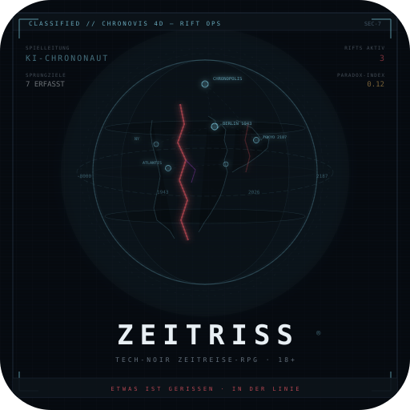

# ZEITRISS®-md Zeitreise RPG

<p align="center">
  
</p>

[![LLM-Ready ✅][llm-ready-badge]][llm-ready-link]

> **Tech-Noir-Agententhriller mit KI-Spielleitung.** Ihr spielt Chrononauten
> des ITI — Elite-Agenten, die durch die Zeit springen, um die Hauptzeitlinie
> zu stabilisieren. Explodierende Würfel, HUD-Overlay, persistente Saves.
> **18+, Uncut.**

## Was ist ZEITRISS?

Ein Pen-&-Paper-RPG, bei dem die **KI eure Spielleitung ist**. Kein
vorgefertigtes Text-Adventure, kein Choose-Your-Own-Adventure — ein
vollständiges Rollenspielsystem mit Würfelproben, Charakterentwicklung,
Kampagnenfortschritt und einer KI, die alles leitet: Szenen, NSCs, Kämpfe,
Loot und Debrief.

Ihr müsst vor dem ersten Run nicht das Regelwerk lesen — einrichten,
Preset wählen, losspielen.

### So sieht das aus

```text
EP 1 · MS 3 · SC 7/12
PHASE Konflikt · MODE CORE
Lvl 4 ▓▓▓▓░░░░░░ 4/10
Px 2/5 · Stress 3/10
Obj: Dossier sichern
```

> Der Wachmann dreht sich um. Seine Hand geht zum
> Holster. Du bist schneller.

`Probe: Nahkampf → W6: [6]`\
`→ Exploding! → W6: [2] = 8`\
`+ STR 4/2 + Talent 1 = 11`\
`vs SG 8 → TREFFER`

> Dein Ellbogen trifft seinen Kehlkopf. Er klappt
> zusammen, lautlos.

`Kodex: Wachmann neutralisiert.`\
`Noise +1 · Mag 8/8 · Checkpoint 40m`

### Ähnlich, aber anders

|              | KI-Chat-RPGs     | Pen & Paper    | **ZEITRISS**         |
| ------------ | ---------------- | -------------- | -------------------- |
| Spielleitung | KI, keine Regeln | Mensch         | KI, regelgebunden    |
| Würfel       | Keine            | Ja             | W6/W10, Exploding    |
| Persistenz   | Nur im Chat      | Manuell        | JSON-Save, portabel  |
| Multiplayer  | Begrenzt         | Am Tisch       | Drop-in/out per Save |
| Regelwerk    | Keins            | Buch (100+ S.) | Im Wissensspeicher   |

## Dein Save IST dein Charakter

**Save = Charakter.** Euer Fortschritt hängt nicht an einem Server. Der
Charakter liegt als JSON-Speicherstand vor — wie ein Datenblatt beim
klassischen Pen & Paper.

- **Mitnehmbar:** Denselben Charakter in jedem neuen Chat laden.
- **Teilbar:** Gruppen splitten, spielen getrennt weiter, mergen danach.
- **Dein Besitz:** Kein Account, kein Lock-in. **MMO ohne Server.**

**Multiplayer funktioniert so:** Eine Person hostet den Chat. Im HQ speichert
ihr mit `!save` — der JSON enthält alle Charaktere. Jeder kann seinen Stand
mitnehmen, solo weiterspielen und beim nächsten Gruppenabend wieder einsteigen.
Der erste gepostete Save setzt den Kampagnenrahmen, jeder weitere Charakter
bringt seinen persönlichen Fortschritt mit.

**Hinweis zu Saves:** Ausformulierte Vorgeschichten dürfen ausführlich sein,
der Save bleibt trotzdem kompakt. Beim HQ-`!save` können ältere
Freitext-Details in `summaries.*` verdichtet werden; der spielrelevante Kern
bleibt im strukturierten Charakterstand erhalten.

## Bestehendes Charaktermaterial mitbringen

Du hast bereits eine Figur aus einem anderen Pen-&-Paper oder eine ältere
Kampagnen-Biografie? Dann kannst du vorhandene Notizen, Bögen oder eine
Kurzbiografie als Ausgangsmaterial nutzen.

ZEITRISS übernimmt dabei **keine fremden Regeln 1:1**. Übernommen werden vor
allem **Rolle, Vibe, Hintergrund, Motive, Stärken, Schwächen und
Ausrüstungsrichtung**. Alles andere wird in einen ZEITRISS-kompatiblen
Startcharakter übersetzt.

Wenn deine Runtime Bildinput unterstützt, kannst du auch einen Scan oder ein
Foto als Referenz nutzen. Der robusteste Weg bleibt trotzdem eine kurze
Textzusammenfassung der wichtigsten Eckdaten.

## Einrichten & Spielen

### Was ihr braucht

1. **[OpenWebUI](https://github.com/open-webui/open-webui)** — eure
   Spieloberfläche (kostenlos, self-hosted)
2. **[OpenRouter](https://openrouter.ai)** — Konto + API-Key anlegen, in
   OpenWebUI unter Einstellungen → Verbindungen eintragen
3. **[Python 3.8+](https://python.org)** — auf macOS/Linux vorinstalliert,
   auf Windows einmal von python.org installieren

### Setup-Script starten

**Per ZIP (kein Git nötig):**

1. Oben auf dieser Seite **Code → Download ZIP** klicken
2. ZIP entpacken, Terminal/Eingabeaufforderung im entpackten Ordner öffnen
3. Ausführen:

```
python scripts/setup.py
```

**Per Git:**

```
git clone https://github.com/pchospital-lab/ZEITRISS-md.git
cd ZEITRISS-md
python scripts/setup.py
```

Das Script führt euch durch: API-Key eingeben, Modell wählen — Preset und
Wissensspeicher werden automatisch erstellt. Danach:

1. Neuen Chat in OpenWebUI öffnen
2. Modell **ZEITRISS v4.2.6 Uncut** wählen
3. Lostippen: `Spiel starten (solo klassisch)` — oder `solo schnell` als optionale Fast-Lane für Kurzrunden.
   Startbefehle lassen sich auch in natürlicher Sprache formulieren.

**Aktualisieren:** Neues ZIP laden (oder `git pull`) und Script nochmal
starten — fertig.

### Ohne OpenWebUI (Lumo, Claude Projects etc.)

Wer auf einer anderen Plattform spielen will:

```
python scripts/setup.py --export
```

Das erstellt einen Ordner mit:
- **`knowledge/`** — 19 Wissensmodule (Slots im Default-Ladepfad) → ins Projektwissen
- **`system/`** — Systemprompt → in die Projekt-Anweisungen
- **`SETUP-ANLEITUNG.md`** — erklärt Schritt für Schritt was wohin gehört

Für Lumo: `knowledge/`-Dateien nach Proton Drive kopieren, im Projekt
verlinken. Details: [Lumo-Setup](docs/setup-lumo.md)

### Manuelles Setup (ohne Script)

Geht auch — alle Details in der [Setup-Anleitung](docs/setup-guide.md).

### Modell-Empfehlung (Stand März 2026)

- **Empfohlen:** `anthropic/claude-sonnet-4.6` — einziges Modell mit
  vollständiger Regeltreue. Stärkster Noir-Ton, sauberste Spielerfahrung.
- **Budget:** `z-ai/glm-5-turbo` — 7× günstiger als Sonnet, erkennt
  Regelgates und Load-Router. Bestes Preis-Leistungs-Verhältnis.
- **Ultra-Budget:** `deepseek/deepseek-v3.2` — ~$0.002/Turn, gute
  Atmosphäre, aber ignoriert teils neue Mechaniken (Load-Router, Psi-Gates).
- **Experimentell:** `z-ai/glm-5` — gute Atmosphäre, halluziniert aber
  gelegentlich Regeln.

> Ergebnisse aus dem [Modellvergleich 2026-03-17](internal/qa/evidence/playtest-2026-03-17/AUSWERTUNG.md)
> (5 Szenarien × 4 Modelle, Scorecard-Methodik).

## Das Spielsystem in Kürze

1. **Agenten.** Als Chrononauten deckt ihr Zeitverschwörungen auf — Schicht
   für Schicht, nicht per Briefing-Dump. Jede Episode baut sich auf wie eine
   Staffel: erst der kleine Auftrag vor großer Kulisse, dann die Verdichtung,
   dann das Finale.
2. **Missionsphasen.** Briefing → Infiltration → Konflikt → Exfil → Debrief.
   12 Szenen pro Core-Mission, 14 bei Rift-Ops.
3. **Explodierende Würfel.** W6, ab Attribut 11 W10, ab 14 Heldenwürfel.
4. **Paradoxon-Index.** Belohnungssystem: Bei Px 5 schaltet ihr
   Bonus-Missionen mit Paramonstern und Artefakten frei.
5. **Boss-Rhythmus.** Mission 5 = Mini-Boss, Mission 10 = Episoden-Boss.
6. **Persistenz.** `!save` im HQ, JSON mitnehmen, im nächsten Chat laden.

→ **[Spieler-Handbuch](core/spieler-handbuch.md)** — Einleitung, Regeln,
Schnellstart, FAQ
→ **[SL-Referenz](core/sl-referenz.md)** — Tabellen, Befehle, Systemdetails

## Lizenz

- **Privat:** Kostenlos. CC BY-NC 4.0, Attribution
  "ZEITRISS® — pchospital".
- **Kommerziell:** Schriftliche Vereinbarung nötig (siehe
  [LICENSE](LICENSE)).
- **Streams/Videos:** Erlaubt mit Attribution (siehe
  [Creator-Lizenz](docs/creator-license.md)).
- **18+.** ZEITRISS® ist eine eingetragene Marke (DPMA).

## Feedback

Pull Requests werden nicht angenommen. Bei Regelfehler, Ideen oder
Tippfehler bitte ein
[Issue](https://github.com/pchospital-lab/ZEITRISS-md/issues) erstellen.
Sicherheitsmeldungen: [SECURITY.md](SECURITY.md).

---

© 2025-2026 pchospital – ZEITRISS® – private use only. See LICENSE.

[llm-ready-badge]: https://img.shields.io/badge/LLM--Ready-%E2%9C%85-success
[llm-ready-link]: core/spieler-handbuch.md
