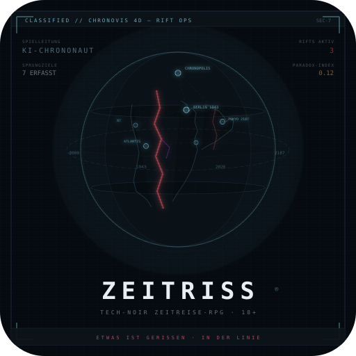

# ZEITRISS®-md Zeitreise-RPG

  

[![LLM-Ready ✅][llm-ready-badge]][llm-ready-link]

> **Tech-Noir-Zeitreise-RPG mit KI-Spielleitung.** Ihr spielt Chrononauten
> des ITI — Elite-Agenten, die durch die Zeit springen, um die Hauptzeitlinie
> zu stabilisieren. Explodierende Würfel, HUD-Overlay, persistente Saves.
> **18+, Uncut.**

## Was ist ZEITRISS?

Ein Pen-&-Paper-RPG, bei dem die **KI eure Spielleitung ist**. Kein
vorgefertigtes Text-Adventure, kein Choose-Your-Own-Adventure — ein
vollständiges Rollenspielsystem mit Würfelproben, Charakterentwicklung,
Kampagnenfortschritt und einer KI, die alles leitet: Szenen, NSCs, Kämpfe,
Loot und Debrief.

Architektonisch ist **ZEITRISS eine portable LLM-RPG-Engine**: Masterprompt
plus 19 Wissensmodule, mit Retrieval, Save-JSON und hoher Regeltreue als
Kernanforderungen. Die Runtime ist kein fester Server und keine feste App,
sondern das LLM deiner Wahl — solange deine Plattform projektweite
Anweisungen, Wissensdateien/Quellen und zuverlässiges Retrieval unterstützt.
Dadurch spielt sich ZEITRISS je nach Modell und Plattform leicht anders,
bleibt aber über den Save portabel: wie ein Charakterbogen, den du an einen
anderen Pen-&-Paper-Tisch mitnimmst.

Die Spielleitung zieht aus einem ganzen Orchester von Generatoren —
Settings, NSC-Pools, Preserve-/Trigger-Seeds, Paradox-Events und
Rift-Koordinaten — und webt daraus jede Kampagne neu. Kein Playthrough
gleicht dem anderen.

Ihr müsst vor dem ersten Run nicht das Regelwerk lesen — einrichten,
Preset wählen, losspielen. **Regeln, Welt, Skillung, Taktik** lernt ihr
**spielerisch im Chat** — fragt einfach die Spielleitung („wie levele ich
am besten?", „was macht TEMP?", „was ist ein Rift-Op?"), sie antwortet
in-world, ohne die vierte Wand zu brechen. Kein Computerspiel und kein
klassisches Pen-&-Paper erklärt euch die Welt so beiläufig wie ZEITRISS:
**nichts bleibt ungeklärt**, weil ihr jederzeit fragen könnt.

### So sieht das aus

🎬 `EP 01 · MS 03 · SC 07/12 · MODE CORE · Objective: Dossier sichern`\
🧠 `Stress 3 · Px █░░░░ (1/5) · Lvl 3 ▓▓▓░░░░░░░ · Rank Operator · SYS 1/4 (free 3)`

> Der Wachmann dreht sich um. Seine Hand geht zum
> Holster. Du bist schneller.

`Probe: Nahkampf → W6: [5] + STR 4/2 + Talent 1 = 8 vs SG 8 → TREFFER`

> Dein Ellbogen trifft seinen Kehlkopf. Er klappt
> zusammen, lautlos.

`Kodex: Wachmann neutralisiert. Stress +1.`

### Ähnlich, aber anders

|              | KI-Chat-RPGs     | Pen & Paper    | **ZEITRISS**         |
| ------------ | ---------------- | -------------- | -------------------- |
| Spielleitung | KI, keine Regeln | Mensch         | KI, regelgebunden    |
| Würfel       | Keine            | Ja             | W6/W10, Exploding    |
| Persistenz   | Nur im Chat      | Manuell        | JSON-Save, portabel  |
| Multiplayer  | Begrenzt         | Am Tisch       | Drop-in/out per Save |
| Regelwerk    | Keins            | Buch (100+ S.) | Im Wissensspeicher   |

## Dein Save IST dein Charakter

**Save = Charakter.** Euer Fortschritt hängt nicht an einem Server. Der
Charakter liegt als JSON-Speicherstand vor — wie ein Datenblatt beim
klassischen Pen & Paper.

- **Mitnehmbar:** Denselben Charakter in jedem neuen Chat laden.
- **Teilbar:** Gruppen splitten, spielen getrennt weiter, mergen danach.
- **Dein Besitz:** Kein Account, kein Lock-in. **MMO ohne Server.**

**Multiplayer funktioniert so:** Eine Person hostet den Chat. Im HQ erzeugen
`!save` und `!speichern` automatisch je Spielerfigur einen vollständigen
persönlichen JSON-Save. Der erste gepostete Save setzt seine Kampagne als
Sitzungsrahmen; weitere Figuren bringen ihren persönlichen Fortschritt mit,
während ihre eigenen Kampagnen pausieren.
Wenn sich Gruppen trennen und später wieder zusammentreffen, verweben sich die
einzelnen Handlungsstränge wieder zu einem gemeinsamen Zeitnetz.

**Spielrhythmus: ein Abschnitt = ein Chat.** ZEITRISS spielt sich in
sauber abgeschlossenen Spielabschnitten — Charaktererschaffung, HQ-Runde,
Mission, Chronopolis, Arena. Am Ende jedes Abschnitts ein `!save`, dann
neuer Chat, Save laden, weiter im HQ-Hub. Klingt ungewohnt, fühlt sich
nach zwei Runden völlig natürlich an: kein Kontext-Overflow, sauberer
Regelzugriff, klarer Schnitt zwischen den Beats. Mehr dazu im
[Spieler-Handbuch](core/spieler-handbuch.md#gameflow-chat-wechsel).

**Hinweis zu Saves:** Ausformulierte Vorgeschichten dürfen ausführlich sein,
der Save bleibt trotzdem kompakt. Beim HQ-`!save` können ältere
Freitext-Details in `summaries.*` verdichtet werden; der spielrelevante Kern
bleibt im strukturierten Charakterstand erhalten.

## Bestehendes Charaktermaterial mitbringen

Du hast bereits eine Figur aus einem anderen Pen-&-Paper oder eine ältere
Kampagnen-Biografie? Dann kannst du vorhandene Notizen, Bögen oder eine
Kurzbiografie als Ausgangsmaterial nutzen.

ZEITRISS übernimmt dabei **keine fremden Regeln 1:1**. Übernommen werden vor
allem **Rolle, Vibe, Hintergrund, Motive, Stärken, Schwächen und
Ausrüstungsrichtung**. Alles andere wird in einen ZEITRISS-kompatiblen
Startcharakter übersetzt.

Wenn deine Runtime Bildinput unterstützt, kannst du auch einen Scan oder ein
Foto als Referenz nutzen. Der robusteste Weg bleibt trotzdem eine kurze
Textzusammenfassung der wichtigsten Eckdaten.

## Setup: vorhandene Chatplattform nutzen

**Mach deine geeignete KI-Chatplattform zu ZEITRISS.** Der einfache Weg ist:
**Download → entpacken → dauerhafte Projektquellen → eine Anweisung → Start.**
Dafür brauchst du weder Git, Terminal, Python, Docker noch einen zusätzlichen
API-Key, wenn dein vorhandener Modellzugang Projektquellen, dauerhafte
Anweisungen und Retrieval unterstützt. Ein Abo allein garantiert diese
Funktionen oder Regeltreue nicht.

Bis ein freigegebenes Upload-ZIP existiert, nutze im Browser **Code → Download
ZIP** für einen nachvollziehbaren Commit oder Tag, entpacke das Repository und
wähle die 19 Dateien exakt nach der Liste im [Setup-Guide](docs/setup-guide.md#browser-einstieg-ohne-installation).
Im **Quell-ZIP** heißen die Anweisungsdateien `meta/masterprompt_v6.md` und
`meta/project_bootstrap_instructions.md`; im **erzeugten Upload-Paket** heißen
dieselben Inhalte `system/SYSTEM_PROMPT_ONLY.md` und
`system/PROJECT_BOOTSTRAP_INSTRUCTIONS.md`. Das Quell-ZIP selbst ist **kein**
bereinigtes Spielpaket. Ein Maintainer kann
das fertige Paket mit `scripts/setup.py --export --require-clean` erzeugen;
es enthält `knowledge/...`, `system/SYSTEM_PROMPT_ONLY.md`,
`system/PROJECT_BOOTSTRAP_INSTRUCTIONS.md`, `SETUP-ANLEITUNG.md`, Manifest und ZIP.

Es gibt genau zwei Projektvarianten: **(A)** vollständigen Masterprompt ins
dauerhafte Anweisungsfeld und 19 Module als Quellen; **(B)** bei zu kleinem
Feld ausschließlich den Project-Bootstrap als Anweisung und die 19 Module plus
Masterprompt als 20 Quelldateien. Nicht stapeln und nichts abschneiden. Der
aktuelle v7-Save ist beim Laden ein eigener Zustandsanker; alte widersprüchliche
Saves desselben Charakters gehören nicht daneben.

Danach einen **neuen Spielchat** öffnen: mit `Spiel starten (solo klassisch)`
neu beginnen oder den extern aufbewahrten persönlichen Save direkt einfügen
und `Spiel laden`/`!laden` verwenden. `!save`/`!speichern` erzeugt den
persönlichen JSON-Save im Chat, aber keine automatische Dateiablage. Saves
gehören nicht dauerhaft zu den Regelquellen.

OpenWebUI + Sonnet 4.6 bleibt das referenzgetestete Entwicklungssetup; dessen
Docker-/Python-Voraussetzungen stehen nachgeordnet im [Setup-Guide](docs/setup-guide.md#komplett-setup-in-openwebui-empfohlen).
Andere Plattformen sind nicht pauschal abgenommen. Ein Spielerbericht belegt
eine vollständige erste Episode in einem ChatGPT-Projekt, aber keine allgemeine
Plattform- oder Modellgarantie.

## Creator Studio

Das [ZEITRISS® Creator Studio](docs/creator-mode.md) setzt Saves, Transkripte
und autorisierte Referenzassets in Medienkonzepte und Creator-Pakete um. Es
läuft strikt getrennt als eigenes Projekt, führt den normalen reinen
Text-Spielbetrieb nicht fort und verändert keinen Spielfortschritt.

## Modell-Empfehlung

**Standard-Stack: `anthropic/claude-sonnet-4.6` + LiteLLM.** Sonnet 4.6 ist
aktuell das einzige getestete Modell mit vollständiger Regeltreue und
stärkstem Noir-Ton. Der LiteLLM-Proxy (Docker, Teil des Standard-Setups) aktiviert
den Anthropic-Prompt-Cache und senkt die Kosten um **~90 %** — ZEITRISS
wird damit **spürbar günstiger** ohne Abstrich bei der Regeltreue.

> In OpenWebUI taucht das Modell nach der LiteLLM-Installation als
> `zeitriss-sonnet` im Dropdown auf. Das ist nur ein LiteLLM-Alias für
> `anthropic/claude-sonnet-4.6` — gleiches Modell, kürzerer Name.
> ZEITRISS wird automatisch auf diesen Alias eingestellt.

## Das Spielsystem in Kürze

1. **Agenten.** Als Chrononauten deckt ihr Zeitverschwörungen auf — Schicht
   für Schicht, nicht per Briefing-Dump. Jede Episode baut sich auf wie eine
   Staffel: erst der kleine Auftrag vor großer Kulisse, dann die Verdichtung,
   dann das Finale.
2. **Missionsphasen.** Briefing → Infiltration → Konflikt → Exfil → Debrief.
   12 Szenen pro Core-Mission, 14 bei Rift-Ops.
3. **Preserve & Trigger — zwei Haltungen, ein Ziel.** Euer Job ist, die
   Geschichte zu wahren. Die eigentlichen Gegner sind **Fremdfraktionen**,
   die den Geschichtsverlauf zu ihren Gunsten umschreiben wollen. Gegen die
   steht ihr gemeinsam — egal, welche Haltung ihr gewählt habt.
   - **Preserve-Agenten** verhindern Ereignisse, die in der dokumentierten
     Geschichte *gerade so nicht* passiert sind, aber in eurer Zeitlinie
     doch einzutreten drohen.
   - **Trigger-Agenten** sorgen dafür, dass dokumentierte Tragödien
     stattfinden, weil ihr Ausbleiben eine schlimmere Kettenreaktion
     auslösen würde.

   Als Trigger-Agent fühlt es sich an wie die dunkle Seite (Katastrophen
   passieren lassen), als Preserve-Agent wie Heldentum (Katastrophen abwenden).
   Ist aber keins von beidem — beide Seiten sind Verbündete innerhalb des
   ITI und kämpfen gegen denselben äußeren Feind.
   Neutrale spielen in Teams beider Haltungen mit; Preserve- und
   Trigger-Agenten operieren im Feld (Core-/Rift-Ops) nur innerhalb
   derselben Haltung zusammen (operatives Zellenprinzip, keine
   Feindschaft). In der **PvP-Arena** ist dagegen jede Kombination
   erlaubt — dort messt ihr euch haltungsübergreifend.
   Chrononauten agieren als Werkzeug eines größeren Plans des ITI.
4. **Explodierende Würfel.** W6, ab Attribut 11 W10, ab 14 Heldenwürfel.
5. **Paradoxon-Index.** Belohnungssystem: Der Anstieg von Px hängt vom
   Missionsverlauf und euren Preserve/Trigger-Entscheidungen ab. Bei Px 5 werden 1–2
   Riftkoordinaten auf der Raumzeitkarte sichtbar — dort warten Rift-Ops
   mit Paramonstern und Artefakten.
6. **Boss-Rhythmus.** Mission 5 = Mini-Boss, Mission 10 = Episoden-Boss.
7. **Persistenz.** `!save` im HQ, JSON mitnehmen, im nächsten Chat laden.

**Makros sind Komfort, keine Pflicht:** `!save`, `!bogen` oder `!menü` sind
Shortcuts. Ihr könnt genauso natürlich schreiben wie „speichere meinen
Charakter“ oder „zeig meinen Bogen“ — die Spielleitung reagiert in-world.

→ **[Spieler-Handbuch](core/spieler-handbuch.md)** — Einleitung, Regeln,
Schnellstart, FAQ
→ **[SL-Referenz](core/sl-referenz.md)** — Tabellen, Befehle, Systemdetails

## Lizenz

- **Inhalte** (Texte, Illustrationen, Regeln) — CC BY-NC 4.0 mit
  Attribution "ZEITRISS® — pchospital". Private Nutzung kostenlos.
- **Code** (Scripts, Tools, Runtime) — MIT.
- **Kommerzielle Nutzung:** Schriftliche Vereinbarung nötig
  (siehe [LICENSE](LICENSE)).
- **Streams/Videos:** Erlaubt mit Attribution
  (siehe [Creator-Lizenz](docs/creator-license.md)).
- **18+.** ZEITRISS® ist eine eingetragene Wortmarke (DPMA).

## Feedback

Pull Requests werden nicht angenommen. Bei Regelfehler, Ideen oder
Tippfehler bitte ein
[Issue](https://github.com/pchospital-lab/ZEITRISS-md/issues) erstellen.
Sicherheitsmeldungen: [SECURITY.md](SECURITY.md).

---

© 2025-2026 pchospital – ZEITRISS® – private use only. See LICENSE.

[llm-ready-badge]: https://img.shields.io/badge/LLM--Ready-%E2%9C%85-success
[llm-ready-link]: core/spieler-handbuch.md
