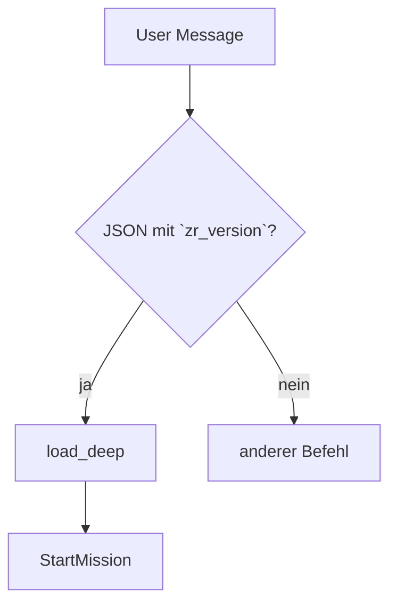

# Runtime-Helfer-Leitfaden

> Übersicht über zentrale Makros für Kampagnenfluss und Funkchecks.

## Inhaltsverzeichnis
- [Einleitung](#einleitung)
- [Nutzung](#nutzung)
- [API / Makros](#api--makros)
- [Beispiele](#beispiele)
- [Änderungsverlauf](#änderungsverlauf)

## Einleitung
Dieses Dokument sammelt kurze Hinweise zu häufig genutzten Runtime-Makros.

## Nutzung
Binde die Makros über `systems/toolkit-gpt-spielleiter.md` ein. Setze das Flag
`GM_STYLE` auf `precision`, wenn strenge Guards aktiv sein sollen.

## Acceptance-Smoketest (Kurzfassung)

1. `Spiel starten (solo klassisch)` → HQ-Overlay `EP·MS·SC` + Compliance-Toast.
2. `Spiel starten (solo schnell)` → Rolle wählen, Briefing ohne Rückfrage.
3. `Spiel starten (npc-team 3 schnell)` → drei NSCs sichtbar.
4. `Spiel starten (npc-team 5)` → Fehlertext „Teamgröße 0–4 …“.
5. `Spiel starten (gruppe schnell)` → zwei Saves + Rolle → Briefing.
6. `Spiel starten (gruppe 3)` → Fehlertext „Bei *gruppe* keine Zahl …“.
7. `!load` HQ-Save → HUD `FS 0/4` (Core) bzw. `FS 0/2` plus `GATE 0/2`.
8. `!helper boss` bestätigt Gate-Status vor Mission 5/10.
9. `!save` im HQ verifiziert Guard (`SYS` voll, `stress=0`, `psi_heat=0`,
   Arena inaktiv).
10. `!arena status`/`!arena quit` stellt den HQ-Reset vor neuen Saves klar.
11. `Px 5` erreicht → Hinweis „Seeds erzeugt, spielbar nach Episodenende“.
12. Mission 5 → HUD `GATE 2/2`, ggf. `SF-OFF`, Boss-DR-Toast in Szene 10;
    Missionsende setzt Self-Reflection auf `SF-ON` zurück.
13. Psi-Konflikt → `Psi-Heat +1`; nach Konflikt `psi_heat = 0`, HQ-Transfer
    setzt SYS/Stress/Psi-Heat zurück.
14. `!accessibility` → `contrast=high`, `badge_density=dense/compact`,
    `output_pace=slow` speichern; Toast „Accessibility aktualisiert …“.
15. Save laden → `!accessibility` erneut prüfen, Werte sind persistiert.

## Nachrichtenfluss: Lade-Pipeline


## API / Makros
### `DelayConflict(threshold=4, allow=[])`
Verzögert Konfliktszenen bis zur angegebenen Szene. Standardmäßig bleibt die
Liste `allow` leer; setze etwa `allow=['ambush','vehicle_chase']`, wenn frühe
Überfälle oder Verfolgungen erlaubt sein sollen. Missions-Tags `heist` oder
`street` senken das Limit automatisch um je eine Szene (Minimum: Szene 2).

### `comms_check(device, range_m, …)`
Prüft Gerät und Reichweite. Akzeptiert `device`
(`comlink|cable|relay|jammer_override`, Groß-/Kleinschreibung egal) sowie eine
Reichweite in Metern. Optional können `range_km`, Jammer- oder Relay-Flags
übergeben werden. Liefert `true`, wenn Reichweite × `state.comms.rangeMod`
größer Null ist und bei Jammer nur Kabel, Relais oder Override genutzt werden.
Die Kernregeln sind im [README → Comms-Core](README.md#comms-core) gespiegelt.
Wird durch `must_comms(opts)` ergänzt, das automatisch km→m konvertiert.

### `must_comms(opts)`
Zentraler Guard für Funkverkehr. Wirft `CommsCheck failed: require valid device/range or relay/jammer override.`
bei ungültigem Gerät oder Reichweite.

### `can_open_conflict(type)`
Liefert `true`, wenn Konflikte vor `DelayConflict`-Threshold erlaubt sind und
`type` in der per `allow` gesetzten Ausnahmeliste (`ambush`, `vehicle_chase`
etc.) steht, sonst `false`.

### `assert_foreshadow(count=2)`
Warnung im PRECISION-Stil, falls weniger als `count` Hinweise für spätere
Bosskämpfe gesetzt wurden. Core-Missionen benötigen nun vier Foreshadows,
Rift-Operationen zwei, um Szene 10 zu erreichen.

### `ForeshadowHint(text, tag='Foreshadow')`
Registriert einen Foreshadow-Hinweis und sendet einen passenden HUD-Toast.
Nur Hinweise, die über dieses Makro oder automatische System-Hints gesetzt
werden, heben den Gate für Szene 10 auf. Persistiert Marker in `logs.foreshadow`
und hält das HUD-Badge aktuell.

## Beispiele
```js
// Kurzes Beispiel
DelayConflict(4, ["ambush", "vehicle_chase"]);
```

## Änderungsverlauf

- 2025-08-15: Erste Version, lint-konform.
