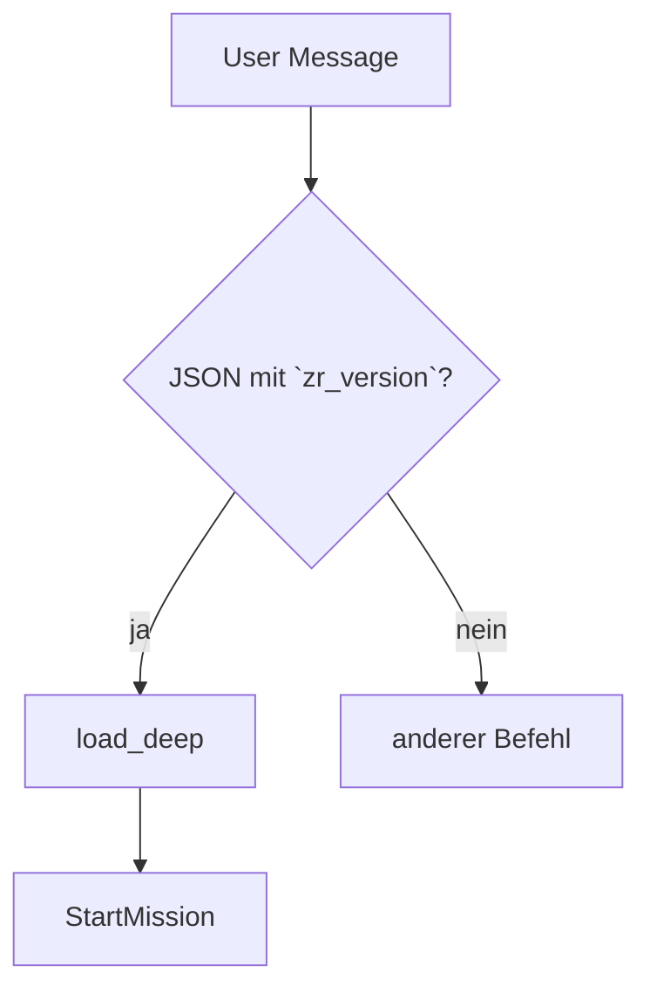

# Runtime-Helfer-Leitfaden

> Übersicht über zentrale Makros für Kampagnenfluss und Funkchecks.

## Inhaltsverzeichnis
- [Einleitung](#einleitung)
- [Nutzung](#nutzung)
- [API / Makros](#api--makros)
- [Beispiele](#beispiele)
- [Änderungsverlauf](#änderungsverlauf)

## Einleitung
Dieses Dokument sammelt kurze Hinweise zu häufig genutzten Runtime-Makros.

## Nutzung
Binde die Makros über `systems/toolkit-gpt-spielleiter.md` ein. Setze das Flag
`GM_STYLE` auf `precision`, wenn strenge Guards aktiv sein sollen.

## Nachrichtenfluss: Lade-Pipeline


## API / Makros
### `DelayConflict(threshold=4, allow=[])`
Verzögert Konfliktszenen bis zur angegebenen Szene. Optional erlaubt eine
Liste `allow` frühe Überfälle wie `ambush` oder `vehicle_chase`. Missions-Tags
`heist` oder `street` senken das Limit automatisch um je eine Szene (Minimum:
Szene 2).

### `comms_check(device, range)`
Prüft Gerät und Reichweite. Wird durch `must_comms(opts)` ergänzt.

### `must_comms(opts)`
Zentraler Guard für Funkverkehr. Wirft `CommsCheck failed: require valid device/range or relay/jammer override.`
bei ungültigem Gerät oder Reichweite.

### `can_open_conflict(type)`
Liefert `true`, wenn Konflikte vor `DelayConflict`-Threshold erlaubt sind
(`ambush`/`vehicle_chase` etc.), sonst `false`.

### `assert_foreshadow(count=2)`
Warnung im PRECISION-Stil, falls weniger als `count` Hinweise für spätere
Bosskämpfe gesetzt wurden. Core-Missionen benötigen nun vier Foreshadows,
Rift-Operationen zwei, um Szene 10 zu erreichen.

### `ForeshadowHint(text, tag='Foreshadow')`
Registriert einen Foreshadow-Hinweis und sendet einen passenden HUD-Toast.
Nur Hinweise, die über dieses Makro oder automatische System-Hints gesetzt
werden, heben den Gate für Szene 10 auf.

## Beispiele
```js
// Kurzes Beispiel
DelayConflict(4, ["ambush"]);
```

## Änderungsverlauf

- 2025-08-15: Erste Version, lint-konform.
