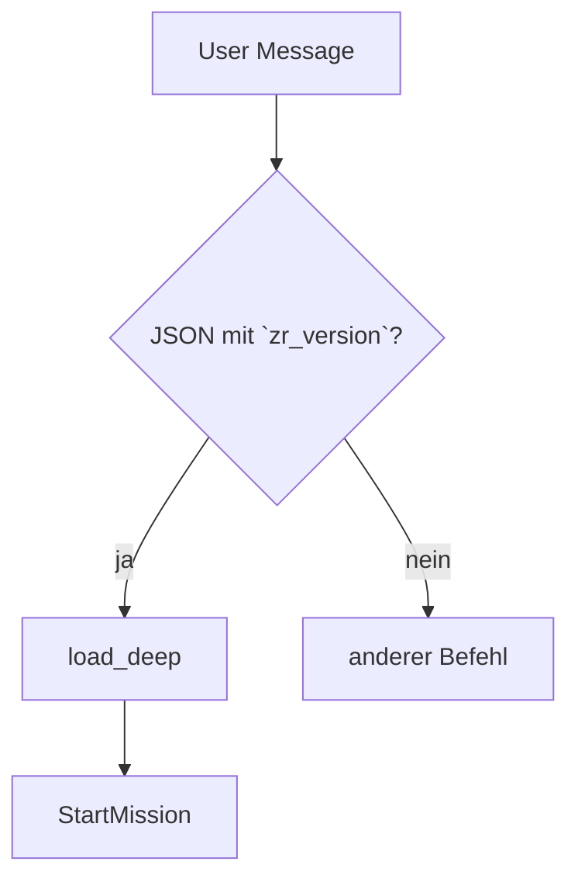

# Runtime-Helfer-Leitfaden

> Übersicht über zentrale Makros für Kampagnenfluss und Funkchecks.

## Inhaltsverzeichnis
- [Einleitung](#einleitung)
- [Nutzung](#nutzung)
- [API / Makros](#api--makros)
- [Beispiele](#beispiele)
- [Änderungsverlauf](#änderungsverlauf)

## Einleitung
Dieses Dokument sammelt kurze Hinweise zu häufig genutzten Runtime-Makros.

## Nutzung
Binde die Makros über `systems/toolkit-gpt-spielleiter.md` ein. Setze das Flag
`GM_STYLE` auf `precision`, wenn strenge Guards aktiv sein sollen.

## Acceptance-Smoketest (Mirror)

### Dispatcher-Starts & Speicherpfade

1. `Spiel starten (solo klassisch)` → Erschaffung → HQ-Intro → Briefing → SC 1
2. `Spiel starten (solo schnell)` → Rolle → Defaults → Briefing/SC 1
3. `Spiel starten (npc-team 3 schnell)` → Autogen-NSCs (3) → Briefing
4. `Spiel starten (npc-team 5)` → Fehlertext „Teamgröße erlaubt: 0–4 …“
5. `Spiel starten (gruppe schnell)` → 2 Saves + 1 Rolle → Briefing
6. `Spiel starten (gruppe 3)` → Fehlertext „Bei gruppe keine Zahl …“
7. `Spiel laden` + kompatibler Save → Kodex-Recap-Overlay → HQ/Briefing (keine Startfrage)
8. `Speichern` während Mission → Blocker „Speichern nur im HQ …“
9. Gear-Alias: „Multi-Tool-Armband ausrüsten“ → still → „Multi-Tool-Handschuh“
10. „Px 5“ triggern → Hinweis: Seeds erzeugt, spielbar nach Episodenende, Reset danach

### Boss-Gates & HUD-Badges

11. `!helper boss` nach Mission 4 → Foreshadow-Liste zeigt Szene 5/10. HUD-Toast
    `Gate blockiert – Gate 0/2`, bis Hinweise erfüllt sind.
12. Mission 5 starten → HUD meldet den Encounter-Hinweis
    `Boss-Encounter in Szene 10`, zeigt `GATE 2/2` und – falls zuvor deaktiviert –
    `SF-OFF` (Suggest-Badge bleibt davon unberührt). Der Foreshadow-Zähler startet
    bei `FS 0/4` und zählt hoch. In Szene 10 erscheint der Toast `Boss-DR aktiviert – −X
    Schaden pro Treffer` (DR nach Teamgröße/Boss-Typ laut
    [Boss-DR-Skala](gameplay/kampagnenstruktur.md#boss-rhythmus-pro-episode)); beim
    Missionsende (Abbruch oder Abschluss) setzt die Runtime Self-Reflection
    automatisch auf `SF-ON` zurück.

### Psi-Heat & Ressourcen-Reset

13. Psi-Charakter in Konflikt schicken, Psi-Aktion nutzen → HUD meldet
    `Psi-Heat +1`; nach Konflikt springt Psi-Heat automatisch auf 0. HQ-Transfer
    setzt SYS/Stress/Psi-Heat zurück.

### Accessibility & UI-Persistenz

14. `!accessibility` auslösen → Dialog öffnet sich. `High Contrast`,
    `Badges: dense` oder `compact` und `Output pace: slow` bestätigen; HUD-Toast
    „Accessibility aktualisiert …“ notieren und die aktualisierten UI-Felder im
    Save-Preview sichern. Legacy-Werte `full|minimal` werden auf
    `standard|compact` gemappt.
15. Save laden → `!accessibility` erneut öffnen → Einstellungen sind
    persistiert (`contrast: high`, `badge_density: dense|compact`,
    `output_pace: slow`).

**Arena- und Fahrzeug-Smoke (Ergänzung)**
- Arena/Psi: Ein Lauf mit Psi-Charakter (`phase_strike_cost()` aktiv, HUD-Toast
  mit Tax + Logs), ein Lauf ohne Psi (nur Arena-Gebühr, `psi_buffer` aktiv).
- Fahrzeuge/Massenkonflikte: „Cineastische Verfolgung“ auslösen (Start-Overlay,
  Crash/Stress protokollieren) und Massenkonflikt-Flag aufnehmen.

## Nachrichtenfluss: Lade-Pipeline


## API / Makros
### `DelayConflict(threshold=4, allow=[])`
Verzögert Konfliktszenen bis zur angegebenen Szene. Standardmäßig bleibt die
Liste `allow` leer; setze etwa `allow=['ambush','vehicle_chase']`, wenn frühe
Überfälle oder Verfolgungen erlaubt sein sollen. Missions-Tags `heist` oder
`street` senken das Limit automatisch um je eine Szene (Minimum: Szene 2).

### `comms_check(device, range_m, …)`
Prüft Gerät und Reichweite. Akzeptiert `device`
(`comlink|cable|relay|jammer_override`, Groß-/Kleinschreibung egal) sowie eine
Reichweite in Metern. Optional können `range_km`, Jammer- oder Relay-Flags
übergeben werden. Liefert `true`, wenn Reichweite × `state.comms.rangeMod`
größer Null ist und bei Jammer nur Kabel, Relais oder Override genutzt werden.
Die Kernregeln sind im [README → Comms-Core](README.md#comms-core) gespiegelt.
Wird durch `must_comms(opts)` ergänzt, das automatisch km→m konvertiert.

### `must_comms(opts)`
Zentraler Guard für Funkverkehr. Wirft `CommsCheck failed: require valid device/range or relay/jammer override.`
bei ungültigem Gerät oder Reichweite.

### `can_open_conflict(type)`
Liefert `true`, wenn Konflikte vor `DelayConflict`-Threshold erlaubt sind und
`type` in der per `allow` gesetzten Ausnahmeliste (`ambush`, `vehicle_chase`
etc.) steht, sonst `false`.

### `assert_foreshadow(count=2)`
Warnung im PRECISION-Stil, falls weniger als `count` Hinweise für spätere
Bosskämpfe gesetzt wurden. Core-Missionen benötigen nun vier Foreshadows,
Rift-Operationen zwei, um Szene 10 zu erreichen.

### `ForeshadowHint(text, tag='Foreshadow')`
Registriert einen Foreshadow-Hinweis und sendet einen passenden HUD-Toast.
Nur Hinweise, die über dieses Makro oder automatische System-Hints gesetzt
werden, heben den Gate für Szene 10 auf. Persistiert Marker in `logs.foreshadow`
und hält das HUD-Badge aktuell.

## Beispiele
```js
// Kurzes Beispiel
DelayConflict(4, ["ambush", "vehicle_chase"]);
```

## Änderungsverlauf

- 2025-08-15: Erste Version, lint-konform.
