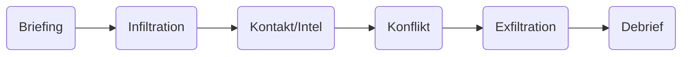
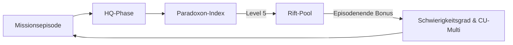
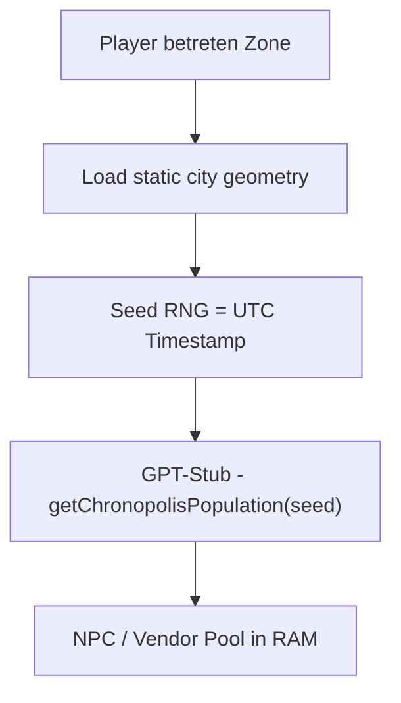

# ZEITRISS 4.2.6 - Modul 6: Regel- und Inspirationsmodul für langfristige Kampagnen

## Gameplay-Index

- Einführung
- Kampagnenplanung im ZEITRISS-Stil
- HQ-Verwaltung und Ausbau
- Beziehungen zu NSCs, Fraktionen und Mitagenten
- Mechaniken für langfristige Entwicklungen
- Erzählpausen, Freizeit und Alltag im HQ
- Arena-Modus: PvP-Kämpfe
- Chronopolis - Endgame-Hub
- Fazit

Diese Modulnummer führt die Hauptreihe nach Modul 5 fort und bindet nahtlos an Modul 7 (Fahrzeuge, Konfliktsystem & Kreative Generatoren) an.

## Einführung

**ZEITRISS 4.2.6** präsentiert ein filmisches, immersives Kampagnensystem, das Spielleiter*innen und
Spieler*innen hilft, epische **Langzeit-Abenteuer** zu gestalten. Dieses Modul bietet strukturierte
Werkzeuge für die Planung mehrteiliger Handlungsbögen, die Weiterentwicklung eines gemeinsamen
Hauptquartiers (HQ) und die Pflege von Beziehungen im Verlauf der Kampagne. Alle Elemente sind
**klar strukturiert** und **modular anwendbar**, sodass sie je nach Bedarf der Gruppe eingesetzt
werden können. Im Fokus steht stets das besondere **ZEITRISS-Flair** - temporeiche Einsätze durch
Raum und Zeit, dramatische Entscheidungen mit Folgen für die Geschichte und intime Charaktermomente
in einer lebendigen Basis. Im Folgenden werden die einzelnen Bausteine des Moduls ausführlich
beschrieben.

### Kampagnenhierarchie

Das ZEITRISS-System unterscheidet klar vier Ebenen:

- **Mission** - eine einzelne Operation mit rund zwölf Szenen.
- **Episode/Fall** - fasst etwa zehn Missionen desselben Settings zusammen.
- **Arc** - mehrere Episoden bilden einen übergeordneten Handlungsbogen.
- **Kampagne** - verknüpft mehrere Arcs zu einer fortlaufenden Gesamtstory.

### Einsatz-Einstiege & Szenen-Gate

- **Undercover bleibt vollständig:** Auch verdeckte Einsätze durchlaufen alle Kernphasen.
  Übersprungene Schritte werden später als Komplikationen eingebracht (z. B. plötzlicher Scan,
  Schichtwechsel, Verdachtsmoment), damit Spannung und Belohnungslogik konsistent bleiben.
- **Szenen-Mindestmaß:** Die Runtime öffnet `Sicherung`/`Flucht` erst nach **6-7** vollwertigen
  Szenen und füllt fehlende Abschnitte mit Twists oder Gegenangriffen auf, bis der Zielkorridor
  (12 Core / 14 Rift) erreicht ist. **Kurzschnitte zählen nicht** - jede Szene muss eine Phase
  oder klare Wendung abbilden, damit das Gate nicht zum Aufsplitten von Missionen verleitet.
- **Loot/Cleanup/Exfil gehören zum Flow:** Loot-Blöcke listen regulär Waffen/Tools,
  Keys/Daten, Wert/CU und Hinweise; "heißes Loot" wird markiert. Cleanup bleibt
  ein Risiko- oder Protokoll-Entscheid (Zeit, Stress, Noise/Heat) statt
  Schritt-für-Schritt-Anleitung. Exfil-Fenster sollen sichtbar bleiben und als
  Optionen mit Risiken präsentiert werden.

## Kampagnenplanung im ZEITRISS-Stil

Langanhaltende ZEITRISS-Kampagnen profitieren von einer **durchdachten Planung** und **flexiblen
Struktur**, die sowohl spannende Episoden als auch verzweigende Handlungsstränge ermöglicht. Im
Zentrum stehen **Handlungsbögen (Arcs)**, die wie Staffeln einer Fernsehserie organisiert sind und
in einzelne **Episoden** unterteilt werden. Jeder Bogen hat ein eigenes Thema oder Missionsziel,
während sich über die gesamte Kampagne ein roter Faden spannt.
Inspiration für komplette Arcs liefert der
[Arc-Generator](./kreative-generatoren-missionen.md#arc-generator)
im Generator-Modul.

### Arc-Baukasten und Episodenstruktur {#arc-baukasten-und-episodenstruktur}

Stellt euch jede Kampagne als **Baukasten von Handlungsbögen** vor, aus denen ihr eure Geschichte
zusammensetzt. Ein Handlungsbogen kann z. B. eine bestimmte Bedrohung oder Epoche fokussieren. Er
umfasst mehrere **Episoden** (Spielabende oder Abenteuer), die in sich geschlossen spannende
Ereignisse zeigen und gemeinsam den Arc vorantreiben. Die vier Arc-Phasen erstrecken sich jeweils
über ein Set von Episoden:

- **Einleitung:** Einführung in das neue Kapitel - z. B. eine mysteriöse Anomalie in der Zeit, erste
  Aufträge und Exposition der Lage.
- **Konflikt & Entwicklung:** Die Agenten stellen Nachforschungen an, treffen auf Hindernisse und
  bekommen es mit Rivalen oder **Fraktionen** zu tun. Die Spannung und das Tempo steigen, mehrere
  Handlungsfäden laufen zusammen.
- **Klimax des Arcs:** Eine dramatische Mission oder Konfrontation, die den Kern des Handlungsbogens
  auflöst. Filmisch kann dies ein Höhepunkt à la Staffelfinale sein, mit einem entscheidenden Sieg,
  Opfer oder einem Cliffhanger.
- **Übergang:** Nachbereitung der Ereignisse und Überleitung zum nächsten Arc. Hier bieten sich
  **Zwischensequenzen** oder Ruhephasen im HQ an, um die Veränderungen durch den letzten Arc zu
  verarbeiten.

| Arc-Phase               | Typische Episoden | Zweck                     |
| ----------------------- | ----------------- | ------------------------ |
| **Einleitung**          | Episoden 1-2      | Setup & Exposition       |
| **Konflikt & Entwicklung** | Episoden 3-7   | Ermittlungen & Eskalation|
| **Klimax**              | Episoden 8-9      | Finale Konfrontation     |
| **Übergang**            | Episode 10        | Abschluss & Ausblick     |

Durch diese episodische Struktur erhalten die Spieler regelmäßig Erfolgserlebnisse und die Kampagne
bleibt **übersichtlich gegliedert**, ohne an epischer Gesamterzählung einzubüßen. Der **Arc-
Baukasten** erlaubt es der Spielleitung außerdem, bei Bedarf flexibel Episoden einzuschieben oder
Handlungsbögen zu verlängern, falls die Spieler z. B. unerwartete Nebenwege einschlagen.
```yaml
episode:
  min_scenes: 120
  max_scenes: 140
  setting_lock: true
  arc_generator_default: true
  sg_rift_bonus: 1
```
Eine Episode fasst rund **zehn Missionen** derselben Epoche zusammen. Da jede Mission
auf **12-14 Szenen** abzielt und das Szenen-Gate erst nach **6-7** vollwertigen Einträgen öffnet,
ergibt sich die Zielspanne von **120-140 Szenen pro Episode**. Das Gate sichert das Mindesttempo
und verhindert, dass Missionen kleingeschnitten werden. Die Werte sind **Leitplanken**, damit Tempo und
Belohnungslogik konsistent bleiben; einzelne Missionen dürfen kürzer oder länger ausfallen, solange
der durchschnittliche Korridor pro Episode gewahrt bleibt.
Jede Missionsphase kann sich dabei über mehrere Szenen erstrecken.
Bei **Session 0** ruft Kodex einmalig `episode_seed_make()` auf. Das Makro zieht zehn
Missions-Seeds, legt sie als `campaign.episode_plan` ab und speichert Start- sowie
Endpunkt in `campaign.episode_start` und `campaign.episode_end`.
Erst nach Mission 10 offenbart Kodex den vollen Zusammenhang.

### Generatoren im Kampagnenablauf {#generatoren-kampagne}

Ein kompletter Kampagnenzyklus nutzt mehrere Tabellen und Tools:

- **Session 0:** `episode_seed_make()` legt zehn Missions-Seeds an (`campaign.episode_plan`)
  und fixiert `campaign.episode_start` sowie `campaign.episode_end`.
- **Sitzungsstart:** Der **Automatische Mission Seed** bestimmt Zeit, Ort, Anomalie und Risiko.
- **Core-Ops:** Ziehen Ziele aus `CoreObjectiveTable`.
- **Rift-Ops:** Nutzen Seeds aus dem "Rift Seed Catalogue"; offene Seeds erscheinen bei
  `ClusterCreate()`. `campaign.rift_seeds[]` führt den Pool als Single Source of
  Truth; `arc_dashboard.offene_seeds[]` spiegelt ausschließlich diesen Block.
- **Encounters:**
  - NSC-Generator und risikobasierte Encounter-Pools füllen Zwischenszenen.
  - Para-Creature-Generator (Urban Myth Edition) liefert urbane Legenden für historische
    Rifts.
  - Kreaturen- & Paramonster-Generator stellt futuristische oder rift-spezifische Bosse
    bereit.
- **Bossphase:** Szene 10 ruft `generate_boss()` auf; typischer Showdown gegen ein
  Paramonster. Vorher setzt das System zwei Foreshadow-Hinweise (Signatur-Gadget
  und Fluchtgeometrie). Die Boss-Szene läuft im Stil **VERBOSE** (4-6 Sätze) und
  drückt mit Elementen wie Timer oder Verstärkung.

#### Foreshadow-Gate & Bossphase verzahnen {#foreshadow-gate-bossphase}

1. **HUD & Log klarmachen:** Das Toolkit zeigt im HUD ein Badge wie `Foreshadow 2/4` an und
   führt einen deduplizierten Foreshadow-Log. Die Einträge landen im Foreshadow-Panel der
   UI, sodass SL und Spielende jederzeit sehen, welche Marker bereits gesetzt sind.
2. **Pflicht-Hinweise zählen:** Die zwei Hinweise vor Szene 10 erfüllen gleichzeitig die
   Boss-Gate-Vorgabe. Core-Ops benötigen insgesamt **4** eindeutige Marker, Rift-Ops **2**.
   Wiederholte Themen zählen nicht doppelt.
3. **Trigger-Moment:** Die Spielleitung ruft `ForeshadowHint(tag, text)` immer dann auf,
   wenn ein signifikanter Hinweis ausgespielt wird (z. B. "Signatur-Gadget" oder
   "Fluchtgeometrie"). Die Tags fließen in den Gate-Zähler ein.
4. **Gate prüfen:** Erreicht das HUD die geforderte Zahl (Core 4/4, Rift 2/2), ist der
   Boss freigegeben. Verzögerte Konflikte bleiben möglich, wenn `DelayConflict` mit
   `allow=["ambush", "vehicle_chase"]` aktiviert ist.
5. **Beispiel:** Vor dem Showdown zeigt das HUD `Foreshadow 2/4` (Core-Mission 4 erledigt);
   nach Mission 9 stehen `Foreshadow 4/4` und der Boss-Gate öffnet.

### Fraktionsdynamik und -Konflikte


Ein zentrales Element im ZEITRISS-Flair sind mächtige **Fraktionen**, die im Verborgenen über die
Zeit hinweg agieren. Jede Fraktion - ob verbündete Zeitagenten-Orden, feindliche Chrono-Kartelle
oder unabhängige historische Gruppierungen - verfolgt eigene Ziele. Um die Kampagne dynamisch und
lebendig zu gestalten, sollten diese Fraktionen aktiv in die Handlungsbögen eingewoben werden.

- **Fraktionen planen mit:** Gebt jeder wichtigen Fraktion einen Plan oder ein sich entwickelndes
  Ziel pro Arc. Zum Beispiel könnte eine rivalisierende Organisation versuchen, einen bestimmten
  historischen Ablauf zu manipulieren, während die Spieler versuchen, das zu verhindern.
- **Konflikte und Allianzen:** Die Fraktionen interagieren nicht nur mit den Spielercharakteren,
  sondern auch untereinander. Schmiedet Allianzen oder entfacht Konflikte im Hintergrund - etwa könnte
  eine **feindliche Zeitreise-Fraktion** unvermittelt eingreifen. Diese sogenannte
  **Fremdfraktion** verfolgt eigene Ziele und kann die Lage völlig umkrempeln. Die Agenten
  könnten vor Entscheidungen gestellt werden, welche Gruppe sie unterstützen, was den Verlauf der
  Geschichte beeinflusst.
- **Veränderliche Machtverhältnisse:** Am Ende jedes Handlungsbogens sollte sich die Stellung der
  Fraktionen verändert haben. Notiert, welche Fraktion an Einfluss gewonnen oder verloren hat. Diese
  **dynamische Fraktionslandschaft** beeinflusst den nächsten Arc: Gegner, die man geschwächt hat,
  ziehen sich vielleicht zurück oder sinnen auf Rache, während gerettete Gruppierungen künftig als
  Verbündete auftreten. Dadurch entsteht ein lebendiges Geflecht an Beziehungen, das der Kampagne
  Tiefe und Abwechslung verleiht.

### Fraktionsinterventionen {#fraktionsinterventionen}

- Wählt eine **Fremdfraktion** mit eigenem Ziel.
- Zu Missionsbeginn auf Intervention würfeln (`1-2` ruhig, `3-4` Beobachter, `5-6` aktiver Eingriff).
- Bei aktivem Eingriff zwingt die Fraktion mindestens **eine volle Szene Gegenwehr** (Hinterhalt,
  Sperrfeuer, Blockade). Ergebnis `5-6` ist kein Flavor-Tag, sondern löst einen echten Angriff aus,
  bevor die Spielenden freie Aktionen haben.
- Nach der Mission die Konsequenzen im Kampagnenlog notieren und ggf. Fraktionswerte anpassen.
- Nach der Szene `log_intervention({'result': status, 'faction': fraktion,
  'impact': konsequenz})` aufrufen. Das Makro erzeugt das HUD-Tag automatisch und
  speichert Status, Fraktion, Szene, Mission und optionale Felder wie
  `observer: true` (still beobachtend) oder `escalated: true` (offener Eingriff)
  im Save sowie im Arc-Dashboard.

### Preserve-vs-Trigger-Logik

#### Haltung, Teams und Missionspools

Alle neuen Chrononauten starten als **Neutrale** beim Ordo Mnemonika und spielen
den **Mischpool** — Preserve- und Trigger-Seeds rotieren frei.

**Team-Kompatibilität:**
- **Neutral + Preserve** = erlaubt (der Neutrale spielt im Preserve-Team mit)
- **Neutral + Trigger** = erlaubt (der Neutrale spielt im Trigger-Team mit)
- **Neutral + Neutral** = erlaubt (Mischpool)
- **Preserve + Preserve** = erlaubt
- **Trigger + Trigger** = erlaubt
- **Preserve + Trigger** = **nicht erlaubt** (nur innerhalb derselben Haltung)
- **Alle gemeinsam gegen Fremdfraktionen** = immer, unabhängig von Haltung

Das ist kein Ausdruck von Feindschaft, sondern ein **ITI-Operationsprinzip**:
Bei moralisch ambigen Zeitmanipulationen sollen interne Spannungen nicht den
Einsatz gefährden. Preserve- und Trigger-Agenten sind **Verbündete innerhalb
des ITI** — Meinungsverschiedenheiten bleiben interne Debatte.

Gegenseitige Kontrolle zwischen Preserve und Trigger funktioniert auf
**Organisationsebene** (Missionsberichte, Debriefings), nicht im Feld.

**Missionspools:**
- **Mischpool-Modus (Standard):** Neutrale erhalten Missionen aus beiden Pools —
  Preserve-Seeds und Trigger-Seeds rotieren. So stellt das ITI operative
  Flexibilität sicher. Im Save steht `campaign.mode = "mixed"`.
- **Fokussierter Pool:** Wer zu einer Preserve- oder Trigger-Fraktion
  **übertritt**, erhält fortan ausschließlich Seeds der gewählten Haltung.
  Der Missionspool ändert sich nur durch Fraktionsübertritt, nicht bei
  der Charaktererstellung.
  HQ-Befehl (erst nach Übertritt relevant): `!kampagnenmodus preserve`
  oder `!kampagnenmodus trigger`.
- **Gemeinsamer Feind:** Der Gegner sind stets **Fremdfraktionen**, die den
  Geschichtsverlauf manipulieren wollen. Preserve und Trigger kämpfen
  zusammen gegen diese äußeren Bedrohungen.

Eine Kampagne startet standardmäßig im **Mischpool-Modus** und darf Preserve- und
Trigger-Seeds mischen. Preserve-Missionen sichern Beinahe-Katastrophen,
während Trigger-Missionen dokumentierte Tragödien gewährleisten. Die Seeds
bleiben in getrennten Pools (`preserve_pool`/`trigger_pool`), damit die Themen
klar bleiben, aber der Einsatz darf rotieren. `campaign.mode` steuert den Fokus
(`mixed`, `preserve`, `trigger`), während `campaign.seed_source` pro Mission
festhält, ob der aktuelle Seed aus Preserve oder Trigger stammt.
Im Briefing nennt das HUD Zeit und Ort einer Instabilität; welches Ereignis
betroffen ist, deckt die Investigation auf. Zur Auswertung nutzt die
KI-Spielleitung je nach `seed_source` `history_ok_preserve()` oder
`history_ok_trigger()`. Pro entspricht Preserve, Contra steht für Trigger.
**Beide Seiten arbeiten für das ITI und verfolgen dasselbe Ziel: den
dokumentierten Geschichtsverlauf wahren.** Preserve-Agenten verhindern
Katastrophen, die nicht hätten passieren sollen. Trigger-Agenten stellen
sicher, dass dokumentierte Katastrophen stattfinden — weil deren Verhinderung
eine schlimmere Kettenreaktion auslösen würde. Der Gegner sind stets
**Fremdfraktionen**, die den Geschichtsverlauf manipulieren wollen:
Bei Preserve will eine Fremdfraktion die Katastrophe auslösen, bei Trigger
will eine Fremdfraktion sie verhindern. Preserve und Trigger kämpfen zusammen
gegen diese äußeren Bedrohungen — sie sind Verbündete, keine Rivalen.
Eine kurze Zusammenfassung der Abläufe bietet das Spieler-Handbuch.
> **Hinweis:** In **Trigger-Missionen** müssen die dokumentierten Tragödien
> historisch korrekt eintreten; ihre Verhinderung würde eine deutlich schlimmere
> Katastrophe auslösen. Dieses Framing hält die Entscheidungen der Agenten
> moralisch nachvollziehbar, obwohl sie historisches Unheil herbeiführen.

**Toleranzfenster für Abweichungen**

- **Fokus nur aufs Kernereignis:** Warnungen und harte Eingriffe greifen erst, wenn der Kern-Auslöser
  gefährdet ist (z. B. Start der Rakete, Signatur-Meeting, Evakuierung). Lärm, unorthodoxe Taktiken
  oder alternative Wege bleiben zulässig.
- **Toleranz-Puffer:** `tolerance = 2-3` Eskalationspunkte standardmäßig. Einzelverstöße erzeugen nur
  Flavor-Hinweise; erst kumulierte Abweichungen stoßen einen Warning-Cutscene an.
- **Debrief-Label:** Tolerierte Abweichungen landen als **Noise** im Debrief (kein Malus, kein Reset),
  echte Gefährdungen als **Violation** mit klarer Begründung.

#### Entscheidungsroutine Preserve vs. Trigger {#preserve-trigger-ablauf}

1. **Start als Neutrale:** Alle Chrononauten beginnen beim Ordo Mnemonika im
   **Mischpool** (`mixed`). Die Haltung entwickelt sich im Spielverlauf —
   es gibt keine Abfrage bei Session 0. Erst nach einem Fraktionsübertritt
   setzt das HQ `!kampagnenmodus preserve` oder `!kampagnenmodus trigger`.
   Ohne Übertritt bleibt `mixed` aktiv.
2. **Seed-Pool wählen:** Pro Mission zieht Kodex einen Seed aus dem passenden Pool.
   In `mixed` darf frei rotiert werden; der Seed schreibt `campaign.seed_source`
   (`preserve` oder `trigger`).
3. **Sitzungsstart-Checkliste:** Pool wählen → Mission-Seed ziehen → Seed-Typ im HUD
   markieren (`[PRESERVE]` oder `[TRIGGER]`) → Briefing fahren.
4. **Einsatz ausspielen:** Während der Mission bleibt der Seed-Typ fix; die SL nutzt
   passende Complications und NSC-Haltungen (Preserve defensiv, Trigger konfrontativ).
5. **Debrief:** Beim Auswertungsschritt ruft die SL den passenden Call des aktiven
   Seeds auf — `history_ok_preserve()` oder `history_ok_trigger()`.
#### Missionsablauf auf einen Blick {#mission-chart}



##### Trigger-Beispiel Titanic 1912 {#trigger-beispiel-titanic-1912}

```yaml
# gameplay/kampagnenstruktur.md - Trigger-Beispiel Titanic
title: "Trigger-Mission Titanic 1912"
id: EX-TRIG-1912-TIT
trigger_only: true
version: 4.2.6
```

**Ereignis:** Untergang der Titanic.
**Hintergrund:** Ein Zeitverbrecher will das Schiff retten, um ein
Prototyp-Funkgerät zu bergen. Würde die Katastrophe ausbleiben,
gerät die Technik in militaristische Hände und verschärft kommende
Kriege.

1. Briefing - Auftrag: Titanic muss wie bekannt untergehen.
2. Infiltration - Undercover an Bord in Southampton.
3. Kontakt - Verdächtigen Offizier im Rauchsalon belauschen.
4. Intel - Merkwürdige Funkbauteile in seinem Gepäck sichern.
5. Konflikt - Eiswarnungen im Funkraum abfangen.
6. Konflikt - Störsender installieren, um Hilfe zu verzögern.
7. Infiltration - Pumpensteuerung sabotieren.
8. Twist - Saboteur deckt die Agenten auf, kurzer Nahkampf.
9. Exfiltration - Rettungsboote beobachten, Chaos zulassen.
10. Konflikt - Gegner versucht weiterhin, Passagiere zu retten.
11. Exfiltration - Via Zeitriss oder Rettungsboot entkommen.
12. Debrief - Titanic sinkt, Zeitlinie stabil.


### Core- & Rift-Loop

Das Kampagnenspiel wechselt zwischen **Core-Ops** und **Rift-Ops**.

#### SSOT-Anker für Core-/Rift-Loop (Gameplay-Pass)

- **MUSS:** Px bleibt ein Belohnungssystem; bei Px 5 löst `ClusterCreate()`
  1-2 Rift-Seeds aus und der Index wird für den nächsten Zyklus zurückgesetzt.
- **MUSS:** Die CU-Formel bleibt in Core- und Rift-Ops identisch:
  `Belohnung = Basiswert × Ergebnis × Seed-Multi × Hazard-Pay`.
- **MUSS:** Der Boss-Rhythmus bleibt invariant (Core: Mini-Boss Mission 5,
  Episoden-Boss Mission 10; Rift: Boss in Szene 10).
- **SOLL:** Core-Ops bilden den Standardpfad innerhalb einer Episode;
  Rift-Ops folgen als Bonus-Missionen nach Episodenabschluss.
- **KANN:** Optionale Darstellungsvarianten (z. B. Tonalität oder
  Präsentationsdetails) sind zulässig, solange keine der MUSS-Invarianten
  verändert wird.

**Core-Ops** sind historische Spionagemissionen ohne echte Anomalien. Scheinbar
übernatürliches entpuppt sich meist als Technologie oder Trick, die Gegner sind
vor allem menschliche Rivalen oder Fraktionen. Bedeutende Relikte können eine
Rolle spielen, gelten jedoch nicht als regeltechnische Artefakte.
**Spielgefühl Core-Ops:** Tech-Noir-Spionage-Thriller mit klaren Agentenfilm-Beats.
Infiltration, Verhandlung, Überwachung, Sabotage, Flucht. Die Epoche liefert das
Setting (Kalter Krieg, viktorianisches London, antikes Ägypten, Industrialisierung),
die Agenten bringen moderne Technik mit. Die Spannung entsteht aus dem Kontrast
Chrononaut vs. Zeitepoche — nicht aus Zeiteffekten.

**Rift-Ops** drehen sich um offene Zeitrisse. Sie werden aus dem
[Rift Seed Catalogue](gameplay/kreative-generatoren-missionen.md#rift-seed-catalogue) bestimmt und
enthalten immer eine Anomalie mit Para-Wesen. Sie nutzen den regulären Gear-Loot-Pool
der Core-Ops; Relikte bleiben Core-exklusiv. Ein Artefaktwurf erfolgt ausschließlich
nach dem Rift-Boss in Szene 10 (Katalog + Generator, frei handelbar/verkaufbar).
Epiloge bleiben würfelfrei, Stoppuhr-Artefakte gelten nur als Plot-Schwachstellen.
Damit bleibt die Belohnungslogik über alle Rift-Ops hinweg balancestabil.
**Spielgefühl Rift-Ops:** Mystery-Casefile / Monster-Hunt im Agenten-Thriller-Rahmen. Eine
Kreatur oder Anomalie pro Mission, die mit einem einzigen Zeit-Marker verbunden ist
(Echo, Loop, Phasenverschiebung). Der Rest der Mission ist bodenständige Ermittlung,
Jagd und Konfrontation. Beispiel: Ein Zukunfts-Rift führt in ein Raumschiff — die
Besatzung muss gerettet werden, Raptoren in den Lüftungsschächten stammen von einer
Fremdfraktion. Das HAT mit der Zeitlinie zu tun, braucht aber KEINE Zeiteffekte als
Gameplay-Mechanik. Kein Zeiteffekt-Feuerwerk — eine Kreatur hat vielleicht einen
temporalen Trick, das reicht.
Diese Einsätze laufen außerhalb der aktuellen Episode und zählen nicht zur regulären
Missionszahl.

Rift-Seeds sind **Narben früherer Fehlgriffe** - ob durch Fremdfraktionen,
fehlgeleitete Chrono-Teams oder eigene Fehlentscheidungen. Sie erscheinen auf
der Raumzeitkarte als urbane Legenden, deren Kern immer einen **Zeit-Marker**
trägt: Echos, Loops, Deja-vus oder Verzögerungen, die zeigen, dass der
Geschichtsfluss instabil ist. Sobald die Agenten das Phänomen neutralisieren,
verschwindet der Seed: Die Legende ist aufgeklärt, der "Riss" schließt sich.

> **Spieler-Perspektive:** Rift-Ops sind Bonus-Content. Ihr habt sie euch durch
> gutes Spielen verdient. Stellt euch das wie Freischalt-Missionen in einem
> Videospiel vor: Sammelt genug Resonanz (Px 5), bekommt einen Rift-Seed,
> spielt die Mystery-Casefile-Mission, lootet Artefakte. Es ist eine Belohnung, kein Problem.

Rifts bringen häufig sogenannte **Paramonster** hervor - temporale Wesen, die im
[Generator-Modul](kreative-generatoren-begegnungen.md#kreaturen-generator) beschrieben sind.
Die Resonanz (Paradoxon-Index) steigt gemäß TEMP-Progresstabelle
([Regelkern](../core/zeitriss-core.md#paradoxon-index-positive-feedback-gauge)).
Erreicht sie Px 5, enthüllt `ClusterCreate()` 1-2 neue Seeds und setzt Index und Resonanz
zurück. Offene Risse landen im Spielstand als `rift_seeds` und lassen sich über das
**ClusterDashboard** einsehen. Jede weitere Px-5-Stufe **stapelt** zusätzliche Seeds
im Pool; beim Merge/Group-Import greift eine Deckelung (max. 12 offene Seeds),
Überschuss geht automatisch an ITI-NPC-Teams und triggert das Trace
`rift_seed_merge_cap_applied` plus einen `merge_conflicts`-Eintrag (`rift_merge`).
🌀 PX 5/5 - ClusterCreate aktiviert · Neue Seeds: #011, #015
Erst nach Abschluss der Episode kann die Gruppe
einen Eintrag via `launch_rift(seed_id)` als eigenständige Rift-Op starten und danach
zum Core-Generator zurückkehren. Diese **Rift-Ops** gelten als filmische
Einzelmissionen und zählen nicht zur Missionsanzahl einer Episode.

Jeder Seed steht für ein offenes Pararift.
Sobald `ClusterCreate()` aktiv wird, springt der Paradoxon-Index auf 0.
Die neu sichtbaren Seeds landen anschließend im Array `rift_seeds`.
Der Reset greift erst nach einer Runde, damit dramatische Szenen ausklingen können.
Bei parallelen Einsätzen zählt jeder Trupp seinen Index separat und merge ihn im HQ.
Optional kann ein **Index-Merge-Schalter** definieren, ob die Werte im HQ sofort
zusammengeführt oder getrennt bleiben.

**Single Source:** `campaign.rift_seeds[]` bleibt die führende Liste offener Risse;
`arc_dashboard.offene_seeds[]` spiegelt sie nur. Merges respektieren immer den
Host-Save, zusätzliche Importe ergänzen lediglich Charaktere, Loadouts und Wallets.

#### Level-Hinweise & Rift-Tier-System {#rift-tier-system}

Das Rift-Tier-System unterteilt die Endgame-Progression in **fünf Stufen** mit
klar definierten Levelspannen. Jeder Tier-Übergang bringt neue Mechaniken und
Herausforderungen — nicht nur steigende Zahlenwerte.

| Tier | Levelbreich | Seed-Tag   | Neue Mechaniken & Herausforderungen |
| ---- | ----------- | ---------- | ----------------------------------- |
| **1** | 1–25       | `early`    | Basis-Paramonster, einfache Anomalien; Fokus auf Erkundung und erste Rift-Erfahrung. |
| **2** | 25–80      | `early-mid`| **Zwischenstufe:** Paramonster mit Phasen-Mechaniken (Enrage, Phasenwechsel); Umgebungseffekte (Zeitregen, Schwerkraft-Flimmern) als permanente Szenen-Modifier. Erste Cluster-Events möglich. |
| **3** | 80–200     | `mid`      | Multi-Phase-Bosse mit Schwachstellen-Rotation; Rift-Instabilitäten erzwingen taktische Repositionierung; Seed-Kombinationen (zwei Seeds interagieren). |
| **4** | 200–500    | `mid-late` | **Zwischenstufe:** Bosse nutzen eingeschränkte Chrono-Tricks (Zeitschleife einer Runde, Echo-Doppelgänger); Para-Fauna als permanente Begleittruppen; Cluster-Rifts mit parallelen Zielen (Containment + Neutralisierung). |
| **5** | 500–1000   | `late`     | Apex-Paramonster mit voller Chrono-Suite; Seed-Ketten (Abschluss eines Seeds öffnet den nächsten); Rift-Kern-Zerstörung als Multi-Szenen-Showdown mit eigener Foreshadow-Sequenz. |

##### Tier-Übergangs-Regeln

- **Freier Zugriff ab Level 1:** Alle Seeds sind jederzeit spielbar; die Runtime
  passt Gegner, Auflagen und Belohnungen an Squad-Level und Teamgröße an.
  Das Tier-System ist ein **Balancing-Hinweis**, kein Gating.
- **Tier-Aufstieg:** Sobald das Squad-Level die Obergrenze eines Tiers
  überschreitet, erscheinen Seeds des nächsten Tiers bevorzugt in
  `ClusterCreate()`. Bereits offene Seeds behalten ihren ursprünglichen Tier-Tag.
- **Skalierung:** Die Runtime skaliert Gegner-HP, DR und Spezialmechaniken
  anhand des Seed-Tiers. Niedrig-Tier-Seeds in High-Level-Squads erhalten
  einen leichten Buff, bleiben aber unter dem Schwierigkeitsgrad des
  aktuellen Squad-Tiers.

Seeds landen im Save/Dashboard als:
`campaign.rift_seeds[{id, epoch, label, status:'open', seed_tier:'early'}]`
und spiegeln als `arc_dashboard.offene_seeds[]` denselben Eintrag.

- **Cluster- & Level-Metadaten (optional):** Ergänze nach Bedarf
  `cluster_hint: 1-25|25-80|80-200|200-500|500-1000` und ein freies
  `level_hint` (z. B. „ab Lvl 80 empfohlen"), um das gewünschte Power-Level
  abzubilden. Sie dienen nur dem Debrief/Arc-Dashboard, nicht als Gating-Flag;
  die Runtime zieht weiterhin Squad-Level und Teamgröße heran.

Seeds liegen immer als Objekte mit `id/label/status/seed_tier/hook` vor; der
Normalizer ergänzt fehlende Felder aus dem Seed-Katalog, damit Casefile-Overlays
(`CASE <ID>: <Label> · HOOK …`) konsistent bleiben.

Solange Seeds offen sind, sammeln sie sich im Rift-Pool. Schwelle und CU-Belohnung steigen erst nach der Episode.
Nach einer Rift-Op verschwindet der zugehörige Seed, und die Boni sinken entsprechend.
`apply_rift_mods_next_episode()` zählt ausschließlich **offene** Seeds für
`sg_bonus = min(3; offene Seeds)` und `cu_multi = min(1,6; 1 + 0,2 × offene Seeds)`,
sodass Gruppen ihren Schwellen- und Loot-Faktor bewusst über gelagerte Seeds steuern können.
`launch_rift()` bleibt bis zum Episodenabschluss gesperrt: Runtime und Toolkit prüfen
`campaign.episode_completed` bzw. `mission_in_episode ≥ 10`, bevor ein Seed
gestartet werden darf.

#### Kurzübersicht: Missions-Rhythmus und Artefakt-Plot

- **Paradoxon-Index/Resonanz 0-5:** Anstieg gemäß TEMP-Progresstabelle.
  Bei Px 5 enthüllt `ClusterCreate()` 1-2 neue Seeds und setzt beide Werte auf 0.
- **Rift-Pool:** Offene Seeds erhöhen Schwelle und CU-Belohnung erst nach Episodenende.
  Ein Seed lässt sich dann via `launch_rift(seed_id)` als eigenständige Rift-Op starten.
- **Artefakt-Drops nur am Rift-Boss:** Core-Ops liefern Relikte und regulären Gear-Loot; Rift-Ops
  nutzen denselben Gear-Pool, bekommen aber **nur nach dem Boss (Szene 10)** einen Artefaktwurf
  (z. B. `1W6 → 6` = seltenes Artefakt). Stoppuhr-Artefakte bleiben als Plot-
  Schwachstellen möglich, ersetzen aber den Boss-Loot nicht. Relikte bleiben
  Core-exklusiv.
- **Kurzmissionen** lassen den Paradoxon-Index langsamer steigen und
  zählen erst nach zwei Einsätzen als **+1**. Bei aktivem Paradoxon-Subsystem
  steigt der Index nur bei jedem zweiten erfolgreichen Stabilisierungseinsatz um **+1**.

#### Boss-Rhythmus pro Episode

Der 5/10-Rhythmus zählt **Missionen** innerhalb einer Episode, nicht Szenen. Erst in der
fünften Mission tritt ein Mini-Boss auf, in der zehnten der Episoden-Boss. Rift-Operationen
bilden eine Ausnahme: Ihr Boss erscheint in Szene 10.

| Mission | Gegnertyp |
| ------- | --------------------------------------------- |
| 5       | Mini-Boss der aktuellen Epoche |
| 10      | Episoden-Boss einer Zeitreise-Fraktion |
| Rift Sz. 10 | Rift-Boss aus dem Para-Pool |

Mini-Bosse nutzen keine Zeittricks. Episoden-Bosse dürfen genau einen kurzen Chrono-Effekt einbringen.

**Automatischer Boss-DR:** Das Toolkit vergibt beim Spawn jedes Bosses eine
Pflicht-Schadensreduktion. Der Wert richtet sich nach der Teamgröße:

| Teamgröße | Mini-Boss DR | Arc-/Rift-Boss DR |
| --------- | ------------ | ----------------- |
| 1-2       | 1            | 2                 |
| 3-4       | 2            | 3                 |
| 5         | 3            | 4                 |

Teamgrößen sind kampagnenweit auf 1-5 gedeckelt - auch in der Arena. Ältere
Saves mit größeren Teams werden beim Laden auf 5 reduziert.

Der HUD-Hinweis "Boss-DR aktiviert - -X Schaden pro Treffer" nutzt diesen Wert
und kappen Exploding-Overflow konsequent. `campaign.team_size` übernimmt der
Runtime-Start automatisch aus `party.characters`/`team.members` und legt den
DR-Wert kampagnenweit als `campaign.boss_dr` ab. Diese Vorgabe ersetzt
Hausregeln und verhindert überzogene Burst-Spitzen, ohne Solo- oder Duo-Läufe
übermäßig zu strecken.

### Boss-Foreshadow Checklist (Szenen unverändert) {#boss-foreshadow}
- Core-Ops:
  - Szene 4: **zwei** Foreshadows (z. B. Signatur-Waffe, Fluchtweg).
  - Szene 9: **zwei** Foreshadows (z. B. Gegnerdoktrin, Umgebungsrisiko).
- Rift-Ops:
  - Szene 9: **zwei** Foreshadows (z. B. Sensor-Anomalie, Boss-Schwächehinweis).

*Hinweis:* Boss erscheint weiterhin Core: **M5/M10**, Rift: **Szene 10**.


#### Paradoxon-Subsystem

Weitere Details stehen im
[Paradoxon-Subsystem](../characters/zustaende.md#paradox-subsystem).
Dieses Kapitel fasst die Effekte kurz zusammen:

| Stufe | In-Mission-Effekt                       | HQ-Effekt                                    |
| ----- | --------------------------------------- | -------------------------------------------- |
| 0-4   | Stabil — keine mechanischen Effekte     | Fortschritt über HUD-Farbe sichtbar          |
| **5** | Resonanzpeak erreicht                    | **ClusterCreate()** → 1-2 Seeds; Paradoxon = 0 |

Der Index wird kampagnenweit verfolgt. Bei Px 5 macht `ClusterCreate()` 1-2 neue
Rift-Seeds sichtbar.
Optional kann ein leichter ±1-Jitter aktiv sein, damit die Schwelle nicht exakt
vorhersehbar bleibt.

#### Cluster-Erzeugung

Seeds werden ausschließlich in `campaign.rift_seeds[]` abgelegt.
Jeder Eintrag enthält mindestens `id`, `epoch`, `label` und
`status` (`locked_until_episode_end`/open/closed); optional `seed_tier`, `cluster_hint`,
`time_marker`, `discovered_at` und `level_hint`.
`arc_dashboard.offene_seeds[]` wird beim Laden/Schreiben
automatisch aus `campaign.rift_seeds[]` synchronisiert und darf
nie manuell editiert werden.

> **Seed-Sperre bis Episodenende (Testrun 3, #002):**
> `ClusterCreate()` erzeugt Seeds und speichert sie in
> `campaign.rift_seeds[]`. Seeds sind **GESPERRT** bis zum
> Episodenende. Die Spielleitung darf Seeds vor Episodenende
> **NICHT** anbieten, auch nicht als Vorschau oder Teaser.
> Neu erzeugte Seeds erhalten `status: "locked_until_episode_end"`.
> Dieser Status kann **nicht** vor Episodenende auf `"closed"`
> oder `"open"` gesetzt werden. Erst nach Abschluss der Episode
> (`campaign.episode_completed` bzw. `mission_in_episode ≥ 10`)
> wandelt die Runtime alle `locked_until_episode_end`-Seeds in
> `status: "open"` um.
>
> **SaveGuard-Hinweis:** Seeds mit `status: locked_until_episode_end`
> können nicht vor Episodenende auf `available` gesetzt werden.
> Der Serializer bricht mit einem Guard-Fehler ab, wenn ein Seed
> mit diesem Status und `campaign.episode_completed == false`
> einen anderen Status als `locked_until_episode_end` führt.

```pseudocode
threshold = 5
if jitter_on:
    threshold += random.choice([-1, 0, 1])

if paradox_level >= threshold:
    num = roll(1,2)
    cluster = []
    for i in range(num):
        seed = roll_from("RiftSeedTable", focus="external")
        cluster.append({id: seed.id, epoch: seed.epoch,
                        label: seed.label,
                        status: "locked_until_episode_end"})
    campaign.rift_seeds.extend(cluster)
    arc_dashboard.offene_seeds = campaign.rift_seeds  # Spiegel
    paradox_level = 0

# Episodenende: Seeds freischalten
if episode_completed:
    for seed in campaign.rift_seeds:
        if seed.status == "locked_until_episode_end":
            seed.status = "open"
```

#### Mission-Schema

| Schiene      | Generator                         | Artefakte? | Stil                 | HUD                   |
| --------------------- | ------------ | ------------------ | ------------------------------- | --------------------- |
| **Core-Ops** | Rand-Epochen & CoreObjectiveTable | - | Spionage-Thriller    | `[CORE MISSION - …]`  |
| **Rift-Ops** | RiftSeedTable d24                 | Artefaktwurf Boss Sz. 10 (Katalog/Generator, handelbar) | Blockbuster-Anomalie | `[RIFT RESPONSE - …]` |

#### Missionsdauer vs. Soll-Szenen {#missionsdauer}

| Format | Dauer IRL | Soll-Szenen | Beschreibung |
| --------------------- | ------------ | ------------------ | ------------------------------- |
| **Mission (Core-Op)** | 60-75 min | **12 Szenen** | "Netflix-Folge" - Cliffhanger, Level-Up |
| **Rift-Op (X-File)**  | 90-120 min   | **14 Szenen**      | Action-Thriller - zwei Peaks,<br>Twist und Finale |

#### Aktaufteilung pro Missionstyp

- **Core (Thrillerton, 12 Szenen):** Akt A (1-4) Setup, Anreise und erster Konflikt, Akt B (5-9)
  Intel-Twist und Sicherungsvorbereitung, Akt C (10-12) Showdown/Flucht/Debrief. Das
  Boss-Gate öffnet frühestens bei Szene 10 und verlangt **4** eindeutige Foreshadow-Marker
  (Mission 4 und 9 je zwei).
- **Rift (Film-Template mit Mid-Twist, 14 Szenen):** Akt A (1-4) Tatort & erste Spur,
  Akt B (5-9) Leads, Ermittlungen und Mid-Twist (spätestens Szene 9), Akt C (10-12) Boss-Showdown,
  Szene 13 Nachspiel, Szene 14 Epilog/Flashback (kein Loot). Showdowns beginnen frühestens bei Szene 10;
  das Boss-Gate verlangt **2** Foreshadow-Marker vor dem Einstieg.

### Post-Op Sweep (optional)

Nach Primärziel öffnet sich das **Exfil-Fenster**. Übliche Start-TTL: **8 Minuten**.

**Begriffe:**

- **IA - Insertion Anchor:** Einstiegspunkt der Mission.
- **RW - Return Window:** Zeitfenster für den Rücksprung.

Weitere Kürzel und SSOT-Definitionen stehen im [Glossar des Spieler-Handbuchs](../core/spieler-handbuch.md#glossar).

**Ablauf:**

1. **Standard-Rücksprung nur vom IA.** Das Team kehrt dorthin zurück und armiert das RW.
   - **IA kompromittiert?**
     - **Option A:** IA zurückerobern (kurze Szene; Fail-Forward → Verfolgung/Tradeoff).
     - **Option B:** Alt-Anchor definieren (1 Szene; Fail-Forward → Zeitverlust/Spuren).
2. **Sweep vs. RW:** Solange ein Sweep läuft, kann das RW nicht armiert werden.
   Jede Sweep-Szene kostet `TTL - 2 Min` und `Stress +1` (Ausführender). Nach dem Sweep
   muss das Team zum IA oder Alt-Anchor und dort das RW arminieren.
3. **Interruption-Check** bei aktivem Druck (z.B. Patrouille, Sirene). Fail-Forward → Chase oder kleiner Tradeoff.
4. **Nullzeit-Beat Pflicht:** Vor dem HQ-Cut immer der kurze Transfer-Moment (Kälte, Licht, 3…2…1).

**TTL ≤ 0 ⇒ Hot-Exfil:** 2-3 kurze, harte Szenen; Misslingen zieht im Default keinen automatischen Px-Abzug nach sich, sondern eskaliert Stress/Heat/CU- und Storyfolgen (optional kann die Runde eine Px-Verlust-Regel aktivieren).

Empfehlung: **0-2 Sweeps**. Mehr ist möglich, doch Stress & Zeit erhöhen das Risiko.
**Speichern** bleibt **HQ-exklusiv**.

### Cinematic Arc {#cinematic-arc}

Missionen entfalten ihre Wirkung erst durch einen ruhigen Einstieg. Plane zu Beginn
mindestens zwei Szenen für Ankunft, Beobachtung oder Planung ein, bevor der erste
große Konflikt losbricht. GPT darf die Länge flexibel erweitern und muss die Handlung
nicht übereilt vorantreiben. Mehr Szenen bedeuten mehr Raum für Spannung.
Core-Ops sollen wie Folgen einer Streaming-Serie wirken, Rift-Ops eher wie einzelne
Kinofilme. Vermeide es, schon in Szene 1 oder 2 das Finale einzuleiten.

### Staffel-Skeleton "Glanzlicht"

| Ep | Phase | Arbeitstitel             | Kernmechanik                                     |
| -- | ----- | ------------------------ | ------------------------------------------------ |
| 1  | Core  | Lieferung aus dem Nichts | Phantom-Stahllieferung (Logistik vs. Sabotage)   |
| 2  | Core  | Planer unter Zeitdruck   | Social-Heist im Baubüro                          |
| 3  | Core  | Kanal unter dem Palast   | Understreet-Einbruch                             |
| 4  | Core  | Der Schatten der Zukunft | Verfolgung / Gefecht mit Fremdfraktion           |
| 5  | Core  | Die Nacht der Bauprobe   | Sicherung oder Einbau letzter Zukunfts-Bauteile  |
| 6  | Core  | Bauabnahme               | Staffel-Finale: Showdown Bewahren vs. Auslösen   |

Im Finale treffen beide Philosophien direkt aufeinander: Die Chrononauten wollen
das Ereignis bewahren, die gegnerische Fraktion versucht es auszulösen (oder
umgekehrt, je nach Kampagnenausrichtung).

Rifts spawnen separat zwischen diesen Episoden und werden einzeln gelistet.

### Epoch-Lock & Rift-Loop

Zeitriss-Episoden bleiben stets in derselben Epoche. Erst nach rund 10 zusammen-
hängenden Missionen springt die Handlung weiter. Je höher der Paradoxon-Index,
desto mehr Rifts entstehen und beeinflussen die folgende Episode.

#### Grundablauf



Nach jeder Mission zeigt die Spielleitung **automatisch** einen
**Missions-Abschlussbildschirm** — der Spieler muss nicht danach fragen.
Dieser Screen läuft in fester Reihenfolge ab:

1. **Missions-Bewertung** — Erfolg/Teilerfolg/Fehlschlag, Px-Stand anzeigen
2. **Loot-Recap** — alle gefundenen Gegenstände und Artefakte auflisten
3. **CU-Auszahlung** — Belohnung nach CU-Formel berechnen und ausschütten,
   bei Teams Wallet-Split durchführen
4. **XP & Level-Up** — EP vergeben; bei Aufstieg genau eine Upgrade-Wahl
   anbieten (`+1 Attribut` **oder** `Talent/Upgrade` **oder** `+1 SYS`).
5. **Ruf-Update** — Fraktionsruf-Änderungen nennen

Erst **danach** folgt das **HQ-Menü** mit drei Optionen:

1. **Schnell-HQ** — Heilen + Shoppen in wenigen Klicks, schnell
   wieder einsatzbereit.
2. **HQ manuell erkunden** — volle HQ-Szenen mit Shopbesuchen,
   Kodex-Begleitung, Fraktions-RP, Feilschen und Quartierausbau.
3. **Auto-HQ & Save** — automatische Abwicklung der HQ-Pflichtschritte; danach startet das nächste Briefing.


#### Gameflow-Spickzettel (Core vs Rift) {#gameflow-spickzettel}

```mermaid
flowchart TD
    seed[Mission-Seed] --> gate[Szenen-Gate 6-7/12-14]
    gate --> m5[Mini-Boss M5 (Core-only)]
    gate --> play[Mission-Loop]
    play --> boss[Boss-Sz. 10 (Core/Rift)]
    boss --> debrief[Debrief & HQ-Phase]
    debrief --> rewards[CU · Loot-Recap · XP/Ruf · Level/Skills]
    rewards --> px[Paradoxon-Index & offene Seeds]
    px -->|Px 5| rift[Rift-Pool/ClusterCreate()]
    px --> next[Mission N+1]
    rift --> epi[Episodenende]
    epi --> optional[Optionale Rift-Operation(en)]
    optional --> reset[Seed-Multi neu setzen]
    reset --> next
```

| Element                  | **Core-Ops**                                            | **Rift-Ops**                                                  |
| ------------------------ | ------------------------------------------------------- | ------------------------------------------------------------ |
| Zielkorridor Szenen      | 12 (Gate öffnet nach 6-7)                               | 14 (Gate öffnet nach 6-7)                                    |
| Foreshadow-Gate          | 4 eindeutige Marker vor Boss                            | 2 eindeutige Marker vor Boss                                 |
| Boss-Rhythmus            | Mini-Boss Mission 5, Episoden-Boss Mission 10           | Boss in Szene 10 jeder Rift-Op                               |
| Loot/Belohnungen         | Gear + Relikte; CU-Formel gilt; Debrief listet Loot & CU| Gear + Artefaktwurf am Boss; gleiche CU-Formel im Debrief    |
| Paradoxon & Seeds        | Px 5 ⇒ `ClusterCreate()`; Seed-Multi wirkt ab Episodenende | Rift-Seeds liegen im Pool; Seed-Multi sinkt beim Schließen   |
| HQ-Pflichtschritte       | Auto-Screen: Bewertung → Loot-Recap → CU → XP/Level-Up → Ruf; dann HQ-Menü (Schnell/Manuell/Auto), Save im HQ | identisch; Rift-Starts erst nach Episodenende                |

**HQ-Kurzcheck nach jeder Mission:**
- Auto-Screen zeigen (Bewertung → Loot → CU → XP/Level-Up → Ruf) — **immer automatisch**.
- Offene Seeds und Paradoxon-Index anzeigen; Seed-Multi fürs Episodenende im Blick behalten.
- HQ-Menü anbieten: Schnell-HQ (schnell wieder raus), Manuell (volle Szenen) oder Auto & Save.

#### Offene Rifts
In der HQ-Phase, nach Abschluss der Episode, entscheidet das Team pro Seed,
ob es eindringt und ihn versiegelt oder bis später warten will.
Der Bonus auf Probe-Schwelle und CU-Belohnung durch offene Rifts greift erst nach Beendigung der Episode.
Danach wird der Wert für alle Missionen berechnet und sinkt, sobald ein Seed entfernt wird.

| Offene Seeds | Probe-Schwelle + | CU-Belohnung × |
| ------------ | ---------------- | -------------- |
| 0            | 0                | 1.0            |
| 1            | +1               | 1.2            |
| 2            | +2               | 1.4            |
| 3+           | +3 (Cap)         | 1.6 (Cap)      |

Weitere Seeds erhöhen den Wert bis zum Cap von **+3 / 1,6** (ab drei offenen Seeds).
Wer stylisch spielt und den natürlichen Ablauf der Geschichte wahrt, generiert
mehr Paradoxon-Punkte; plumpes Vorgehen bremst den Aufbau, ohne im Default automatisch Px abzuziehen.

Einheitliche CU-Formel (Core **und** Rift):
`Belohnung = Basiswert(Risiko) × Ergebnis-Multiplikator × Seed-Multi × Hazard-Pay`.
Basiswerte sind 400/500/600 CU (Low/Mid/High), Ergebnis-Multiplikatoren liegen
bei 0,3/0,6/1,0/1,2 (fail/partial/success/bonus), `Seed-Multi = 1 + 0,2 ×
offene Seeds` mit Cap `min(1,6; …)` (Minimum 1,0) und Hazard-Pay gewährt
Solo/Buddy-Teams **1,5×**.

##### Rifts sammeln {#rifts-sammeln}

Seeds können bis zum Ende einer Episode oder sogar bis nach der Kampagne im
Pool liegen bleiben. Nach **jeder Mission** folgt jedoch die Pflicht-HQ-Phase.
Dort kann die Runde ein ITI-Einsatzkommando per `resolve_rifts(ids)`
losschicken oder die Seeds für spätere Einsätze aufheben. Eigene Rift-Ops
dürfen erst nach Abschluss der aktuellen Episode gestartet werden.

Der Bericht würfelt ein 50/50-Ergebnis aus. Fällt es negativ aus, verliert die
Gruppe CU in Höhe ihres Spielerlevels (niemals unter 0). Bei einem positiven
Ergebnis erhalten sie ein Item im Wert von **CU × Spielerlevel**. Offene Seeds
werden nach jedem Entfernen neu verrechnet, sodass der Schwierigkeitsgrad stets
aktuell bleibt. Bis zu zwei Seeds dürfen offen bleiben, um sie später selbst als
Rift-Op zu spielen oder für künftige Plots zu parken.

> **Beispiel** - *Seargent Meyer: "Es war hart den Zusammenbruch der Brücke noch
> einmal miterleben zu müssen, aber das ist nun mal der Lauf der Dinge. Dafür
> haben wir den Mothman dingfest gemacht; der wird der Zeitlinie keinen Ärger
> mehr bereiten. Leider hat sich Sarah W. verletzt, das kostet euch 3 CU."*

### Arc-Lock & Self-Collision Guard {#arc-lock}

Ein **Arc** setzt sich aus mehreren Episoden desselben historischen Hotspots zusammen.
Die Handlung verläuft in der Regel vorwärts. Ein einzelner Rücksprung pro Arc
ist erlaubt, darf jedoch keine Selbstbegegnung ermöglichen.

```pseudo
if last_player_epoch == requested_epoch
   and abs(Δt) < 6h:
       redirect_same_slot(+6h)
```

Das Macro `redirect_same_slot()` verschiebt den Einsatzstart um mindestens sechs
Stunden. Bewahren und Triggern führen zum gleichen Ergebnis; nur Stil und
Paradoxon-Wert variieren.

#### Rift-Side-Ops

Eine Rift-Op umfasst eine **vollständige Mission**. Sie folgt dem
üblichen Ablauf Briefing → Aufklärung → Konflikt → Auswertung.
Meist bekämpfen die Agenten ein Paramonster, zerstören dessen Kern und
schließen damit den Seed. Der Schwierigkeitsgrad der Rift-Mission orientiert
sich an der zum Einsprung offenen Seed-Anzahl. Verlassen die Agenten den Rift,
schließt sich der Riss automatisch - gelungen oder nicht. Der Seed verschwindet
aus dem Pool, wodurch Schwelle und CU-Multi erneut sinken.
Während einer Rift-Op bleibt der Paradoxon-Index unverändert: Weder der
Einsprung noch die Ereignisse im Riss erhöhen ihn. Kontakt mit Artefakten kann
den Index dennoch steigern. Die Handlung ist ein eigenständiges Mystery-Casefile,
die nur thematisch zur aktuellen Epoche passt.

**Px-Policy:** Kampagnen führen ausschließlich `campaign.px`; ein separates
`rift_px` existiert nicht. Loader verwerfen abweichende Felder und spiegeln
Rift-Ops automatisch auf den gemeinsamen Px-Stand.

```text
Name / Epoche
Tier: Minor | Std | Major   HP: W6×Tier   DEF-Schwelle: 4-6
Signature-Power: <eine>    Weak Spot: <Skill DC>
CU-Bonus: Spielerlevel × 10
```

##### Rift-Op Film-Template {#rift-op-film-template}
Eine ausgedehnte Rift-Operation spielt sich wie ein Action-Thriller und nutzt
ca. **14 Szenen**. Sie folgt einem einfachen Dreiakt-Schema:

| Akt | Kernszenen |
| --- | --------- |
| **A** | Einstieg, erste Spur, kleiner Konflikt |
| **B** | Nachforschungen, Mid-Twist, großer Showdown |

| **C** | Finale, Aufräumen, Exit-Cliffhanger |
*`NextScene()` nach jeder Szene*

Beispielaufruf:
`StartMission(total=14, seed_id=13, objective="Signal-Leuchtturm sabotieren")`
initialisiert Szene 1 mit Seed-ID und Zieltext im HUD.

###### Autoren-Briefing: Rift-Missionen {#autoren-rift}

Rift-Storys laufen losgelöst vom Core-Plot und nutzen **14 Szenen** im Dreiakt-
Schema. Sie beginnen mit ruhiger Erkundung, eskalieren über einen Mid-Twist und
enden im Showdown gegen ein Paramonster. Die Szenen im Überblick:

1. Einleitung - Ort, Epoche und rätselhafte Störung.
2. Anreise & Erkundung - erste Beobachtungen.
3. Erste Spur oder Zeuge.
4. Konflikt I - kleiner Kampf oder Unfall (Peak 1).
5. Vertiefte Nachforschungen.
6. Falsche Fährte oder Verdächtiger.
7. Eskalation der Anomalie.
8. Twist - wahre Ursache/Paramonster.
9. Planung & Vorbereitung des Angriffs.
10. Showdown-Beginn.
11. Klimax - Gegner besiegt, Riss schließen.
12. Nachwirkungen & Aufräumen.
13. Debriefing oder Rückkehr.
14. Epilog - Fade-out oder kurzer Stoppuhr-Flashback (Artefakt-Drop bereits beim Boss,
    kein Epilog-Wurf).

Stilhinweise:
- Tonalität mischt Mystery-Investigation und Thriller-Action.
- Nur ein übernatürliches Phänomen; alles andere bleibt realistisch.
- Paramonster bildet den Kern der Handlung.
- Ereignisse beeinflussen den Core-Arc nicht.
- Relikte bleiben Core-Beute; Rift-Ops gewähren regulären Gear-Loot **plus** einen
  Artefaktwurf ausschließlich nach dem Boss (Szene 10). Stoppuhr-Artefakte sind
  als Schwachstelle/Timer-Gerät erlaubt, ersetzen aber den Boss-Drop nicht; im
  Epilog wird nicht zusätzlich gewürfelt.
- **Default-Fall:** Rift-Ops spielen sich wie eine urbane Legende. Die Anomalie rührt von
  einem konkreten Para-Wesen her (z. B. Zeitfresser, Echo-Ripper, schattenhafter
  Pendler) oder wird von ihm ausgelöst. Auftrag ist fast immer: Wesen aufspüren,
  Schwachstelle nutzen, neutralisieren. Nach dem Boss-Kill schildert der Debrief,
  wie Alltag und Betroffene wieder ins Lot kommen.
- **Physicality-/Voice-Lock:** Auch Rift-Ops verlangen greifbare Hardware für Scans/Hacks/Comms
  (Linse, Sensor, Kabel/Relais, Terminal) und bleiben strikt in 3rd-Person-Erzählung
  ohne VR/Disembodied-UIs. Chrononaut:innen führen dennoch permanent ihr Retina-MR-HUD
  (Terminator-Stil), das alle Tags und Toasts zeigt.
- **HUD-Schlankheit:** `MODE RIFT` zeigt die Seed-ID samt Risiko/Hook, Toast-Limit 2 pro Szene;
  Foreshadow-Status und Boss-Gate bleiben unverändert im Overlay.

##### Briefing-Baukasten für Rift-Ops

- **Anchor + Auftragstyp:** Setze einen klaren Fokus (Person/Ort/Objekt) und einen Auftragstyp
  (`protect | extract (Evakuierung/Schutzaufnahme) | neutralize | document | influence | prevent`). Rift-Briefings dürfen
  einen höheren Anteil an Objekt-Ankern haben, behalten aber mindestens 40 % Personen-/Einflussziele
  für Parität zum Core-Format.
- **Urban-Legend-Hook:** Seeds bevorzugen bodenständige, greifbare Motive (verlassene Fabrik,
  Stadtrand-Wald, U-Bahn-Station) und eine Legende, die sich auf ein einzelnes Wesen zurückführt
  - Zeitreisender Psychopath, Echo-Kreatur, parasitäres Tier. Das Wesen hat meist eine Zeit- oder
  Raum-Signatur (Freeze, Rewind, Phasen-Sprung), die im Kampf ausgespielt werden kann.
- **Twist verdeckt halten:** Ziehe aus dem Rift-Seed (oder dem Mid-Twist-Pool) einen verborgenen
  Wendepunkt und notiere ihn als SL-Flag; erst Szene 8 legt den Twist offen.
- **Fraktionsbeat loggen:** Lege beim Briefing einen Fraktions-Hook (z. B. Kartell, Archiv, Tempest)
  als `logs.fr_interventions[]` an; aktualisiere ihn Mid-Mission und im Debrief.
- **HUD-Toast:** Einstieg blendet `MODE RIFT · CASE <ID> · <Anchor>/<Objective> · R<Stufe>` ein;
  im Log erscheinen Seed-ID, Risiko und Hook.

Beispiel-Seed-Zeile (Rift):
```
Seed #R-118  ·  Anchor: stillgelegte U-Bahn "Neonfurt"  ·  Auftrag: neutralize  ·  Twist: Täter ist ein
zeitversetzter Serienmörder (para) mit gestohlener Stoppuhr als Artefakt-Katalysator  ·  Fraktionsbeat: Archiv will Opferlisten sichern
Risiko: R3  ·  Hook: kalter Atem in leeren Zügen
```

###### Rift-Mission Template

```text
1. Einleitung/Briefing - [ANOMALIE] in [ORT] ([ZEIT]).
2. Anreise & Erkundung - [HINWEIS 1].
3. Erste Spur - [HINWEIS 2] oder [NSC 1].
4. Konflikt I - [GEGNER 1].
5. Vertiefte Nachforschungen - [NSC 2] oder Archive.
6. Falsche Fährte - Verdacht auf [IRRTUM].
7. Eskalation - [ANOMALIE-AKT].
8. Twist - Paramonster [NAME] entdeckt.
9. Planung & Vorbereitung - [AUSRÜSTUNG].
10. Showdown-Beginn - Kampf in [SZENERIE].
11. Klimax - [SCHWACHSTELLE/LÖSUNG] nutzen.
12. Nachspiel - Aufräumen in [ORT].
13. Debrief - Rückreise oder HQ-Funk.
14. Epilog - Fade-out oder kurzer Stoppuhr-Flashback (Artefakt-Drop bereits beim Boss,
    kein Epilog-Wurf).
```

_SL-Sidebar:_ Die wahre Ursache der Anomalie bleibt geheim.
Gib sie nur preis, wenn die Spieler explizit nachforschen.


##### Mini-Walkthrough London-Arc - Endgültige Fassung {#mini-walkthrough-london-arc}

```yaml
# gameplay/kampagnenstruktur.md - Abschnitt Mini-Walkthrough London-Arc
title: "Mini-Walkthrough London-Arc"
id: EX-PRES-1851-LON
type: core_op            # wichtig: nicht rift_op
preserve_only: true
version: 4.2.6
```

**Mission 1 - Chrono Heist**
1. Briefing - Auftrag: Brand im Crystal Palace verhindern.
2. Infiltration - Lieferkutsche schmuggelt Team aufs Gelände.
3. Kontakt - Bestechung eines Wachmanns öffnet Seitentor.
4. Intel - Heizungspläne sichern, Lage der Gasrohre prüfen.
5. Konflikt - ARGOS-Agent entdeckt Störsender.
6. Kontakt - Palastarbeiter weist auf Lagertrakt.
7. Intel - Gasflasche mit Zeitsiegel markieren.
8. Konflikt - Saboteure legen Brandfalle.
9. Konflikt - Wache löst Alarm aus, Feuerwerk entzündet sich fast.
10. Exfiltration - Flucht über Dachrinne in den Park.
11. Exfiltration - Zeitriss im Kutschenschuppen erreichen.
12. Debrief - Index 2/5, ARGOS bleibt aktiv.

**HQ-Phase 1** - Paradoxon < 5, kein ClusterCreate().

**Mission 2 - Gasleitung stoppen**
1. Briefing - Seed R-089 droht Explosion am Ausstellungstag.
2. Infiltration - Abwasserkanal führt unter das Gelände.
3. Kontakt - Arbeiter melden unregelmäßige Lieferung.
4. Intel - Abhörgerät entdeckt verdächtige Funksprüche.
5. Konflikt - Gearwrights bewachen Gasverteiler.
6. Kontakt - Ingenieur bittet um Hilfe beim Abdrehen.
7. Intel - Code für Ventile entschlüsseln.
8. Konflikt - Scharfschütze auf Kran hält Team in Schach.
9. Konflikt - Gasleitung schließen, Gegner stören.
10. Exfiltration - Rauch zieht auf, Besucherpanik.
11. Exfiltration - Team springt durch den offenen Zeitriss.
12. Debrief - ClusterCreate() löst Seed R-089, Index 0/5.

**HQ-Phase 2** - Seed bleibt offen; Schwelle +1, CU ×1.2.

**Mission 3 - ARGOS-Venture zerschlagen**
1. Briefing - Letzte Hinweise auf ARGOS-Führer.
2. Infiltration - Nachtmarkt um den Palast.
3. Kontakt - Informant liefert Standortcode.
4. Intel - Überwachungskarten sichern.
5. Konflikt - ARGOS-Techniker stört Energieversorgung.
6. Kontakt - Zivilisten warnen vor Patrouillen.
7. Intel - Identität des Anführers bestätigt.
8. Konflikt - Feuergefecht im Maschinenraum.
9. Konflikt - Saboteur versucht Brand erneut.
10. Exfiltration - Gefangene sichern, per Kutsche raus.
11. Exfiltration - Zeitriss aktiviert, Seed bleibt offen.
12. Debrief - Crystal Palace intakt, Arc abgeschlossen.

**Epilog** - Seed R-089 weiter offen für spätere Rift-Op.
##### Mini-Walkthrough Mauerbau 1961 {#mini-walkthrough-mauerbau-1961}

```yaml
# gameplay/kampagnenstruktur.md - Abschnitt Mini-Walkthrough Mauerbau 1961
title: "Mini-Walkthrough Mauerbau 1961"
id: EX-TRIG-1961-BER
trigger_only: true  # eindeutiger Modus
version: 4.2.6
```

**Mission 1 - Erste Kontakte**
1. Briefing - Ost-Berlin wird abgeriegelt, Schleuserwege kartieren.
2. Infiltration - Kontrollposten beobachten und Umwege testen.
3. Kontakt - Schleusernetz ansprechen, Papiere besorgen.
4. Intel - Baupläne des Schutzwalls auftreiben.
5. Konflikt - Stasi-Patrouille wird misstrauisch.
6. Kontakt - Überläufer warnt vor Plenum 89.
7. Intel - Notfunk abhören, Materialtransporte verfolgen.
8. Konflikt - Kneipenschlägerei lenkt Wachtrupp ab.
9. Konflikt - Saboteure beschädigen Baufahrzeuge.
10. Exfiltration - Rückzug über Kanalrohr.
11. Exfiltration - Zeitriss im Lagerhaus nutzen.
12. Debrief - Index 1/5, Lage weiter gespannt.

**Mission 2 - Pläne sichern**
1. Briefing - Bauleitung überwacht Materialzugänge.
2. Infiltration - Archiv im Verwaltungsbau infiltrieren.
3. Kontakt - Stasi-Logistiker bietet Hilfe gegen Schutzgeld.
4. Intel - Lieferlisten und Routen kopieren.
5. Konflikt - Rivalen belauschen heimlich das Gespräch.
6. Kontakt - Fälscherin liefert offizielle Stempel.
7. Intel - Routenplan der Baufahrzeuge entschlüsseln.
8. Konflikt - Zeitsoldaten greifen ein, Index steigt.
9. Konflikt - Verfolgung über den Alexanderplatz.
10. Exfiltration - Flussfähre Richtung Westen.
11. Exfiltration - Zeitriss im U-Bahn-Tunnel erreichen.
12. Debrief - Seed offen, Index 3/5.

**Mission 3 - Aufruhr entfachen**
1. Briefing - Unruhen sollen Mauerbau erzwingen.
2. Infiltration - Versammlungen koordinieren.
3. Kontakt - Oppositionelle Gruppen zusammentrommeln.
4. Intel - Zeitplan der SED abfangen.
5. Konflikt - Volkspolizei räumt ersten Platz.
6. Kontakt - Stasi spioniert Versammlungen aus.
7. Intel - Funkspruch zum Baubefehl mitschneiden.
8. Konflikt - Straßenkampf mit Loyalisten.
9. Konflikt - Demonstration eskaliert vor dem Tor.
10. Exfiltration - Untertauchen in der Menge.
11. Exfiltration - Zeitriss unter Bahnhof nutzen.
12. Debrief - Mauerbau beschleunigt, Zeitlinie stabil.

**Epilog** - Grenzanlagen entstehen 12./13. August, Fluchtwege reißen ab.
##### Preserve-Arc Salamis 480 v. Chr. {#preserve-arc-salamis-480}

```yaml
# gameplay/kampagnenstruktur.md - Abschnitt Preserve-Arc Salamis 480 v. Chr.
title: "Preserve-Arc Salamis 480 v. Chr."
id: EX-PRES-0480-SAL
type: core_op
preserve_only: true
version: 4.2.6
```

**Epoche:** Klassisches Griechenland & Perserkriege
**Beinahe-Katastrophe:** Die vereinte griechische Flotte siegt knapp bei Salamis.
Wäre Xerxes I. dort erfolgreich gewesen, hätte das Achämeniden-Reich die Ägäis dominiert -
Demokratie und Philosophie, wie wir sie kennen, wären nie entstanden.
**Auftrag:** Der griechische Sieg muss erhalten bleiben.

**Gegnerfraktion:** **ARGOS Venture** - ein transtemporaler Hochrisiko-Megakon.
Die Investoren setzen auf eine "Persische Weltordnung" und versuchen daher,
verdeckt einzugreifen. So wollen sie später an einer exklusiven
Bronze-Silk-Road-Zeitlinie verdienen.

> **Creature-Limit:** einziges Bio-Hybrid bleibt der **Urwolf-Bluthund**
> (zeitversetzter Riesenwolf). Keine weiteren Tiere.
> **Chrompunk-Flair:** Chrom-Söldner im Linothorax-Kevlar,
> Projektionshelme mit Hoplit-Kamm, "Bronze"-Smartguns und Wachstafel-Cyberdecks.

| # | Datum/Phase 480u202f v.u202f Chr. | Codename | Schauplatz | Preserve | ARGOS-Hook |
| -- | ---------------------- | -------- | ---------- | -------- | ---------- |
| 1 | 26. Aug. - Morgengrauen | **Dry Dock** | Korinthische Werft | Brandpfeile sabotieren, Schiffsrumpf beschädigen. |
|   |   |   |   | 3 Bruiser + Urwolf eskortieren Waffen → Nachtkampf auf Triremen |
| 2 | 27. Aug. Mittag | **Copper Quill** | Delphi-Amphiktyonie | Orakelrolle fälschen: 'Seemauern retten Hellas.' |
|   |   |   |   | Face + Hack-Monk säen Panik → Nahkampf im Adyton |
| 3 | 31. Aug. | **Phalanx Key** | Sparta, Gerusia | Überzeuge Ephoren, 50 Triremen freizugeben (keine Landarmee). |
|   |   |   |   | Silver-Tongue besticht Rat → Rededuell, dann Hoplit-Gunfight im Hof |
| 4 | 2. Sept. | **Aegis-Schaltpunkt** | Ägina-Signalfeuer | Bewahre Feuerkette - falsches Signal ändert Flottenorden. |
|   |   |   |   | Drohnen-Rigger zündet Kupfer-Ornithopter-Fackel → Felsenklippen-Duell |
| 5 | 10. Sept. | **Iron Marble** | Piräus-Lager | Persische Skorpion-Ballista-Vorräte zerstören. |
|   |   |   |   | Merc-Squad infiltriert als 'Bauern' → Lagerbrand, Kurzfeuergefechte |
| 6 | 18. Sept. | **Owl Cipher** | Akropolis-Krypta | Geheime Seekriegs-Kodexe von Themistokles sichern. |
|   |   |   |   | Bruiser, Urwolf, Sniper stürmen Höhle → CQB in Karyatiden-Gängen |
| 7 | 20. Sept. | **Channel Ghost** | Meerenge von Salamis | Seil-Boom stören, die Engpass blockieren soll. |
|   |   |   |   | Combat-Divers legen Minen → Unterwasser-Fight an Bronze-Ketten |
| 8 | 21. Sept. Vor-Dämmerung | **Red Keel** | Vorhut-Reede | ARGOS-Dronen von Xerxes' Flaggschiff entfernen. |
|   |   |   |   | Samurai-Bodyguard + Rigger → Stealth-Katana vs. Smart-Kopis |
| 9 | 22. Sept. Schlacht | **Mist Spear** | Deck der Athená Nicé | Admiralsflagge sichern - Signal fürs Gegenrammen. |
|   |   |   |   | Sniper auf Nebelschiff, Urwolf an Kette → Mastkletter-Schusswechsel |
| 10 | 22. Sept. Ende | **Azure Break** | Xerxes' Thron | Xerxes nicht evakuieren - er muss Rückzug befehlen. |
|    |   |   |   | Elite-Handler + Heavy-Merc-Schilde decken Xerxes → Finale Strand-Schlacht (Samurai Gorō hilft) |

### Gegner-Roster (kompakt)

| Einheit                   | Loadout                                  | Kern-Taktik                |
| ------------------------- | ---------------------------------------- | -------------------------- |
| **ARGOS-Bruiser**         | Linothorax-Kevlar, Smart-Gladius, Schild | Breach & Schildwall        |
| **Urwolf-Bluthund**       | Hybrid-Tracker                           | Spur, Biss W⁶, Furcht      |
| **Hack-Monk**             | Wachstafel-Deck, Shock-Stylus            | Matrix-Scrying, Propaganda |
| **Silver-Tongue Face**    | Vox-Mod, Chameleon-Himation              | Bestechung, Crowd-Control  |
| **Drohnen-Rigger**        | Kupfer-Ornithopter, Mini-Hydra-Bots      | Luft-Recon, Sprengungen    |
| **Samurai-Bodyguard**     | Katana T2, Reflex-Boost                  | Elite-Melee                |
| **Sniper (Gastraphetes)** | Repetier-Bolzenwerfer, Optik-Aug         | Fernfeuer                  |
| **Heavy-Merc**            | Hoplon-Drohnen, Pilum-Launcher           | Schildwall-Advance         |
| **Elite-Handler**         | Takt-Leitung, Gel-Stab                   | Kommando, Moral-Boost      |

### Stil- und Regel-Notizen

- **Urwolf** taucht maximal zweimal pro Mission auf (Spür- oder Angsteinheit).
- **Samurai Shimada Gorō** stößt in Mission 8 zum Team - sein Katana schneidet antike Bronze mühelos.
- **Chrom trifft Antike:** Bronze-Kupfer-Optik, aber Smart-Mechanik; der Repetier-Gastraphetes
  spielt sich wie eine Sturm-Armbrust.
- **Paradoxon-Trigger:** nur, wenn ARGOS entscheidend persische Siege erzwingt (flüchtige Persian-Win-Branch).

**Arc-Outcome**

- Erfolg → Griechischer Sieg bleibt, Demokratiepfad stabil, +2 Ruf bei Kodex, 600-800 CU Gesamtertrag.
- Scheitern → "Persische Weltordnung" → ClusterCreate(), Zeitlinie kollabiert, Kampagne-Reset empfohlen.

##### Quick-Mission Feuerkette 1410 {#quick-mission-feuerkette-1410}

*45-Minuten-Demo, Tannenberg/Grunwald - kompaktes 12-Szenen-Format zur Einführung*

> **ZEITPUNKT** 15. Juli 1410 - Vorabend der Schlacht von Tannenberg
> **ORT** Hügelkuppe "Witold-Höhe", 2 km südwestlich des Heerlagers der Ordensritter
> **AUFTRAG** Sabotiert einen hölzernen **Signal-Leuchtturm**, dessen Feuerkette Verstärkung anfordert.

```yaml
# Preserve objectives
preserve_only: true
objective: |
  Entferne Pulverrückstände, damit die Kette erst 1410/07/15 detoniert, wie überliefert.
antagonist: "Der Alte Orden"
antagonist_goal: "Signalkette auslösen und Verstärkung rufen"
```

###### Szenenübersicht

*`NextScene()` nach Szene 12.*
| # | Ort | Konflikt | Ziel | Spur | SG |
|---|----|---------|-----|-----|----|
| 1 | Nullzeit-Bunker | Zeitdruck, Lauscher | Einsatzplan schmieden | Orden spioniert | 5 |
| 2 | Lagerpfad (Nacht) | Wache & Hund | In Lager eindringen | ferne Hammerschläge | 6 |
| 3 | Schmiedehütte | misstrauischer Schmied | Probenstück sichern | zweiter Wachposten naht | 7 |
| 4 | Schleusengraben | verschlammtes Tor | Geheimgang finden | Wasser steigt | 8 |
| 5 | Pulverkammer | Schloss + Giftgasfalle | Zugang zur Feuerkette | Ketten noch ungefährlich | 9 |
| 6 | Decision Room | Alarm droht | Pulverreste entfernen | Rufe von oben | 9 |
| 7 | Turmaufstieg | feindlicher Bogenschütze | Auf Wehrgang gelangen | Belagerer rücken an | 7 |
| 8 | Wehrgang Ost | Patrouille kreuzt | Zündvorrichtung sabotieren | Rauchwolke im Tal | 8 |
| 9 | Wehrgang West | Kreuzritter rufen Hilfe | Fluchtweg sichern | Kanister mit Öl | 7 |
| 10 | Hofpassage | Ritter greifen an | Zeitriss erreichen | Pferde scheuen | 8 |
| 11 | Waldrand | Verfolger abschütteln | Rücksprungpunkt erreichen | Turm brennt nicht | 6 |
| 12 | Debrief im HQ | - | Bericht abliefern | Orden sucht Täter | - |
##### Kurzabenteuer "Operation GLASLÄUFER" {#operation-glaslaeufer}

*10-Seiten-Outline, Berlin 1961*

| # | Ort | Konflikt | Ziel | Spur | SG |
|---|----|---------|-----|-----|----|
| 1 | HQ-Briefing | straffer Zeitplan | Auftrag besprechen | Funkmast-Foto | 5 |
| 2 | Checkpoint Charlie | misstrauische Grenzer | Einreise sichern | Baukolonne im Hintergrund | 6 |
| 3 | Straßenmarkt | neugieriger Informant | Stasi-Ingenieur finden | Gerücht Funkstörung | 6 |
| 4 | Baucontainer | versteckte Mikrofone | Pläne kopieren | abgenutztes Siegel | 7 |
| 5 | Funkmast-Basis | Patrouille prüft Ausweise | Zugang zum Mast | Aktentasche voller Skizzen | 8 |
| 6 | Wartungsgang | Reparaturtrupp taucht auf | Abhörgerät platzieren | Dröhnen setzt ein | 8 |
| 7 | Versorgungsraum | Zeitsoldaten erscheinen | Kampf vermeiden | Index steigt auf 1 | 9 |
| 8 | Container-Hack | Alarm ausgelöst | Steuerung sichern | Peilsender piept | 9 |
| 9 | Flucht zur Spree | Scheinwerfer suchen | Dampfer erreichen | Hund bellt am Kai | 7 |
| 10 | Dampferdeck | Verfolger feuern | Abfahrt erzwingen | Funkspruch "Ziel flieht" | 8 |
| 11 | Spree-Ufer | Motorboot jagt | Abstand gewinnen | Wasserpegel steigt | 7 |
| 12 | HQ-Debrief | - | Einsatz bewerten | Zeitsoldaten aktiv | - |
*`NextScene()` nach Szene 12.*
*Start in 60 Sek.*
1. Wählt Pre-Gen-Operative.
2. Das ITI stellt ein Standard-Loadout kostenlos bereit; Zusatzgear kostet
   CUs (siehe Modul 15).
3. SL würfelt Wetterprobe, nennt Sicht & Geräuschpegel. Los!

##### Beispiel-Episoden & Rift-Op {#beispiel-episoden}

*Hinweis:* Die folgenden Listen zeigen einzelne Missionen.
Im neuen Schema zählen rund zehn solcher Einsätze zu einer Episode bzw. einem Fall.

**Episode 1 - OKO FALSE-ALARM**
1. Briefing in Nullzeit-Atrium - Petrow retten, Atomkrieg verhindern.
2. Moskau-Vorstadt: Schwarzmarkt-Kontakt für Uniform.
3. LKW-Kontrolle: falsche Papiere überzeugen.
4. Zaun bei Schneesturm - Laser-Kamera, Wachhund.
5. Lüftungsschacht voller Frost - leise sägen.
6. **Twist:** Legionär-Leibwache patrouilliert (anachron).
7. Funkraum - Sat-Signal stören oder fälschen.
8. Zentrale - Petrow zweifeln lassen, Raketen-Alarm blinkt.
9. Alarm ertönt doch: Neandertaler-PMC stürmt Flur.
10. Schacht-Escape zum Wald.
11. Verfolgung auf Ural-Truck.
12. Debrief - 300 CU + Lizenz-Shop.

**Episode 4 - FALKENSTEIN NACHTJAGD**
1. Briefing - Burggraf verkauft Zukunfts-Tech.
2. Dorf-Schankstube: Gerücht, Geheimgang entdecken.
3. Nacht-Wald, Armbrust-Patrouille.
4. Steinschloss-MG-Nest (anachron) auf Zugbrücke.
5. Innenhof - mittelalterliche Drohne auf Scheiterhaufen-Podest.
6. **Twist:** Gladiator mit PKM bewacht Schatzkammer.
7. Krypta-Tunnel - Kreuzrisse im Mauerwerk explodieren.
8. Schatzkammer - Daten-Kristall sichern.
9. Alarm: Burghorn + Scheinwerfer aus 1930.
10. Dach-Rappelling bei Vollmond-Bluthunden.
11. Fluss-Flucht im Ruderboot, Verfolgung durch Sturmtruppler.
12. Debrief - 450 CU.

**Episode 9 - TITAN DRIFT**
1. Briefing - Kolonisten 99 % tot, Anomalie stoppen.
2. Dock-Schleuse: Vereiste Panels, Energie 3 %.
3. Dunkel-Korridor, Leichensäcke treiben.
4. Reaktor-Core, Alien-Raptoren (zeitversetzt) nagen Kabel.
5. Sensor-Array - Windung außerhalb Schiffshülle.
6. **Twist:** Gegenspieler nutzt Zeit-Leuchtboje, Risse im Rumpf.
7. Kolonisten-Cryo-Deck - Restcrew befreien.
8. Reaktor neu starten (Schalter-Puzzle).
9. Schwarm-Horde nähert sich Brücke, Zeitdruck 6 min.
10. Not-Abkoppeln Brückensektion.
11. Evac via Shuttleröhre in Orbit-Pod.
12. Debrief - 700 CU, möglicher T3-Kauf.

**Rift-Op Mothman Bridge**
1. Briefing - Sturzregen über Virginias Highway; flackernde Lichter und gesperrte Brücken beunruhigen die Polizei.
2. Anreise bei Sturm, Brückenbauwerk gesperrt.
3. Local Witness - verängstigter Trucker berichtet von roten Augen.
4. Drohnen-Scan zeigt Energiespitzen im Nebel.
5. Spuren sichern am Brückenpfeiler.
6. **Twist:** Phantom-Passanten tauchen zeitversetzt auf.
7. Lagerhaus durchsuchen - alte Karten finden.
8. Mutierte Tiere greifen aus Schatten an.
9. Tunnel unter der Brücke entdecken.
10. Seismische Stöße reißen Mauerstücke weg.
11. Mothman-Sichtung am Brückenbogen.
12. Kampf gegen Kultisten, die Zeitriss stabilisieren wollen.
13. Zeitriss schließen oder abstürzende Brücke riskieren.
14. Debrief - 800 CU, Paradoxon sinkt auf 0.

#### Dev-Check-Liste

- Paradoxon-Tracker 0-5 bleibt bestehen.
- Bei Level 5 `roll(1d2)` Seeds im aktuellen `epoch_id` anlegen.
- Rift-Pool als Array: `seed_id` und
  `status(locked_until_episode_end/open/closed)`.
- Schwierigkeit = `base_dc + open_seeds`.
- CU = `base_cu * (1 + open_seeds*0.2)`.
- High-Level-Ökonomie: Modul 15 listet Richtwerte für Level 100/400/1000
  (Belohnung vs. Kosten/Sinks); Hazard-Pay und Seed-Multiplikator bleiben
  identisch.
- Side-Op erzeugt ein Paramonster nach dem obigen Template im aktuellen `epoch_id`.
- Bei Rift-Ops die `campaign.scene` bis **14** verfolgen und erst dann abschließen.
- Rift-Operationen erhöhen den Paradoxon-Index nicht und schließen sich nach dem Verlassen automatisch.
  Artefaktkontakt kann dennoch Punkte auslösen.
- Artefakte handelbar wie Gear: Research-/Archivwerte dokumentieren Fortschritt;
  prozentuale Buff-Staffel (≈ 10 / 15 / 20-25 %) hält Endgame-Balancing stabil.

#### Adaptive Opposition

Steigt der Paradoxon-Index während einer Mission auf 3 oder höher, reagieren
Antagonisten aktiver. Jeder wichtige Gegner erhält einmalig einen kleinen
taktischen Vorteil - etwa einen Drohnen-Sweep oder einen vorbereiteten
Hinterhalt. Diese Routine verändert den Grund-Schwierigkeitsgrad nicht, sorgt
aber für glaubwürdig agierende Gegenspieler.

### Zeitlinien-Verzweigungen

ZEITRISS-Kampagnen spielen mit dem Konzept alternativer Geschichtsverläufe. **Zeitlinien-
Verzweigungen** sind Entscheidungspunkte, an denen die Handlungen der Spieler die Zukunft spürbar
verändern. Um dies umzusetzen, kann die Spielleitung wichtige Szenarien mit zwei (oder mehr)
möglichen Auflösungen planen. Jede Auflösung führt die Kampagne auf einer etwas veränderten
**Timeline** weiter:

- **Schlüsselentscheidungen definieren:** Identifiziert in jedem Arc ein bis zwei große
  Entscheidungen oder Missionsausgänge, die das Potential haben, den Verlauf der Geschichte zu
  verändern. Das können moralische Dilemmas sein (z. B. einen wichtigen Zeitzeugen retten oder opfern)
  oder strategische Wahlmöglichkeiten (welcher Fraktion wird ein mächtiges Artefakt überlassen?).
- **Alternative Zeitlinien ausarbeiten:** Skizziert für jede mögliche Entscheidung die Konsequenzen.
  Zum Beispiel: Wenn die Agenten **Option A** wählen, gewinnt Fraktion X in der Zukunft die Oberhand -
  was zu einer ganz anderen Ausgangslage im nächsten Arc führt, als wenn **Option B** gewählt würde,
  bei der vielleicht die Geschichte auf den ursprünglichen Pfad zurückgelenkt wird. Diese
  Vorausplanung muss nicht alle Details enthalten, aber klare **Was-wäre-wenn-Szenarien** bieten der
  Spielleitung Orientierung, sobald die Spieler eine Richtung einschlagen.
- **Kontrollierte Verzweigung:** Um die Kampagne beherrschbar zu halten, sollte man nicht jede
  Sitzung verzweigen lassen. Wählt gezielt die wichtigsten Punkte aus. Nach einer Verzweigung kann man
  die Handlungsfäden später auch wieder zusammenführen, wenn nötig. Das ZEITRISS-Flair erlaubt es,
  dass die Charaktere vielleicht sogar **Auswirkungen ihrer Alternativ-Entscheidung** erleben - etwa
  durch Berichte im Kodex - ohne tatsächlich beide Wege vollständig ausspielen zu
  müssen. Dies erhöht das Bewusstsein der Spieler für die Konsequenzen ihres Tuns, ohne die Kampagne
  unübersichtlich zu machen.

Durch die Kombination aus klar strukturierten Arcs, lebendigen Fraktionsdynamiken und wohlüberlegten
Zeitlinien-Verzweigungen wird die Kampagne sowohl **spannend und flexibel** als auch thematisch
kohärent gehalten. Die Spieler spüren, dass ihre Taten Bedeutung haben, was die Immersion und
Motivation enorm steigert.

### Erweiterte Zeitreise-Regeln

#### Selbstbegegnung - "Zeit-Double"
- Ein Agent kann sich nie bewusst selbst begegnen - mehrere Ichs würden die Realität zerreißen.
- Bereits der Versuch ruft die Kausalklingen auf den Plan und erzwingt einen sofortigen Notfallrücksprung.

### Schauplatz-Tags

Kennzeichne Missionen mit ein bis zwei kurzen Tags, um zu zeigen, welche
Fähigkeiten dort glänzen. Beispiele:

| Tag        | Effekt                                                        |
|-----------|---------------------------------------------------------------|
| **dicht** | Viele Deckungen, kurze Sicht - Infiltratoren im Vorteil       |
| **erhöht** | Offene Höhenlagen, ideal für Scharfschützen                  |
| **überfüllt** | Zivilistenströme erschweren Feuergefechte, fördern Social Play |

## HQ-Verwaltung und Ausbau

Das **Hauptquartier (HQ)** der Agenten ist in ZEITRISS mehr als nur ein Aufenthaltsort - es wird im
Verlauf der Kampagne zu einem Spiegel der Erfolge der Gruppe und einem zentralen **Dreh- und
Angelpunkt der Geschichte**. Ein ausgebautes HQ verleiht den Spielercharakteren neue Möglichkeiten,
Ressourcen und Szenen für Rollenspiel. Um das HQ fühlbar wachsen zu lassen, bietet dieses Modul ein
**Ausbau- und Verwaltungssystem**:

Nach jedem Auftrag bietet die Spielleitung an, ins sichere ITI-Hauptquartier zurückzukehren. Dort
finden Debriefing, Heilung und Planung der nächsten Schritte statt. Diese Rückkehr ist fester
Bestandteil des Spielrhythmus und damit verpflichtend. Die Rückkehr kann erzählerisch als
Kurzmontage abgehandelt werden, die HQ-Schritte bleiben jedoch verbindlich.

### Ausbaustufen und Einrichtungen

Das HQ-System gliedert sich in **drei Ebenen**:

#### Ebene 1: ITI-HQ (Team-Ebene)

Zu Beginn nutzen die Agenten das **ITI-Hauptquartier** in der Nullzeit als Basis für ihre Einsätze.
Im Laufe der Kampagne erwerben sie Zugangs-**Stufen** innerhalb ihres Fraktionskomplexes im ITI.
Ein eigenständiges HQ außerhalb der Nullzeit ist nicht vorgesehen.
Durch Erfolge und Ressourcen können sie diese Stufen **freikaufen**.
So erhalten sie Zugang zu bereits bestehenden Einrichtungen oder erweitern diese.
Jede Freischaltung gilt als Investition in die eigene Fraktion.

**HQ-Ausbau nach Rufstufe:**

| Rufstufe | Freischaltung | CU-Kosten |
|----------|---------------|-----------|
| 0 (Start) | Kommandozentrale (Basis), Quartiere (Basis), Fuhrpark (1 Slot) | — |
| +1 | Werkstatt Stufe 1, Klinik Stufe 1 | 500 CU |
| +2 | Labor, Arena, Archiv (sensible Bereiche) | 1.000 CU |
| +3 | Alle Stufe 2, Fuhrpark erweitert | 2.000 CU |
| +4 | Alle Stufe 3, Spezialeinrichtungen | 4.000 CU |

#### Ebene 2: Persönliches Quartier (Charakter-Ebene)

Jeder Chrononaut hat ein **eigenes Quartier** im HQ. Dieses ist rein
**narrativ/kosmetisch** — es liefert keine mechanischen Boni. Upgrades
erfolgen über CU, aber nur als Flavor: Einrichtung, Dekoration,
persönlicher Stash. Alles im HQ ist schnell erreichbar — das Quartier
ist ein Rückzugsort, keine separate Basis.

#### Ebene 3: Fuhrpark (HQ-Facility) {#fuhrpark}

Der Fuhrpark ist **Teil des HQ**. Chrononauten können keine Fahrzeuge
durch Zeitrisse mitnehmen — futuristische Technik in vergangenen Epochen
würde den Zeitstrom massiv stören. Stattdessen nutzt das ITI **subtile
Kausalitätsmanipulation**: Kleine Eingriffe in der Vergangenheit sorgen
dafür, dass ein passendes Fahrzeug "natürlich" in der Zielepoche
existiert. Eine Schraube hier, ein Bauteil dort — und 70 Jahre später
hat ein Hobbybastler genau das richtige Auto in seiner Garage nahe dem
Einsatzort. In der Zukunft steht das Fahrzeug vielleicht gerade zur
Verladung im Museum oder wartet in einem Depot.

**TEMP bestimmt die Verfügbarkeit** (analog zur Px-Füllung):

Im Modus `gruppe` gilt dafür ein gemeinsamer Teamwert:
`TEMP_gruppe = ceil(sum(temp aller aktiven Charaktere) / anzahl)`. Dieser
aufgerundete Durchschnitt steuert die Frequenz identisch für die gesamte
Gruppe (Host-Save führend).

| TEMP | Fahrzeug verfügbar | Exaktheit |
|-----:|-------------------|-----------|
| 1–3 | Alle 5 Missionen | Ungefähr passend, improvisiert |
| 4–7 | Alle 4 Missionen | Überwiegend passend |
| 8–10 | Alle 3 Missionen | Gute Übereinstimmung |
| 11–13 | Alle 2 Missionen | Fast exakt wie gewünscht |
| 14+ | Fast jede Mission | Exakt das gewünschte Fahrzeug |

**Grundregeln:**
- **Vergangenheit:** Nur epochen-passende Fahrzeuge. Ein Oldtimer in die
  Zukunft ist möglich (fällt aber auf), ein Zukunftsauto in die
  Vergangenheit nie.
- **Rift-Ops: Keine Fahrzeuge.** Casefile-Ermittlungen laufen zu Fuß.
- Das Fahrzeug muss nicht exakt dem HQ-Modell entsprechen — je höher
  TEMP, desto besser die Übereinstimmung.
- Spieler können im HQ ein **Wunschfahrzeug konfigurieren** (CU-Kosten
  für Basis + Mods), das ITI versucht es in der Zielepoche bereitzustellen.

**Fahrzeug-Konfiguration (Richtwerte):**

| Fahrzeug-Typ | CU-Kosten | Beispiele |
|-------------|-----------|-----------|
| Einfach | 100 CU | Pferd, Kutsche, Fahrrad |
| Standard | 500 CU | Motorrad, Jeep, Limousine |
| Schwer | 1.500 CU | Gepanzertes Fahrzeug, Truck |
| High-Tech | 4.000 CU | Hover-Gleiter, Zukunftsmodell |

Details zu Fahrzeug-Mechaniken und Verfolgungsjagden:
[Fahrzeuge & Konfliktsystem](fahrzeuge-konflikte.md).

#### Einrichtungen im Detail

Beispiele für Bereiche, zu denen Stufen erworben werden können, sind im
HQ:

- **Kommandozentrale:** Das Herz des HQ, von wo aus Zeitreisen koordiniert werden. Ausbau ermöglicht
  bessere Überwachung der Zeitlinien, schnellere Kommunikation mit Agenten in verschiedenen Epochen
  und Zugriff auf historische Daten. Mit einer erweiterten Kommandozentrale könnten z. B. neue
  Missionen früher erkannt oder Gefahren in der Timeline prognostiziert werden.
- **Labor für temporale Forschung:** Hier untersuchen Wissenschaftler\*innen und Agenten
  zeitverzerrte Artefakte, Paradoxon-Energien und neue Technologien. Ein Labor-Ausbau erhöht die
  Chancen, **technologische Upgrades** oder hilfreiche Gadgets zu entwickeln. Im Spiel kann dies
  bedeuten, dass die Gruppe zwischen Missionen neue Ausrüstung freischaltet oder bessere Methoden
  erhält, Anomalien zu analysieren.
- **Werkstatt & Maschinenraum:** Die Werkstatt erlaubt es, Ausrüstung zu reparieren, maßzuschneidern
  oder sogar Zeitreise-Geräte zu modifizieren. Je besser ausgestattet die Werkstatt, desto effizienter
  können z. B. beschädigte Zeitgeräte wiederhergestellt oder epochen-spezifische
  Ausrüstung (Chrono-Anzug, Tarnvorrichtungen etc.) gewartet werden. Dies bietet einen **greifbaren Vorteil** in späteren Missionen, weil die
  Agenten dank guter Ausrüstung weniger improvisieren müssen.
- **Trainingshalle & PvP-Arena:** Mit dieser Ausbaustufe steht den Agenten die **ITI-Arena** zur Verfügung.
  Projektionsmodule ermöglichen Duelle oder Teamkämpfe ohne reales Risiko. GPT übernimmt fehlende
  Teammitglieder und auch das gegnerische Aufgebot, sodass immer identische Teamgrößen antreten.
  Im Solo-Modus stammen diese Platzhalter aus eurer gewählten Fraktion. In Mehrspielerpartien
  wählt Kodex die Fraktion mit den meisten Teilnehmenden, um freie Slots zu besetzen.
  **Kodex** moderiert die Matches und blendet Punktestände ein. Durch intensives Training lassen sich
  neue Fertigkeiten freischalten oder Boni auf passende Proben erzielen.
- **Persönliche Quartiere:** Jeder Agent verfügt über einen eigenen Raum oder Bereich, der nach und nach
  personalisiert werden kann. Egal in welchem Fraktionskomplex ihr euch befindet — ein eigener
  Stützpunkt außerhalb des ITI ist nicht vorgesehen.
  Quartier-Upgrades sind rein **narrativ/kosmetisch** und liefern keine mechanischen Boni.
  Erinnerungsstücke an vergangene Missionen lassen das HQ zum Tagebuch der Gruppe werden.
  Investitionen in CU bringen Flavor: bessere Einrichtung, Dekoration, persönlicher Stash —
  aber keine Würfelboni. Das Quartier ist ein Rückzugsort, keine separate Basis.
  Siehe [Ebene 2: Persönliches Quartier](#ebene-2-persönliches-quartier-charakter-ebene) oben.
- **Medizinisches Zentrum:** Ein Bereich mit Krankenstation und vielleicht sogar einer temporalen
  Stabilisierungskammer. Bei Ausbauten verbessert sich die medizinische Versorgung, Verletzungen der
  Agenten können zwischen Abenteuern schneller geheilt werden. Zudem können **zeitbedingte
  Beschwerden** (z. B. Alterungseffekte durch Zeitsprünge oder Paradoxon-Erkrankungen) hier behandelt
  werden, was dem Team erlaubt, nach riskanten Missionen schneller wieder einsatzbereit zu sein.
- **Archive & Kodex:** Eine umfangreiche Bibliothek bzw. Datenbank, in der Wissen aus allen Epochen
  gesammelt wird. Im ZEITRISS-Universum könnte dies der **Kodex** sein - eine KI-gestützte Sammlung
  aller bekannten Fakten und Berichte. Durch Ausbau der Archive erhält der Kodex mehr Rechenleistung
  oder Zugang zu geheimen Datenbanken, was bedeutet, dass die Agenten komplexe historische Rätsel
  leichter lösen können. Außerdem dient der Kodex als Erzählinstrument (siehe unten bei
  **Zwischensequenzen**). Ein ausgebautes Archiv könnte auch **Story-Boni** geben: z. B. einen Hinweis
  auf die Schwachstelle eines kommenden Gegners oder eine Prophezeiung, die im richtigen Moment
  auftaucht.

Jede dieser Einrichtungen kann in **Stufen** ausgebaut werden. Man kann dies narrativ handhaben
("Nach dem erfolgreichen Abschluss von Arc 1 kommt Unterstützung vom Zeitrat und das HQ erhält ein
Upgrade…") oder mit einfachen Regeln versehen (etwa dass die Spieler pro großem Erfolg oder pro
ausgegebener Ressource einen Ausbaupunkt erhalten, den sie investieren können). Wichtig ist, dass
die Spieler _spüren_, wie ihr HQ wächst: Beschreibt neue Räume filmisch, betont den Stolz und die
verbesserte Moral der dortigen Crew, und lasst neue spielerische Optionen entstehen.

Einige höhere Ausbaustufen verlangen darüber hinaus einen entsprechenden **Rufwert** bei der gewählten Fraktion.
In der Regel öffnen sich sensible Bereiche des Komplexes erst ab etwa **Ruf +2**.
Der Ausrüstungsshop folgt demselben Prinzip: **Ruf 1** gewährt Tier-1-Lizenzen,
**Ruf 2** schaltet Tier 2 frei usw., sobald die Kosten beglichen sind.
Wechselt eine Gruppe innerhalb ihrer Ausrichtung die Fraktion, bleiben freigeschaltete Stufen erhalten.
Auch angesammelter Ruf geht nicht verloren.

### Ressourcenmanagement

Der HQ-Ausbau geht Hand in Hand mit **Ressourcenverwaltung**. In einer Langzeitkampagne sammeln die
Spieler vor allem **CU (Chrono-Units)**, um Upgrades zu bezahlen. Hin und wieder verlangen
bestimmte Projekte einzigartige Komponenten als Missionsziel.

- **Finanzielle Mittel (CU):** Alle Stufen des HQ und jede Ausrüstung lassen sich ausschließlich mit
  CUs erwerben. Beispiel: Verstärkung der Zeitreaktoren in der Kommandozentrale.
- **Spezialbauteile & Relikte:** Manche Ausbaustufen benötigen ein seltenes Material oder ein
  besonderes Relikt. Core-Ops liefern diese Relikte und Bauteile. Rift-Bosskämpfe werfen
  hingegen seltene Artefakte ab (ggf. Stoppuhr-gebunden), die als außergewöhnliche
  Ressourcen zählen; außerhalb des Boss-Drops tauchen sie nicht als Loot auf. Diese
  Komponenten werden meist in eigenen Missionen erbeutet.
- **Personal & Kontakte:** Neue Verbündete oder Experten, die im Laufe der Kampagne dazukommen,
  kann man ebenfalls als Ressource sehen. Ein brillanter Wissenschaftler NSC im Labor verbessert
  dessen Leistungsfähigkeit. Ein Veteran-Agent als Ausbilder steigert die Effekte der
  Trainingshalle. Solche **personellen Ressourcen** können als Belohnung für bestimmte Missionen
  vergeben werden ("Prof. X schließt sich eurem Team an und leitet nun die temporale Forschung -
  Laborstufe steigt um 1").

Die Spielleitung sollte den Spielern klare Gelegenheiten geben, Ressourcen zu verdienen - z. B. als
Missionsbelohnung, durch das Lösen von Nebenquests oder durch Handel mit Fraktionen. Ebenso wichtig:
Entscheidungen beim Ausgeben dieser Ressourcen. **Priorisierung** ist ein spannender Teil des Spiels
- das Team muss vielleicht wählen, ob es zuerst die Verteidigung des HQ stärkt oder lieber bessere
Analysewerkzeuge beschafft. Diese Entscheidungen wirken sich dann auf kommende Abenteuer aus. Ein
ausgebautes HQ kann außerdem selbst zum Plotpunkt werden, etwa wenn Feinde versuchen, es
anzugreifen, oder wenn ein Experiment im Labor unerwartete Folgen hat. So bleibt das Hauptquartier
stets im Zentrum der Erzählung und wächst organisch mit der Geschichte mit.

## Beziehungen zu NSCs, Fraktionen und Mitagenten

Cineastische Kampagnen leben von starken **Charakterbindungen**. In ZEITRISS 4.2.6 sind es nicht nur
die Ereignisse der Zeitreise, die fesseln, sondern auch die persönlichen Verbindungen der Agenten zu
wichtigen Figuren der Welt - seien es **NSCs**, **Fraktionen** oder die eigenen **Mitstreiter**.
Dieses Modul bietet Ansätze, wie man diese Beziehungen entwickeln und mechanisch wie narrativ
abbilden kann. So entsteht über lange Zeit ein Geflecht an Loyalitäten, Konflikten und Emotionen,
das den Spielern noch mehr Investition in die Handlung gibt.

### Beziehungen zu NSCs aufbauen

NSCs (Nicht-Spieler-Charaktere) - ob historische Persönlichkeiten, Zeitreisende oder Kollegen im HQ
- sollten in einer langen Kampagne wiederkehrend auftreten und Profil gewinnen. Um die Beziehungen
zu diesen Figuren greifbar zu machen, kann die Spielleitung ein **Beziehungswert** oder zumindest
einen notierten Status für wichtige NSCs einführen.

- **Beziehungsstufen:** Legt für Schlüsselfiguren fest, wie eng das Verhältnis zu den Agenten ist.
  Zum Beispiel: 0 = Feindselig, 1 = Neutral, 2 = Verbündet, 3 = Vertraut, 4 = Eng befreundet. Die
  Stufen müssen nicht zahlenmäßig genannt werden, können aber im Hintergrund helfen.
- **Entwicklung durch Taten:** Erhöht oder senkt die Beziehung je nach Aktionen der Spieler. Rettet
  das Team etwa einen NSC vor dem Tod oder hält ein wichtiges Versprechen, kann die Vertrauensstufe
  steigen. Werden Erwartungen enttäuscht oder kommt es zu Verrat, sinkt sie. Diese Änderungen sollte
  die Spielleitung **spürbar ausspielen** - z. B. indem der NSC sich offener und hilfsbereiter zeigt
  oder eben distanzierter und kühler auftritt.
- **Belohnungen aus Beziehungen:** Eine enge Beziehung bringt narrative und praktische Vorteile. Ein
  dankbarer NSC-Verbündeter könnte in einer kritischen Situation zur Hilfe eilen, geheime
  Informationen preisgeben oder sogar bereit sein, Opfer für die Agenten zu bringen. Auf der anderen
  Seite können verärgerte NSCs zu wiederkehrenden Gegnern werden oder der Gruppe Steine in den Weg
  legen.
- **Verschiedene Facetten:** Nicht alle NSC-Beziehungen müssen positiv sein. Rivalitäten oder
  Antipathien können ebenso gepflegt werden. Ein **Rivale** unter den Zeitagenten oder ein
  antagonistisch gesinnter Chronist könnte regelmäßig auftauchen, um die Agenten herauszufordern.
  Solche Beziehungen bringen Spannung und emotionale Tiefe, wenn z. B. ein Feind später widerwillig
  zum Verbündeten wird, weil größere Gefahren drohen.

### Fraktionsruf und Allianzmanagement

Neben individuellen NSCs sollten die Agenten auch ihren **Ruf bei verschiedenen Fraktionen**
aufbauen. Für jedes Bündnis oder jede Rivalität kann die SL einen Wert von -5 bis +5 notieren.
Wie viele Missionserfolge zum Aufstieg nötig sind und welche Auswirkungen hohe beziehungsweise
niedrige Werte haben, wird detailliert im Modul
[Charaktererschaffung](../characters/charaktererschaffung-grundlagen.md#rufsystem-ansehen-bei-fraktionen-iti)
beschrieben. Dort findet ihr auch eine grobe Missions-Tabelle. Kurz gesagt steigt der Ruf nur sehr
langsam, kann aber durch **Fraktionsquests** schneller wachsen. Die SL sollte außerdem aufzeigen,
wie sich Allianzen und Feindschaften zwischen den Fraktionen gegenseitig beeinflussen.

Das **Allianzmanagement** wird so zu einem eigenen kleinen Spiel innerhalb der Kampagne. Spieler
haben das Gefühl, Teil eines größeren Ganzen zu sein, und ihre Taten strahlen über einzelne
Begegnungen hinaus. Visualisieren kann man den Fraktionsruf etwa mit Diagrammen im Kodex oder an
einer Pinnwand im Spielzimmer, sodass alle den Status stets vor Augen haben.

### Teamdynamik unter Mitagenten

Die Beziehungen der **Spielercharaktere untereinander** (und ggf. zu wichtigen Agenten-NSCs im Team)
sind ebenso entscheidend für die Atmosphäre. Im Verlauf einer langen ZEITRISS-Kampagne durchleben
die Agenten gemeinsam Triumphe und Tragödien - das schmiedet Zusammenhalt oder sät Misstrauen, je
nachdem. Das Modul regt an, die **Teamdynamik** aktiv zu gestalten:

- **Hintergrund und Bindungen:** Ermutigt die Spieler, von Anfang an Verbindungen zwischen den
  Charakteren zu definieren. Haben sie gemeinsam eine Ausbildung durchlaufen? Gab es ein prägendes
  Erlebnis (eine erste missglückte Mission, aus der sie gelernt haben)? Solche geteilten Hintergründe
  schaffen initiales Vertrauen oder Spannungen, die im Spiel aufgegriffen werden können.
- **Interne Konflikte ausspielen:** Meinungsverschiedenheiten gehören zu einem dramatischen Verlauf
  dazu. Vielleicht sieht ein Agent die Mission pragmatisch, während ein anderer moralische Bedenken
  hat - so entstehen intensive Dialogszenen. Wichtig ist, diese Konflikte konstruktiv auszuspielen:
  Sie sollten die Charakterentwicklung fördern und idealerweise zu **Wachstum oder Kompromissen**
  führen, statt die Gruppe zu sprengen. Das ZEITRISS-System könnte hier z. B. _Determinationspunkte_
  oder ähnliches vergeben, wenn ein Charakter seine Überzeugung treu bleibt und dadurch das Team
  voranbringt (cinematisch wie der Held, der zunächst gegen den Plan ist, am Ende aber genau dadurch
  alle rettet).
- **Team-Boni durch Vertrauen:** Wenn die Agenten eng aufeinander eingespielt sind, könnte die
  Spielleitung kleine Boni gewähren, die das reflektieren. Zum Beispiel ein **Synergie-Bonus**: Zwei
  Charaktere, die einen hohen Vertrauenswert zueinander haben, erhalten einen Vorteil, wenn sie
  gemeinsam an einer Aufgabe arbeiten (einer lenkt ab, der andere schlägt zu - solche Tandem- Aktionen
  funktionieren reibungsloser). Das muss nicht mechanisch komplex sein, kann aber die Spieler
  belohnen, wenn sie als Team agieren.
- **Gemeinsame Entscheidungen:** Lasst die Spieler auch abseits der Missionen gemeinsam
  Entscheidungen über ihr Vorgehen treffen (z. B. welchen HQ-Ausbau priorisieren wir, welcher Fraktion
  trauen wir mehr?). Diese **Strategie-Besprechungen** im HQ können als Rollenspielszene stattfinden
  und fördern die Gruppendynamik. Hier zeigt sich, wer das Sagen hat, wer vermittelt - wie in einer
  Serie, in der sich das Team um den Kartentisch schart und diskutiert.

Eine gut entwickelte Teamdynamik erhöht die Immersion enorm: Die Spieler fühlen sich wie Teil einer
echten Agentengruppe. Bei Erfolgserlebnissen feiern sie zusammen, bei Rückschlägen trösten sie sich
gegenseitig - genau solche Momente machen eine langfristige Kampagne unvergesslich.

### Team-Perks — Katalog {#team-perks}

Nach einigen gemeinsamen Missionen kann die Gruppe **Team-Perks** freischalten. Diese
Spezialisierungen repräsentieren eingespielte Taktiken oder besondere Ausrüstung und
werden im HQ erworben. Sie sind an Teamzusammensetzung und Archetypen-Kombinationen
gekoppelt und liefern **echte Mechanik**, nicht nur Flavor.

**Regeln:**
- Ein Team hat **maximal 2 aktive Perks** gleichzeitig.
- Ein Perk kostet **500 CU** und erfordert mindestens **3 gemeinsame Missionen**.
- Perks können im HQ gewechselt werden (Kosten: 200 CU Umschulung).

| # | Perk | Voraussetzung | Mechanik |
|---|------|---------------|----------|
| 1 | **Diplomatenteam** | Mind. 1 Face-Archetyp | 1×/Begegnung: eine Sozialprobe erhält **Vorteil** (besserer von 2 Würfen zählt). |
| 2 | **Datenverbund** | Mind. 1 Tech-Archetyp | Dauerhafte Vernetzung: **+1** auf koordinierte Aktionen (Tandem-Proben). |
| 3 | **Kampfverbund** | Mind. 2 Kampf-Archetypen | **+1** auf Angriff und Abwehr; 1×/Kampf dürfen zwei Agenten einen Gegner mit kombiniertem Angriff ausschalten (kein separater SG). |
| 4 | **Fahrzeug-Crew** | Mind. 1 Agent mit Drohnensteuerung/Fahrzeug-Talent | **+2** auf Fahrzeugwürfe, solange ein Mitglied aktiv unterstützt. |
| 5 | **Feldklinik** | Mind. 1 Medic-Archetyp | Nach jedem Gefecht regeneriert jeder Agent **+1 LP** automatisch. |
| 6 | **Geistertruppe** | Mind. 2 Infiltrations-Archetypen | **Vorteil** auf die erste Infiltrations- oder Sabotage-Probe pro Szene. |
| 7 | **Ballistische Optik 2.0** | Mind. 1 Sniper-Archetyp | 1×/Mission: **+2** auf einen Fernkampfwurf von vorbereiteter Position. |
| 8 | **Ricochet Tag** | Mind. 1 CQB + 1 Fernkämpfer | Markiert ein Ziel per Abpraller-Schuss; der nächste Angriff gegen das Ziel ignoriert **1 Punkt Deckung/DR**. |
| 9 | **Psi-Resonanzfeld** | Mind. 2 Agenten mit `has_psi` | 1×/Mission: alle Psi-Proben in einer Szene erhalten **+1**; danach +1 Psi-Heat für alle Beteiligten. |
| 10 | **Temporale Synergie** | Mind. 1 Agent mit TEMP ≥ 8 | 1×/Episode: ein Agent darf eine **misslungene TEMP-Probe** wiederholen (Reroll, besseres zählt). |
| 11 | **Sprachgitter** | Mind. 1 Polyglott-Talent im Team | Das Team erhält automatisch Basis-Übersetzung für die aktuelle Epoche — keine Probe nötig für einfache Verständigung. |
| 12 | **Sturmbrecher** | Teamgröße 4+ | 1×/Mission: das Team ignoriert eine feindliche **Fraktionsintervention** komplett (Würfelwurf entfällt). |
### Solo Ops {#solo-ops}

Solo-Spieler erhalten eine taktische Begleitdrohne als Wingman. Nutze folgendes Template:
- **NPC Tac-Drone** - Robustheit 1, kleine Schwebdrohne; +1 auf Wahrnehmungs- und Zielerfassungswürfe.

Bei Stresswürfen ohne Team darf der Agent sich selbst sammeln (_Selbst-Rally_) bei **TN +1**.
Die Drohne zählt nicht als vollwertiger Spielercharakter, bietet aber narrative Hilfe.

### NPC-Squad-Kodex {#npc-squad-kodex}

Begleit-NPCs (Squad-Mitglieder, Kontakte, temporäre Verbündete) sind **Unterstützer,
nicht Protagonisten**. Die folgenden Regeln sichern die Spieler-Agency und verhindern,
dass NPCs Konflikte dominieren.

1. **Mali auf alle Proben:** NPCs würfeln mit **-1** auf sämtliche Proben
   (Kampf, Social, Tech, Psi). Sie sind Begleiter, nicht Helden.
2. **Kein Killing Blow auf Bosse:** NPCs dürfen Bosse (Mini-Boss, Arc-Boss,
   Rift-Boss) nicht den letzten Treffer versetzen. Würde ein NPC-Angriff
   den Boss auf 0 LP bringen, bleibt der Boss stattdessen bei **1 LP** stehen -
   der finale Schlag gehört den Spielercharakteren.
3. **Unterstützende Rollen:** NPCs handeln primär unterstützend:
   - **Flanken & Ablenkung** - Gegner binden, Deckung gewähren, Feinde
     in ungünstige Positionen locken.
   - **Heilung & Versorgung** - Medizinische Hilfe leisten, Munition oder
     Ausrüstung bereitstellen.
   - **Intel & Aufklärung** - Informationen liefern, Scouting übernehmen,
     Komms offenhalten.
   - NPCs agieren **nicht** als Hauptkämpfer, Primär-Hacker oder
     Solo-Problemlöser.
4. **Spotlight-Verstärker:** Die Spielleitung nutzt NPCs, um den Spotlight
   auf die Spielercharaktere zu lenken - nicht, um ihn ihnen zu nehmen.
   Beispiele:
   - Ein NPC ruft: *"Die Schaltung ist zu komplex - das schaffst nur du, Alex!"*
   - Ein NPC hält den Feind hin, damit der Spielercharakter den
     entscheidenden Hack durchführen kann.
   - Ein NPC liefert den Hinweis, aber die Spieler treffen die Entscheidung.
5. **Keine eigenständigen Plotlösungen:** NPCs lösen keine Rätsel, knacken
   keine Schlüsselcodes und verhandeln keine kritischen Deals selbstständig.
   Wenn ein NPC über relevantes Wissen verfügt, gibt er es als **Hinweis
   an die Spieler weiter**, statt selbst zu handeln.

> **Spielleitung-Kurzregel:** Wenn du dir unsicher bist, ob ein NPC zu viel tut,
> stell dir die Frage: *Würde diese Aktion in einer Serie dem Nebendarsteller
> oder dem Hauptcharakter gehören?* Wenn Hauptcharakter → Spieler machen lassen.

### Nicht-temporale Beobachterinstanzen {#beobachterinstanzen}

Ab Kampagnenstufe 3-5 treten Gruppen auf, die Zeitphaenomene untersuchen, ohne selbst springen zu koennen.
Sie misstrauen ungewoehnlichen Ereignissen und stoeren mit Ermittlungen.

- **Abwehrstab Tempus (Berlin 1943)** - vermutet Spionage durch nicht registrierte Kraefte
- **INT-07 Archivdienst (Wien 1976)** - klassifiziert Anomalie-Ereignisse
- **Emergent Watch (San Diego 2029)** - KI-Netzwerk zur Erkennung von Temporalbruechen

Diese Beobachter helfen den Agenten nicht, sondern erzeugen Reibung, ohne als Fraktion aufzutreten.


### Encounter-Pools außerhalb des HQ {#encounter-pools-ausser-hq}

#### 1 Einsatzkategorien & Nutzung

| Kategorie | Phase | Typischer Einsatz | Wurf-Empfehlung |
| --------- | ----- | ----------------- | --------------- |
| **CORE OPS** | Aufklärung → Zugriff → Exfiltration | Standardmissionen (Sabotage, Sicherung, Extraction) | 1W12 |
| **RIFT OPS** | Bei Paradoxon ≥ 2 oder Cluster-Events | Umgang mit Zeitrissen & Anomalien | 1W10 |
| **FIELD DOWNTIME** | Reiseabschnitt, Low-Signal-Momente | Kurze Verschnaufpausen fernab des HQ | 1W8 |

_Regel: Würfle bei Szenenübergang oder dramaturgischer Flaute; Ergebnisse dürfen frei interpretiert
oder logisch ersetzt werden._

#### 2 CORE OPS-Pool (1W12)

| Wurf | Kodex-ID | Encounter & Kurzbriefing | Konflikt | Basis-DC | Paradoxon |
| ---- | -------- | ----------------------- | -------- | -------- | --------- |
| 1 | **EC-CORE-001** | *Grenzposten 1985*: Soldaten filzen Waggon; Team versteckt Gear. | Stealth / Social | 9 | 0 |
| 2 | **EC-CORE-002** | *Hochhaus-Abseilroute 2072*: Plattform-Einstieg, Sturm. | Infiltration / Klettern | 11 | 0 |
| 3 | **EC-CORE-003** | *Stromausfall 1999*: Notstrom, Fenster 10 Min. | Tech / Sabotage | 10 | +1 bei Verzögerung |
| 4 | **EC-CORE-004** | *Undercover-Auktion 1928*: Bieten auf Relikt; Rivalen anwesend. | Social / Bluff | 8 | 0-1 |
| 5 | **EC-CORE-005** | *Konvoi-Hinterhalt*: Drohne meldet Routen-Split. | Kampf / Fahrzeug | 12 | 0 |
| 6 | **EC-CORE-006** | *Fabrikloft-Labor 2025*: Bio-Schleuse, Chefin da. | Hack / Psi | 10 | +1 bei Psi-Einsatz |
| 7 | **EC-CORE-007** | *Flusskanal-Zufahrt 1643*: Tor öffnet nur heute bei Vollmond. | Survival / Timing | 9 | 0 |
| 8 | **EC-CORE-008** | *Mediensturm*: Kameras rollen. | Social / Disguise | 10 | -1 (Px) bei Live-Übertragung |
| 9 | **EC-CORE-009** | *Cipher-Server NB-II*: Admin anwesend, kennt Logs. | Tech / Social | 11 | 0 |
| 10 | **EC-CORE-010** | *U-Bahn-Flucht*: Zielperson springt in Zug, Notbremse deaktiviert. | Chase | 10 | 0 |
| 11 | **EC-CORE-011** | *Magnetbahn-Deraillieren 2334*: Schiene sabotiert, Chaos. | Infiltration / Repair | 12 | +1 |
| 12 | **EC-CORE-012** | *Orbital-Relais Beta*: Außenbord-Hatch klemmt, Mikro-Meteoriten. | EVA / Tech | 13 | 0 |

#### 3 RIFT OPS-Pool (1W10)

| Wurf | Kodex-ID | Encounter & Kurzbriefing | Konflikt | Basis-DC | Paradoxon |
| ---- | -------- | ----------------------- | -------- | -------- | --------- |
| 1 | **EC-RIFT-001** | *Zeit-Doppel*: Kopie des Teams (5 Min Versatz). | Social / Identity | 11 | +2 wenn ignoriert |
| 2 | **EC-RIFT-002** | *Schwerkraft-Flimmern*: Lokal 0.7 g, Equipment-Checks erschwert. | Survival | 9 | +1 |
| 3 | **EC-RIFT-003** | *Zeitregen*: Regen prasselt rückwärts, Sichtverhältnisse verzerrt. | Stealth / Psi | 10 | +1 |
| 4 | **EC-RIFT-004** | *Cluster-Market*: Schwarzhandel mit Out-of-Era-Tech. | Social / Tech | 10 | +1-2 bei Käufen |
| 5 | **EC-RIFT-005** | *Chrono-Fauna*: Raubtier mit Phasen-Sprung-Muster greift Patrouille an. | Kampf | 12 | 0 |
| 6 | **EC-RIFT-006** | *Looper-Schall*: Geräuschfetzen aus Zukunft warnen vor Wache. | Infiltration | 9 | 0 |
| 7 | **EC-RIFT-007** | *Parallax-Treppe*: Flur mit drei Offsets; nur einer passt. | Rätsel | 11 | +1 je Fehlversuch |
| 8 | **EC-RIFT-008** | *Cluster-Repair-Droid*: Flickt Riss, fordert "Pfand": Ausrüstung. | Verhandeln | 10 | 0 |
| 9 | **EC-RIFT-009** | *De-Sync Pulse*: Elektronik rebootet zufällig; Psi-Module glitch. | Tech / Psi | 12 | +1 |
| 10 | **EC-RIFT-010** | *Rift-Seed-Bloom*: 1-3 Mini-Rifts; Gegner nach Wahl. | Kampf / Containment | 13 | +2 |

#### 4 FIELD DOWNTIME-Pool (1W8)

| Wurf | Kodex-ID | Szene | Nutzen | Hinweis |
| ---- | -------- | ----- | ------ | ------- |
| 1 | **EC-FD-001** | Straßen-Garküche Bangkok 1981 - Gerüchte zum Zielort. | Info-Snack (+1 Kontakt) | Paradoxon 0 |
| 2 | **EC-FD-002** | Nachtzug-Liegewagen - Journalist im Abteil. | Social-Probe, Stress-Abbau | Risiko → Info-Leak |
| 3 | **EC-FD-003** | Kirchplatz-Flohmarkt Prag 1896 - antikes Gadget könnte Schlüssel sein. | Recherche | |
| 4 | **EC-FD-004** | Tankstopp Route 66 1955 - Sheriff nähert sich, Nummernschild falsch. | Bluff | |
| 5 | **EC-FD-005** | Flughafen-Warteschleife 2090 - Drohnenstreik, Flug nur gegen Bestechung. | Ressourcen-Tausch | |
| 6 | **EC-FD-006** | Regnerische Seitenstraße - kleiner Taschendieb stiehlt Datenstick. | Mini-Chase | |
| 7 | **EC-FD-007** | Impro-Jazz-Bar Paris 1937 - Saxophonist bietet Hideout gegen Gefallen. | Social | |
| 8 | **EC-FD-008** | Autonome Werkstatt - Gratis-Repair, aber KI speichert Seriennummern. | Tech | Paradoxon 0 |

#### 5 Mini-Generator »Encounter Composer« (optional)

```
1. Bestimme Kategorie
   - Missionphase = CORE
   - Paradoxon ≥2 = RIFT
   - Ruhe-/Reiseabschnitt = FIELD

2. Würfle passenden Pool (1W12/1W10/1W8).

3. Modifiziere:
   - Gefahr +1 bei Nacht oder schlechtem Wetter.
   - DC -1 bei starker örtlicher Unterstützung.

4. Füge spontan Twist (TW-0xx) hinzu, falls dramaturgisch sinnvoll.
```

#### 6 Social-Encounter-Pack {#social-encounter-pack}

**SC-06 »Radikale Diplomatie«** - West-Berlin 1985. Das Team soll die
Informantin »Satie« zum freiwilligen Herausgeben eines Mikrofilms bewegen.
Drei Verhandlungsstufen erfordern Proben auf Face, Tech oder Infiltration.
Jede Stufe verlangt ein kleines Zukunftsdetail. Übermäßige Preisgabe
erzeugt Paradoxon +1. Teil-Erfolg kostet Bestechung, Misserfolg löst Alarm
aus und verkürzt das Zugriffsfenster.

**SC-07 »Corpo Backdoor«** - Osaka 2072. Compliance-Officer Kaito Morii
hadert mit Loyalität und Moral. Ein Ethik-Duell (*Face* vs. Morii **W10+2**)
sammelt bis zu drei Vertrauenspunkte. Bei voller Punktzahl gewährt er
temporären Netzwerkzugang. Scheitert der Versuch, alarmiert er die
Sicherheitsabteilung (Stealth DC +3). Optional verrät eine Psi-Empathie-Probe
seine Sorge um die Tochter - Paradoxon +1.

#### Encounter-Pool Kurzliste {#encounter-pool-worksheet}

| Kategorie | Gegner-Beispiele | Risiko |
| --------- | ---------------- | ------ |
| CORE OPS | Wachen, Konzern-Söldner, autonome Drohnen | SG dynamisch (Seed-Bonus) |
| RIFT OPS | Parakreaturen, Zeitanomalien, Cluster-Söldner | SG dynamisch (Seed-Bonus) |
| FIELD DOWNTIME | Zivilisten, Schmuggler, lokale Miliz | SG dynamisch (Seed-Bonus) |

Diese Tabelle kann ausgedruckt werden und bietet der SL einen schnellen Überblick.
Die genauen SG-Werte setzt das System erst zur Laufzeit anhand offener Rifts ein.

### Kodex-gesteuerte Story-Zwischensequenzen

Ein besonderes Feature im ZEITRISS-Setting ist der **Kodex** - eine Art allwissendes Archiv oder KI,
das einerseits Fakten speichert, andererseits als **Erzählgerät** fungiert. Das Modul schlägt vor,
den Kodex zu nutzen, um **Story-Zwischensequenzen** einzubauen, die von Beziehungen und
Kampagnenfortschritt getriggert werden. Diese Sequenzen funktionieren wie filmische Cutscenes in
einem Videospiel oder Serie: Sie unterbrechen kurz das aktive Spielgeschehen, um eine wichtige
Geschichte oder Charakterentwicklung zu zeigen.

So könnt ihr den Kodex gezielt einsetzen:

- **Beziehungs-Meilensteine:** Erreicht ein NSC-Verbündeter oder ein Mitagent einen neuen
  Vertrauenslevel mit den Spielercharakteren, kann der Kodex dies reflektieren. Beispielsweise
  entdeckt das Team im Kodex eine neue persönliche Logbuch-Aufzeichnung der betreffenden Person - der
  Spielleiter liest oder überreicht diese als Narrative. Darin könnte der NSC seine wahren Gefühle,
  eine tragische Vergangenheit oder Hoffnungen für die Zukunft ausdrücken. Die Spieler erfahren so
  intime Details, die im normalen Dialog vielleicht nie ausgesprochen würden, was die Beziehung auf
  eine neue Ebene hebt.
- **Fraktions- und Plotenthüllungen:** Nach einem großen Wendepunkt in der Kampagne (z. B. dem Ende
  eines Arcs oder einer drastischen Zeitlinien-Änderung) kann der Kodex eine **Zwischensequenz**
  aktivieren: Vielleicht simuliert er eine historische Doku, die zeigt, wie die Welt sich durch die
  Taten der Agenten verändert hat. Oder er spielt eine geheime Nachricht ab, die eine Fraktion vor
  langer Zeit hinterlegt hat, um genau in diesem Moment abgespielt zu werden. Diese Momente fühlen
  sich an wie Szenen in einem Film, in denen Hintergrundwissen oder neue Gefahren offenbart werden -
  z. B. eine holografische Aufnahme, in der der Antagonist seinen Plan erläutert (und die Agenten
  heimlich zuhören).
 - **Charaktermomente im Kodex:** Der Kodex kann auch Erinnerungen oder Projektions-Rekonstruktionen von Charakteren
  darstellen. Beispielsweise erlebt ein Agent in einer Zwischensequenz einen Traum oder eine Vision,
  die eigentlich vom Kodex induziert wird - etwa um auf einen bevorstehenden Riss hinzuweisen,
  erscheinen Bilder einer zerstörten Zukunft. Solche Sequenzen geben der Spielleitung die Möglichkeit,
  Foreshadowing zu betreiben oder moralische Fragen aufzuwerfen, ohne direkt durch NSCs eingreifen zu
  müssen.

Diese **kodex-gesteuerten Szenen** sollten sparsam und gezielt eingesetzt werden, damit sie einen
Höhepunkt darstellen. Sie können vorbereitete Texte oder improvisierte Beschreibungen sein, je nach
Spielstil. Wichtig ist, sie **filmisch auszuschmücken**: Beschreibt z. B., wie die Beleuchtung im
Archiv gedimmt wird, ein Lichtbild flackert auf und die Stimmen aus der Vergangenheit ertönen. Die
Spieler lehnen sich einen Moment zurück und lauschen - wie Zuschauer - der Zwischensequenz, bevor
sie wieder in ihre Rollen einsteigen. Durch dieses Stilmittel gewinnt die Kampagne an erzählerischer
Tiefe und Abwechslung, ohne den Spielfluss zu stören.

## Mechaniken für langfristige Entwicklungen

Über viele Spielsitzungen hinweg sollen die **Auswirkungen der Spielerhandlungen** sichtbar und
spürbar werden. Nichts steigert die Immersion mehr, als wenn die Gruppe merkt, dass sie die Welt -
oder in ZEITRISS gar die Zeit selbst - nachhaltig verändert. Hierfür führt das Modul einige
Mechaniken ein, die **langfristige Entwicklungen** abbilden: **Ruf**, **Einflusszonen**,
**historische Auswirkungen** und **Paradoxon-Verschiebungen**. Diese Konzepte greifen ineinander und
erzeugen zusammen ein Gefühl fortschreitender Geschichte.

- **Ruf und Ansehen:** Wie beim Fraktionsmanagement beschrieben, sammelt die Gruppe Ruf innerhalb des ITI-Systems.
  Die meisten NSCs erkennen sie nicht wieder.
  Rufwerte spiegeln, wie Kodex und verbuendete Fraktionen die Agenten einschaetzen.
  Hoher Ruf erleichtert interne Ablaeufe; schlechter Ruf erzeugt Misstrauen.
  Dieser Wert wirkt nur in ITI- und Fraktionskreisen - Epochen vergessen ihre Helfer.
- **Einflusszonen:** Mit der Zeit wird die Gruppe in bestimmten **Regionen oder Zeiten** einen
  Fußabdruck hinterlassen. Diese Einflusszonen sind Bereiche, in denen die Agenten besonders viel
  bewirkt haben oder Ressourcen aufgebaut haben. Man kann dies wie kleine Reviere behandeln: z. B. hat
  die Gruppe nach einigen Missionen starken Einfluss im London des 19. Jahrhunderts (weil sie dort
  mehrmals agiert haben und Verbündete besitzen) und vielleicht im Marskolonie-Jahr 2125. Andere Ecken
  der Geschichte bleiben dafür graue Flecken, wo sie niemand kennt. Einflusszonen könnte man auf einer
  Timeline-Karte markieren oder im Kodex vermerken. Mechanisch ließe sich ein Vorteil gewähren, wenn
  Missionen in einer Einflusszone stattfinden (z. B. schnellere Informationsbeschaffung, ein Netzwerk
  von Kontakten, Verstecke im Gebiet). Umgekehrt sind Missionen außerhalb des bekannten Einflusses
  riskanter, da die Agenten dort bei Null anfangen. Die Ausbreitung von Einfluss kann eine stille
  Motivation sein, mehr Orte/Epochen zu besuchen und dort Gutes zu tun -
  dort effektiver zu agieren - Beruehmtheit spielt keine Rolle.
- **Historische Auswirkungen dokumentieren:** In einer Zeitreise-Kampagne ist es essenziell, die
  **veränderten Geschichtsverläufe** festzuhalten. Das ZEITRISS-Modul empfiehlt, eine **Timeline-
  Chronik** zu führen. Nach jeder größeren Mission sollte die Spielleitung notieren: Was war der
  **ursprüngliche Verlauf** der Geschichte an diesem Punkt, und was ist nun durch die Spieler anders?
  Diese Chronik kann Teil des Kodex sein - die Spieler haben vielleicht sogar Zugriff darauf und
  können selbst staunen, wie sehr ihre Handlungen die Welt verändern. Historische Auswirkungen können
  subtil sein (ein gerettetes Leben führt Generationen später zu einer neuen Erfindung) oder drastisch
  (eine verhinderte Schlacht verändert den Ausgang eines Krieges). Das Wichtige: Diese Veränderungen
  bieten **neue Story-Hooks**. Beispielsweise taucht plötzlich ein Zeitreisender aus einer
  alternativen Zukunft auf, der aus der von den Spielern geschaffenen Zeitlinie stammt - konfrontiert
  die Agenten mit den Folgen ihres Handelns. So spürt die Gruppe den **Verantwortungsdruck**, der mit
  der Macht über die Zeit einhergeht.
- **Paradoxon-Verschiebungen:** Wenn man an der Zeit selbst manipuliert, bleibt dies nicht ohne
  Risiko. Hier kommt das Konzept der Paradoxon-Verschiebungen ins Spiel. Jedes Eingreifen, das der
  "ursprünglichen" Geschichte widerspricht, erzeugt eine gewisse **paradoxe Energie**. Das Modul
  schlägt vor, diese als eine Art Leiste oder Zähler im Hintergrund mitzuführen. Kleine Änderungen
  (die im großen Gefüge keine Wellen schlagen) senken den Wert nur minimal, aber große Eingriffe
  (z. B. das Überleben einer Person, die ursprünglich sterben sollte)
  senken oder lassen das Paradoxon deutlich stagnieren.
  Wird ein bestimmter Schwellenwert überschritten, können **Temporalstörungen** auftreten: Die Welt
  beginnt zu flackern, Déjà-vus plagen die Charaktere, und es können Zeitkreaturen erscheinen - würfelt.
  Wer solche Phänomene vermeiden möchte, spielt die optionale **Covert-Ops**-Variante ohne Kreaturen
  im Kreaturen- & Gestalten-Generator eine passende Erscheinung -, die versuchen, das Paradoxon
  "aufzufressen". Diese Ereignisse sind exzellente Aufhänger für Zwischenspiele. Vielleicht müssen die
  Agenten ein **Paradoxon glätten**, indem sie einen Teil der Änderung rückgängig machen oder einen
  Ausgleich in der Timeline schaffen. Gelingt es ihnen, sinkt der Paradoxon-Zähler wieder. Schaffen sie es
  nicht, kann aus der Paradoxon-Verschiebung ein dauerhaftes Phänomen werden (z. B. ein Riss in der
  Realität, den man im HQ überwachen und eindämmen muss).

Durch diese langfristigen Mechaniken bleibt die Kampagnenwelt im Fluss. Die Spieler sehen direktes
**Feedback auf ihr Tun**: Ihr Einfluss wächst, ihre Taten formen Geschichte, doch zugleich müssen
sie mit den Konsequenzen wie Paradoxon-Effekten umgehen. Diese Balance aus Erfolg und Verantwortung
sorgt für anhaltende Motivation. Die Kampagne wird so zu einer lebenden Chronik, die sich gemeinsam
mit den Spielern entfaltet.

### Ressource-Turn im HQ

Zwischen zwei Missionen kann die Gruppe einen kurzen **Ressource-Turn** einlegen.
Dieser Ablauf dauert nur wenige Minuten Spielzeit und besteht aus drei Schritten:

1. **Stash verwalten** - Gefundene Artefakte oder CUs lagern und Ausrüstung tauschen.
2. **Stress abbauen** - Kurze Erholungsaktionen wie Training oder Gespräche senken Stress um 1.
3. **Forschung anstoßen** - Ein Projekt oder Hinweis für die nächste Mission vorbereiten.

Jeder Turn zählt als eine HQ-Runde. Mehrfache Durchläufe sind möglich, doch die
Zeit verstreicht entsprechend in der Spielwelt.

## Erzählpausen, Freizeit und Alltag im HQ

Nicht jede Minute einer Kampagne muss mit Missionen und Konflikten gefüllt sein. Im Gegenteil:
**Erzählpausen** - ruhigere Phasen zwischen den großen Einsätzen - verleihen der Geschichte erst die
richtige Würze. In ZEITRISS 4.2.6 bietet das HQ den perfekten Schauplatz für **Freizeitaktivitäten und
soziale Interaktionen** der Agenten. Solche Momente machen die Welt glaubwürdiger und die Charaktere
menschlicher. Außerdem erlauben sie es der Runde, mal durchzuatmen, bevor der nächste Zeitriss
geöffnet wird. Hier ein paar Anregungen, wie man diese Pausen gestaltet:

- **Alltagsszenen im HQ:** Zeigt den Agenten bei alltäglichen Tätigkeiten in ihrem Hauptquartier.
  Vielleicht kochen zwei Mitstreiter zusammen Abendessen in der Kantine und tauschen dabei Anekdoten
  aus ihrer echten Geburtszeit aus (eine ideale Gelegenheit für Charakterspiel und Lacher, wenn z. B.
  ein Agent aus dem Mittelalter und eine Agentin aus dem 22. Jahrhundert über Rezeptzutaten
  fachsimpeln). Solche Szenen wirken klein, aber sie festigen die Glaubwürdigkeit des ZEITRISS-
  Universums.
- **Freizeit und Hobbys:** Ermuntert die Spieler, kleine Hobbys oder Interessen für ihre Charaktere
  zu entwickeln, die nichts mit der Mission zu tun haben. Der eine Agent pflegt im HQ-Garten seltene
  Pflanzen aus verschiedenen Epochen, die andere zeichnet Porträts der historischen Figuren, denen sie
  begegnet ist. Vielleicht veranstalten die Agenten einen **Filmabend mit historischen Filmen** (Meta-
  Humor: die Charaktere schauen sich eine verzerrte Hollywood-Version eines Ereignisses an, das sie
  _selbst_ tatsächlich erlebt haben). Solche Freizeitaktivitäten lockern die Stimmung und bieten oft
  humorvolle oder rührende Momente.
- **Trainings- und Übungsszenen:** Die Trainingshalle und andere Einrichtungen können für
  freiwillige Übungen genutzt werden. Man könnte kleine **Minispiele** einbauen: z. B. ein Wettkampf
  im Schießstand (würfeln, wer bessere Treffer erzielt), ein Schachspiel gegen den Kodex (Rätsel für
  den Spieler), oder ein gemeinsames Übungsszenario auf einem nachgebauten historischen Schlachtfeld.
  Diese Szenen haben geringes Risiko, geben aber allen Charakteren Gelegenheit, ihre Fähigkeiten zu
  zeigen oder voneinander zu lernen - ideal für Immersion und Teamgeist.
- **Projektionssuite-Einheiten:** Moderne Projektionssuiten unterstützen vor allem Systemzugriff-
  und Datentrainings. Reale Gefechtsübungen finden hingegen auf spezialisierten
  Trainingsgeländen statt. Die KI-Spielleitung kann Projektionssuiten nutzen, um
  Debriefing-Sequenzen oder taktische Planungen zu begleiten.
- **Soziale Events im HQ:** Vielleicht gibt es Anlass zu feiern - einen Geburtstag eines
  Teammitglieds aus einer längst vergangenen Epoche, das Jubiläum der Gründung der ZEITRISS-
  Organisation, oder einfach den Erfolg eines abgeschlossenen Arcs. Ein **Fest im HQ** mit dekoriertem
  Gemeinschaftsraum, Musik und Reden kann ein ganzes Spieltreffen füllen, wenn die Gruppe Spaß an
  Rollenspiel hat. Hier können NSCs vom Personal (Köche, Techniker, junge Rekruten) zu Wort kommen,
  und es entwickeln sich neue Einblicke. Solche Events können auch dramaturgisch genutzt werden: Oft
  entspannt sich die Lage - bis plötzlich eine Nachricht eintrifft, die die nächste Mission ankündigt,
  oder ein Verräter sich genau diesen Moment aussucht, um zuzuschlagen. Der Kontrast zwischen Feier
  und Gefahr bleibt den Spielern besonders im Gedächtnis.
- **Mini-Ereignisse & Anomalien:** Manchmal sorgt das HQ selbst für kleine Aufregung.
  Ein fehlgeschlagenes Experiment kann etwa einen Dodo im Labor materialisieren
  oder ein Nano-Schwarm entweicht. Solche Vorfälle haben nur geringe Auswirkungen,
  lockern aber die Downtime auf und bringen Gelegenheit für schnelle Würfelproben.
- **Intime Charakterepisoden:** Einzelne kurze **Szenen nur mit einem Charakter** können in solchen
  Pausen stattfinden. Etwa ein Agent, der nachts nicht schlafen kann und im leeren Kontrollraum sitzt,
  gequält von Zweifeln - bis ein Mentor-NSC hinzukommt und ein aufmunterndes Gespräch beginnt. Solche
  Zwei-Personen-Dialoge sind wie Filmszenen, in denen die Figur Tiefe gewinnt. Die Spielleitung kann
  diese gezielt anbieten ("Möchtet ihr eine Szene spielen, in der euer Charakter X verarbeitet? Ich
  könnte NSC Y dazuholen."). In der sicheren Umgebung des HQ kann man Gefühle und
  Charakterentwicklungen thematisieren, für die mitten im Missionsstress keine Zeit war.

Diese Freizeit- und Alltagssequenzen sind **optional** und abhängig vom Geschmack der Gruppe. Doch
gerade in einer langfristigen Kampagne sorgen sie für **Pacing** - ein ausgewogenes Tempo. Die
dramatischen Höhepunkte wirken intensiver, wenn es zwischendurch Leerlauf und Ruhe gab. Und die
Spieler schätzen ihre Charaktere mehr, wenn sie sie auch mal von einer anderen, alltäglichen Seite
zeigen konnten. Im ZEITRISS-Kontext verstärken solche Pausen das Flair, weil sie die außerzeitliche
Natur des HQ betonen: Während draußen Jahrzehnte in Sekunden verrinnen, sitzen drinnen Freunde
beisammen und spielen Karten, als gäbe es kein Morgen - ein kleiner **surrealer Realismus** im
Herzen des Sci-Fi-Abenteuers.


## Arena-Modus: PvP-Showdowns

Die **ITI-Arena** bietet mehr als einen schlichten Ring. Vor jedem Match wählt
**Kodex** per Missions-Generator ein kurzes **Szenario** - zum Beispiel eine
Verfolgungsjagd oder die Befreiung einer Geisel. Ein Team versucht, das Ziel
auszulösen, das andere möchte es verhindern. Gespielt wird direkt die
entscheidende Showdown-Szene.

Die Arena ist eine **Mixed-Reality-Trainingsanlage**: reale Hallensegmente,
magnetische Felder für Trägheit und G-Peaks, dazu Anzüge/Helme mit haptischem
Feedback und medizinischem Monitoring. Waffen, Fahrzeuge und Gadgets erscheinen
als **MR-Overlay** im Visor, sind aber an reale Props, Rigs und Marker
gekoppelt. Ein Beacon-Gitter liefert allen Teilnehmenden denselben
Referenz-Raster, sodass jede Projektion für alle gleich sitzt - nichts ist
"nur im Kopf".

**PvP-Policy (Cross-Alignment):** Jede Serie läuft mit einer klaren Policy,
die im Save als `arena.match_policy` gespiegelt und im HUD genannt wird.
Standard ist `sim` (**Sim/Range**): offizielles Training ohne Lore-Folgen,
Fraktionen dürfen gemischt werden. Alternativ `lore` (**Lore-Kampf**):
Cross-Alignment ist erlaubt, aber die Rivalität gilt als kanonischer
Stellvertreter-Konflikt mit narrativem Echo (Dialoge, Ruf, Folgeaufträge).
Die Arena kennt bewusst **keine Haltungstrennung** — Preserve gegen Trigger,
Neutrale gegen alle, jede Kombination ist erlaubt. Das lockert das
Haltungssystem sympathisch auf und gibt allen Fraktionen einen Raum
für direktes Kräftemessen.

**Eintrittsbild:** In der Schleuse knacken Magnetfelder an, die Anzüge ziehen
kurz an Schultern und Hüfte, die Halle brummt. Im Staging-Bereich blinken die
Visoreinblendungen nur als dünne Linien; sobald das Tor in die Combat-Zone
öffnet, "setzen" sich MR-Waffen und Fahrzeuge sauber auf die realen Rigs.

1. **Eintritt:** Der Arenabesuch kostet **250 CU plus 1 % des aktuellen
   Vermögens**. Kodex zieht den Betrag aus dem primären Economy-Feld und
   spiegelt ihn via `sync_primary_currency()` sofort auf `economy.cu` und
   `economy.credits`, damit HQ-Pool und Credits-Fallback identische Werte führen.
   Vor dem Start legen die Teilnehmenden ihre gewünschte Teamgröße fest.
2. **Szenario-Setup:** Kodex zieht das Arenenszenario aus
   `kreative-generatoren-missionen.md#missions-generator` und beschreibt die
   Ausgangslage. Auf Wunsch wählt er eine Kulisse über den
   `#epochen-generator`. Kulisse meint ein modulares Trainingsset (Wände,
   Props, Licht, Nebel) plus MR-Overlay - kein echter Epochensprung.
3. **Matchmaking:** GPT füllt fehlende Verbündete und Gegenspieler über den
   NSC-Generator (`kreative-generatoren-begegnungen.md#nsc-generator`). Level
   und Ausrüstung orientieren sich am Durchschnitt der Spielenden. Eine
   optionale **Schwierigkeit** erlaubt es, Gegner schwächer oder stärker zu
   skalieren. Anschließend versetzt Kodex beide Gruppen in die Arena.
4. **Showdown:** Gespielt wird im **Best-of-Three**-Format. Ein HUD-Overlay zeigt
   Punktestand und Rundenfortschritt. Nach jedem Duell kann eine Revanche
   gestartet oder die Arena verlassen werden. Wer nach einem Sieg weiterspielt
   und die Serie verliert, erhält keinen Bonus.
5. **Belohnungen:** Siege bringen CU, Ruf und steigende Multiplikatoren. Wer eine
   Best-of-Three-Serie gewinnt und danach aussteigt, erhält **+1 Px**, sofern die
   laufende Episode noch keinen Arena-Bonus verbucht hat. Kodex markiert den
   Abschluss mit einem `arena_episode_stamp`. Die Startgebühr fällt bei jedem
   neuen Lauf erneut an.

```typescript
// Paradoxon-Bonus der PvP-Arena - nur einmal pro Episode
const episode = campaign.episode ?? "freeplay";
if (team_wins >= 2 && exit_arena && arena.last_reward_episode !== episode) {
  group.paradox += 1;
  arena.last_reward_episode = episode;
}
```

**Pflicht-Dämpfer:** Die Arena setzt automatisch einen **Exploding-Dämpfer**
ein. Jeder Overflow oberhalb des ersten Würfels wird halbiert (aufgerundet).
Das Toolkit loggt den Effekt im HUD (`Arena-Dämpfer aktiv - Exploding-Overflow`)
und nutzt den gekappten Wert für SG-Checks oder erzählerischen Schaden. Der
Effekt ist die **Impuls-Governor**-Schicht des Anzugs/Feldes, die Spitzen kappt
und den Körper schützt. So
bleiben Lucky Shots dramatisch, ohne 20+ Spitzen zu erzeugen. Der Runtime-Helper
`apply_arena_rules()` aktiviert den Dämpfer gemeinsam mit dem verpflichtenden
`psi_buffer` für alle Teilnehmenden, sobald `arena.active = true` gesetzt ist,
und synchronisiert `phase_strike_tax` mit dem PvP-Modus. Außerhalb aktiver Läufe
füllt der Helper fehlende `psi_buffer`-Flags ebenfalls automatisch auf, sodass
auch HQ-Szenen den Standard-Kernschutz führen.

**Mode-Reset nach Arena-Exit:** Beim Start setzt `arenaStart()` den
Kampagnenmodus temporär auf `pvp` und merkt den alten Wert in
`campaign.previous_mode`. Beim Verlassen stellt `arenaEnd()` den
Ursprungsmodus (`preserve`/`trigger`/`mixed`) wieder her und leert
`previous_mode`. Fehlt `previous_mode` (z. B. bei Legacy-Saves), fällt der
Reset auf `preserve` zurück. Arena ist **kein** dauerhafter Kampagnenmodus.

Die PvP-Arena eignet sich, um Kampffertigkeiten zu testen oder Rivalitäten
zwischen Fraktionen auszutragen, ohne die Zeitlinie zu gefährden. Das
`arena_episode_stamp` hängt im HQ in der Gatehall aus; sobald Kodex es setzt,
weiß die Gruppe, dass für die laufende Episode kein weiterer Px-Bonus mehr
wartet.

**Siegbedingungen:** Ein Duell gilt als gewonnen, wenn das gegnerische Team
kampfunfähig ist oder das Missionsziel erreicht wurde. Verlassen Teilnehmende
die Arena vorzeitig, verlieren sie die laufende Serie und erhalten nur bis
dahin verdiente Belohnungen.

Zwischen den Runden werden **LP, Munition und anhaltende Effekte vollständig
zurückgesetzt** - per Medi-Scan, Suit-Rekalibrierung und Crew-Reload. Treffer
verursachen **kontrolliertes** haptisches Feedback, aber keine bleibenden
Schäden: Bei 0 LP greift der Suit-Lock, die Person wird medizinisch geprüft und
scheidet aus dem Match aus.

**Feedback-Intensität:** Die Arena kann als Kalibrierung geführt werden
(`feedback_intensity: off | low | standard`). "Low" bleibt spürbar, aber weich
abgefedert; "Standard" betont den Lerneffekt, bleibt jedoch sicherheitsbegrenzt.

Der Begriff **Revanche** beschreibt das Fortsetzen derselben Serie. Ein
**neuer Lauf** beginnt eine frische Serie mit erneuter Startgebühr.

**Fahrzeug-Rigs (optional):** Arena-Fahrzeuge sind Boden-Rigs/Harnesses im
Magnetfeld-Deck. Die MR-Karosse legt sich als Overlay über das Rig, während die
Magnetfelder das Gefühl von Schweben und Trägheit liefern. Alle Teilnehmenden
sehen dieselbe Karosse im Visor, weil sie am gemeinsamen Beacon-Raster
verankert ist.

**Balance-Leitplanken:** Mächtige Psi-Kontrollkräfte wirken abgeschwächt oder
werden automatisch resistiert. Einmalige Artefakte sind im Arena-Modus
deaktiviert. Kodex darf Gegner mit passenden Kontern erzeugen, um Ausreißer zu
vermeiden. Zusätzlich erzwingt das HUD den Runtime-Helfer `phase_strike_tax()`
(+1 SYS) und verpasst allen Teilnehmenden die Kernanzug-Flag `psi_buffer = true`,
damit Phase-Strike im PvP teurer wird und Nicht-Psioniker einen Grundschutz
behalten. `phase_strike_cost()` quittiert jeden Abruf während aktiver Arena
automatisch mit dem HUD-Toast `Arena: Phase-Strike belastet +1 SYS (Kosten 3)`
und legt einen Trace in `logs.arena_psi[]` ab (`ability='phase_strike'`,
`base_cost`, `tax`, `total_cost`, `mode`, `arena_active` plus optionale Felder
für `mode_previous`/`location`/`gm_style`/`reason`), damit Logs und Toolkit-
Hooks die Kostenentwicklung belegen können.

**Optionales Duell:** Auf Wunsch können zwei Agenten ein 1v1-Duell austragen.
Kodex moderiert neutral und stellt keine KI-Gegner.

### Arena-Ökonomie-Regeln {#arena-oekonomie}

Die folgenden Regeln steuern das Belohnungssystem der PvP-Arena und verhindern
exzessives Grinding, während sie geschicktes Spiel gegen anspruchsvolle Gegner
belohnen.

#### Belohnungsformel

Arena-CU werden **nicht flat** vergeben, sondern skalieren mit dem Gegner-Tier:

```
Arena-CU = Basis-CU × Gegner-Tier-Multiplikator
```

| Gegner-Tier | Multiplikator | Beispiel (Basis 100 CU) |
| ----------- | ------------- | ----------------------- |
| Tier 1      | ×1,0          | 100 CU                  |
| Tier 2      | ×1,5          | 150 CU                  |
| Tier 3      | ×2,0          | 200 CU                  |
| Tier 4      | ×2,5          | 250 CU                  |
| Tier 5      | ×3,0          | 300 CU                  |

Die Basis-CU richten sich nach dem Durchschnittslevel der Spielenden
(analog zur regulären CU-Formel).

#### Anti-Grinding: Cooldown

Pro Episode sind maximal **3 Arena-Matches** erlaubt. Kodex führt einen
Zähler in `arena.matches_this_episode` und verweigert den Eintritt nach
dem dritten Lauf mit dem HUD-Toast: *"Arena-Kontingent erschöpft - nächste
Episode freigegeben."*

#### Diminishing Returns

Wiederholte Siege gegen **denselben Gegnertyp** (gleiche Fraktion + Tier)
bringen ab dem zweiten Sieg nur noch **50 % der regulären Belohnung**.
Kodex trackt die Typen in `arena.defeated_types[]` und setzt die Liste
beim Episodenwechsel zurück.

```typescript
const reward = base_cu * tier_multi;
if (arena.defeated_types.includes(enemy_type)) {
  return Math.floor(reward * 0.5);
}
arena.defeated_types.push(enemy_type);
return reward;
```

#### First-Win-Bonus

Die **ersten 3 Arena-Siege pro Gegner-Tier** gewähren einen einmaligen
Bonus von **+50 % CU** auf die reguläre Belohnung. Kodex speichert
abgeschlossene Tiers in `arena.first_wins[tier]` (Zähler 0-3).

| Sieg Nr. (pro Tier) | Bonus     |
| -------------------- | --------- |
| 1-3                  | +50 % CU  |
| 4+                   | kein Bonus|

> **Zusammenspiel:** Diminishing Returns und First-Win-Bonus schließen sich
> nicht gegenseitig aus. Ist es der erste Sieg gegen einen Tier, greift der
> Bonus. Ist derselbe Gegnertyp bereits besiegt, greift stattdessen der
> 50-%-Malus - selbst wenn der Tier-Bonus noch verfügbar wäre.
> First-Win-Bonus hat **Vorrang**, solange der Zähler unter 3 liegt.

## Chronopolis - Endgame-Hub

_Implementations-Package für Code, Art & Content_

### 1 | High-Level-Pitch

> **Chronopolis** ist die **gescheiterte Zeitlinie der aktuellen Episode** —
> so sieht die Welt aus, wenn die Mission fehlschlägt. Düster, instabil, gefährlich.
> Die Stadt wird bei jedem Betreten **frisch instanziert** (gelockt auf die Episodenepoche),
> mit neuen Bewohnern, Händlern und Begegnungen.
> Die ringförmige Stadt schmiegt sich um das zentrale ITI-Hauptquartier.
> **Keine Waffenruhe** — hier passiert alles, ohne Szenencount.
> **Tod folgt auch in Chronopolis der Core-/Rift-Regel:** kein Sonder-Respawn,
> kein Traum-Reset. Im Gruppenmodus greift die verpflichtende
> Todesentscheidung (_Tod bleibt Kanon_ oder _Reload vom letzten
> Gruppen-DeepSave_). Chronopolis-Items gehen nur verloren, wenn ihr den Run
> nicht lebend verlasst.
> Items die man lebend rausbringt: behalten. Keine Auswirkungen auf die echte Zeitlinie.
> Chronopolis ist eine temporäre Instanz, erschaffen von Kodex. Kein Speichern möglich.

### 2 | Freischalt-Logik

| Flag            | Wert                                                              |
| --------------- | ----------------------------------------------------------------- |
| **Level-Gate**  | `PLAYER_LEVEL ≥ 10` _(änderbar in Config)_          |
| **Key-Item**    | `itm_quant_key` (Erhalt beim Level-Up 10)              |
| **Entry-Event** | `evt_enter_chronopolis()` _(wie zuvor, Level-Check auf 10 anpassen)_ |

**Event-Definition `evt_enter_chronopolis()`** - Beim ersten Betreten von Chronopolis
wird überprüft, ob Level ≥ 10 und das Key-Item vorhanden sind. Bei Erfolg löst das
Event die Warn-Cutscene aus (siehe Abschnitt 7) und startet anschließend die
Instanzierungs-Pipeline.

### 3 | Instanzierungs-Pipeline



#### 3.1 GPT-Stub-Signature

```json
POST /gpt/getChronopolisPopulation
{
  "seed": 1696851200,
  "player_rank": 52,
  "flags": ["temporal_ship_unlocked"]
}
```

**Response** - Beispiel

```json
{
  "vendors": [
    {
      "id": "vend_neoark",
      "type": "Temporal Shipwright",
      "inventory": ["timesloop_schooner", "chronoglider_mk2"],
      "greeting": "Sturm der Äonen, Captain?"
    },
    ...
  ],
  "npcs": [
    {"id":"npc_oracle", "role":"Rumormonger", "hook":"Seed about 1883 Krakatoa Rift"},
    ...
  ]
}
```

_→ Engine erstellt Instanz; Cache gilt bis Spieler Zone verlässt._

### 4 | Leitplanken für dynamische Bevölkerung


| Kategorie | Mindest-Pool | Beispiele | Regel-Notizen |
| --- | --- | --- | --- |
| **Händler** | 6 | Temp. Shipwright, Antikythera Arch., Dieselpunk Shop | 3-5 Items, 1 Prototyp |
| **Quest-Giver** | 3 | Rift Cartographer, Lost-Era Agent, Flux-Smuggler | Seeds, Gerüchte oder Side-Ops |
| **Atmosphäre NPC** | 10 | Sprawl-Pilger, Android Poet, Retro-Cyber Monk | Kein Handel; nur Flavor |
| **Event-NPC** | 1 | Random Duelist, Street-Race Announcer | 10 % Spawn-Chance; Mini-Game |
### 5 | Item- & Service-Matrix in Chronopolis

| Kategorie             | Nutzen                                   | Preis    | Paradoxon-Risiko           |
| --------------------- | ---------------------------------------- | -------- | -------------------------- |
| **Temporal Ships**    | Inter-Epoch Travel / Schnell-Exfil       | 5 000 CU | Stress +1 bei riskanter Nutzung (Default) |
| **Never-Was Gadgets** | Einmal-Buffs (z. B. "Quantum Flashbang") | 500 CU   | Heat +1 bei öffentl. Nutzung (Default) |
| **Era-Skins**         | Kosmetisch                               | 200 CU   | 0                          |

_Px = Paradoxon-Index-Punkte. Tabelle direkt in `cu_waehrungssystem.md` referenzieren._

#### 5.1 Rotation & Gates

- **Rang & Research:** Jede Zeile vermerkt ein Mindest-Rank-Label sowie ein Research-Level. Das HUD blendet verschlossene Einträge mit 🔒 und der geforderten Stufe ein.
- **Daily Stamp:** `!chrono stock` würfelt pro Nullzeit-Tag ein filmisches Angebot; ein Reset löscht den Cache und zieht frische Händler auf die Bühne.
- **Slot-Matrix:** Pro Tageswurf erscheinen 1 Temporal Ship, 3 Never-Was Gadgets
  und 4 Era-Skins; `log_market_purchase()` übernimmt die gleiche Verteilung
  für Save- und Debrief-Logs.
- **City-Tick:** Episodenabschluss triggert automatisch einen Reset. Optional rotiert das Angebot alle drei Missionen (`!chrono tick` → `off` oder `3`).

### 6 | No-Go-Zonen (Style-Compliance)

- **Keine Meta-Reveals** über Realität / Bewusstsein.
- **Keine Variablen Stadtgeometrie** - Gebäude bleiben identisch, nur Personen wechseln.
- **Keine Auto-Paradoxon-Explosion** beim Betreten; Chronopolis ist _zeitverankert_.
- **Keine Schritt-für-Schritt-Gewalt** oder Body-Handling; Konflikte laufen als
  Actionfilm-Beat (Setup → Moment → Konsequenz) mit filmischen, aber abstrakten
  Details.
- **Konsequenzen statt Detailprozeduren:** Noise, Stress, Heat oder enge Zeitfenster
  spiegeln Risiken und Eskalation.

### 7 | Cutscene & UI-Flow

1. **Warn-Popup (einmalig)**
   "Chronopolis entzieht sich jeder bekannten Zeitlinie. Nur wer die Konsequenzen akzeptiert, tritt ein."
   Buttons: _Abbrechen_ / _Eintreten_
2. **5-s Establishing Shot** über ringförmige Skyline → Fade to Player Spawn-Point "Paradoxon Plaza".
3. **UI-Banner**: "Bewohner wechseln mit jedem Besuch - halte Ausschau nach seltenen Händlern!"

_(Assets: Skyline-Mat, Plaza Spawn-Statue, 2x Ambient Loop.)_

### 8 | Beispiel-Run (Spieler Level 11)

1. Spieler klickt "Chronopolis betreten".
2. Engine ruft GPT-Stub mit Seed `2025-06-18-T19:15:00Z`.
3. Stadt lädt, 8 Händler & 15 NPC erscheinen.
4. Händler "Temporal Shipwright Novara" bietet **Chronoglider MK II** an.
5. Spieler kauft Item → -1 Paradoxon-Punkt erst beim ersten Einsatz außerhalb Chronopolis.
6. Verlassen → Instanz-Cache gelöscht. Nächster Eintritt ⇒ komplette Neu-Population.

### Chronopolis Static Map Blueprint

Chronopolis bleibt als kreisförmiger Stadtteil mit 600 Metern Durchmesser
erhalten. Der Ω-Ring schwebt als Transitlinie über den Kopfsteinen und rahmt
den **Central Spire** ein - ein 180 Meter hoher Chronotorium-Turm, in dessen
Glaskern das **ITI-Hauptquartier** der Nullzeit ankert. Von der Paradoxon Plaza
aus zieht sich der Stadtkragen wie ein Wurm um das Kommandozentrum. Vier
Quadranten schließen unmittelbar an die Plaza und damit an die Hauptanflugzone
des ITI an: Im Norden liegt der Temporal Dockyard, in dem Neo-Ark-Schiffe an
Slip #01 direkt an die Hangars des ITI andocken; im Osten pulsiert der Chrono-
Bazaar mit dem Fractal-Canopy-Markt und den offiziellen ITI-Genehmigungsständen;
im Süden warten die Regalbrücken der Eternal Archive samt Infinite Staircase als
verlängerte Wissenslobby des HQ; im Westen gleitet das Aion Sanctuary samt
Glass-Wave-Kathedrale in gedämpftem Amberlicht, das als Rückzugsbereich für
Agenten deklariert ist. Jede Straße misst weiterhin zwölf Meter Breite, sodass
die Plaza trotz der dichten Vertikalstruktur offen bleibt und freie Sichtachsen
auf den Spire gewährt.

Vertikal staffelt sich der Hub in vier Ebenen: Unterhalb (-20 m) verzweigen die
Wartungstunnel des Sub-Grids, die direkt in die Servicetrassen des ITI führen
und als optionale Arenen dienen. Auf Straßenniveau trifft die Gruppe Händler,
Projektionskioske und Ruheinseln, die alle mit den HQ-Protokollen synchronisiert sind.
Auf +25 Metern zieht der magnetische Ω-Ring seine Schleife - erst ab Level 60
zugänglich, aber als visueller Kontrast stets präsent und als Express-Route zu
den äußeren ITI-Docks gekennzeichnet. Die Spitze des Spires ist als Sky-Deck in
Cutscenes reserviert, in denen Zeitpartikel der Skybox wie Glühwürmchen um die
Kuppel treiben und das ITI-Logo als Lichtbild schweben lassen.

Stimmunglich hilft folgender Merkmix bei Beschreibungen: kaltes Türkis trifft
auf warme Amber-Akzente; Glocken aus dem Sanctuary verweben sich mit dem dumpfen
Maschinenbrummen des Docks. Props folgen der oktogonalen Chrono-Glyphik -
Kioske und Sitzbänke besitzen integrierte Kompassrosen, die subtile Hinweise auf
die Zeitanker-Technologie liefern und den ITI-Navigationsroutinen entsprechen.

Für Einstiege bleiben fünf Spawnpunkte relevant und klar an die HQ-Logistik
gebunden: `SPWN_PLAZA` (0,0,0) für den Standardstart am ITI-Empfang;
`SPWN_DOCK` (-260,180,0) für Schiffstutorials mit direkter Sichtlinie auf die
Hangars; `SPWN_BAZ` (260,180,0) als Händlerhotspot mit mindestens drei
Verkäufern und ITI-Lizenzprüfung; `SPWN_ARCH` (-260,-180,0) für Questcluster im
Archivflügel; `SPWN_SANC` (260,-180,0) als stiller Ruhepol für Nachbesprechungen.
Jedes Straßenmodul von zehn Metern Kantenlänge hält zwei Sockets für Händler- oder
NPC-Besetzungen bereit - die Engine tauscht also nur Population, niemals die
Geometrie.

Die Kamerafahrt zur Vorstellung der Stadt dauert fünf Sekunden: Der Blick startet
100 Meter über dem Spire (`C0`), sinkt auf 60 Meter mit leichtem Roll nach rechts
(`C1`), schweift zwei Sekunden über die Dockyard-Kräne (`C2`) - inklusive Blick
auf die angedockten ITI-Schiffe - und endet acht Meter über der Paradoxon-Plaza
(`C3`).

Die vollständige Maintainer-Blaupause mit Asset-Budgets, Mod-Kit-Dateien und
Build-Roadmap bleibt in `docs/dev/chronopolis-map-blueprint.md` dokumentiert.
Hier konzentrieren wir uns auf die Informationen, die GPTs für das Leiten
benötigen.

## Fazit

**ZEITRISS 4.2.6** bietet mit diesem Regel- und Inspirationsmodul einen umfangreichen Werkzeugkasten,
um aus einer Kampagne ein filmreifes Epos zu machen. Durch die **Arc-Struktur** mit verzweigten
Zeitlinien bleibt die Handlung flexibel und doch fokussiert. Das ausbaubare **Hauptquartier**
verwandelt sich von einer simplen Basis zu einem lebendigen Mittelpunkt, an dem Fortschritt und
Erinnerungen der Gruppe sichtbar werden. **Beziehungsnetzwerke** zu NSCs, Fraktionen und innerhalb
des Teams verweben persönliche Geschichten mit der großen Zeitchronik, sodass jeder Sieg und jede
Niederlage auf mehreren Ebenen Bedeutung trägt. Langfristige **Entwicklungen** wie Ruf,
Einflussgebiete und die Paradoxonmechanik stellen sicher, dass die Taten der Agenten konsequenzenreich
nachhallen. Und schließlich füllen **Erzählpausen im HQ** die Lücken zwischen den Einsätzen mit
Leben, Humor und Herz.

All diese Elemente sind modular - Spielrunden können jene Teile herausgreifen, die zu ihrem Stil
 passen. Wer mehr Action möchte, fokussiert auf Missionen und Paradoxon-Effekte; wer Drama liebt,
vertieft Beziehungen und Alltagssequenzen. Die **klare Struktur** hilft der Spielleitung, den
Überblick zu bewahren, während die Spieler sich im dichten Geflecht der Story verlieren können. So
entsteht das typische **ZEITRISS-Flair**: eine Kampagne, die sich anfühlt wie eine mitreißende
Zeitreise-Serie zum Selbst-Erleben - voller cineastischer Momente, nachhallender Entscheidungen und
dem Gefühl, Teil etwas Großem zu sein. Viel Erfolg und vor allem viel Spaß beim Gestalten eurer
eigenen ZEITRISS-Saga!

© 2025 pchospital - ZEITRISS® - private use only. See LICENSE.
