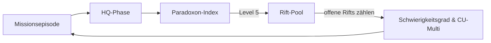
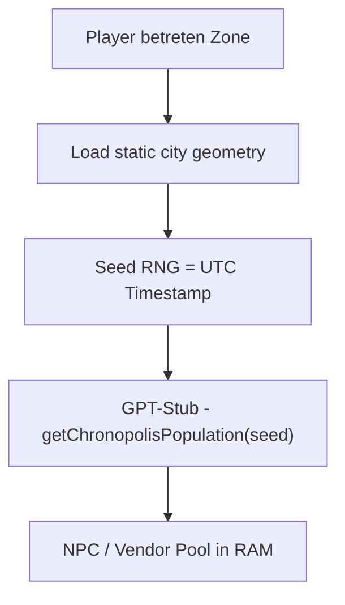

# ZEITRISS 4.1.6 – Modul 6: Regel- und Inspirationsmodul für langfristige Kampagnen

## Gameplay-Index

- Einführung
- Kampagnenplanung im ZEITRISS-Stil
- HQ-Verwaltung und Ausbau
- Beziehungen zu NSCs, Fraktionen und Mitagenten
- Mechaniken für langfristige Entwicklungen
- Erzählpausen, Freizeit und Alltag im HQ
- Arena-Modus: PvP-Kämpfe
- Chronopolis – Endgame-Hub
- Fazit

Diese Modulnummer setzt die Hauptreihe nach einem ausgelassenen siebten Teil fort.

## Einführung

**ZEITRISS 4.1.6** präsentiert ein filmisches, immersives Kampagnensystem, das Spielleiter*innen und
Spieler*innen hilft, epische **Langzeit-Abenteuer** zu gestalten. Dieses Modul bietet strukturierte
Werkzeuge für die Planung mehrteiliger Handlungsbögen, die Weiterentwicklung eines gemeinsamen
Hauptquartiers (HQ) und die Pflege von Beziehungen im Verlauf der Kampagne. Alle Elemente sind
**klar strukturiert** und **modular anwendbar**, sodass sie je nach Bedarf der Gruppe eingesetzt
werden können. Im Fokus steht stets das besondere **ZEITRISS-Flair** – temporeiche Einsätze durch
Raum und Zeit, dramatische Entscheidungen mit Folgen für die Geschichte und intime Charaktermomente
in einer lebendigen Basis. Im Folgenden werden die einzelnen Bausteine des Moduls ausführlich
beschrieben.

## Kampagnenplanung im ZEITRISS-Stil

Langanhaltende ZEITRISS-Kampagnen profitieren von einer **durchdachten Planung** und **flexiblen
Struktur**, die sowohl spannende Episoden als auch verzweigende Handlungsstränge ermöglicht. Im
Zentrum stehen **Handlungsbögen (Arcs)**, die wie Staffeln einer Fernsehserie organisiert sind und
in einzelne **Episoden** unterteilt werden. Jeder Bogen hat ein eigenes Thema oder Missionsziel,
während sich über die gesamte Kampagne ein roter Faden spannt.
Inspiration für komplette Arcs liefert der
[Arc-Generator](kreative-generatoren-missionen.md#arc-generator)
im Generator-Modul.

### Arc-Baukasten und Episodenstruktur {#arc-baukasten-und-episodenstruktur}

Stellt euch jede Kampagne als **Baukasten von Handlungsbögen** vor, aus denen ihr eure Geschichte
zusammensetzt. Ein Handlungsbogen kann z. B. eine bestimmte Bedrohung oder Epoche fokussieren. Er
besteht aus mehreren **Episoden** (Spielabenden oder Abenteuern), die in sich geschlossen spannende
Ereignisse zeigen und gemeinsam den Arc vorantreiben. Für jeden Handlungsbogen können folgende
Phasen geplant werden:

- **Einleitung:** Einführung in das neue Kapitel – z. B. eine mysteriöse Anomalie in der Zeit, erste
  Aufträge und Exposition der Lage.
- **Konflikt & Entwicklung:** Die Agenten stellen Nachforschungen an, treffen auf Hindernisse und
  bekommen es mit Rivalen oder **Fraktionen** zu tun. Die Spannung und das Tempo steigen, mehrere
  Handlungsfäden laufen zusammen.
- **Klimax des Arcs:** Eine dramatische Mission oder Konfrontation, die den Kern des Handlungsbogens
  auflöst. Filmisch kann dies ein Höhepunkt à la Staffelfinale sein, mit einem entscheidenden Sieg,
  Opfer oder einem Cliffhanger.
- **Übergang:** Nachbereitung der Ereignisse und Überleitung zum nächsten Arc. Hier bieten sich
  **Zwischensequenzen** oder Ruhephasen im HQ an, um die Veränderungen durch den letzten Arc zu
  verarbeiten.

Durch diese episodische Struktur erhalten die Spieler regelmäßig Erfolgserlebnisse und die Kampagne
bleibt **übersichtlich gegliedert**, ohne an epischer Gesamterzählung einzubüßen. Der **Arc-
Baukasten** erlaubt es der Spielleitung außerdem, bei Bedarf flexibel Episoden einzuschieben oder
Handlungsbögen zu verlängern, falls die Spieler z. B. unerwartete Nebenwege einschlagen.
```yaml
episode:
  min_scenes: 30
  max_scenes: 50
  setting_lock: true
  arc_generator_default: true
  sg_rift_bonus: 1
```
Jede Missionsphase kann sich dabei über mehrere Szenen erstrecken.

### Fraktionsdynamik und -Konflikte


Ein zentrales Element im ZEITRISS-Flair sind mächtige **Fraktionen**, die im Verborgenen über die
Zeit hinweg agieren. Jede Fraktion – ob verbündete Zeitagenten-Orden, feindliche Chrono-Kartelle
oder unabhängige historische Gruppierungen – verfolgt eigene Ziele. Um die Kampagne dynamisch und
lebendig zu gestalten, sollten diese Fraktionen aktiv in die Handlungsbögen eingewoben werden.

- **Fraktionen planen mit:** Gebt jeder wichtigen Fraktion einen Plan oder ein sich entwickelndes
  Ziel pro Arc. Zum Beispiel könnte eine rivalisierende Organisation versuchen, einen bestimmten
  historischen Ablauf zu manipulieren, während die Spieler versuchen, das zu verhindern.
- **Konflikte und Allianzen:** Die Fraktionen interagieren nicht nur mit den Spielercharakteren,
  sondern auch untereinander. Schmiedet Allianzen oder entfacht Konflikte im Hintergrund – etwa könnte
  eine dritte Partei unvermittelt eingreifen, was zu überraschenden Wendungen führt. Die Agenten
  könnten vor Entscheidungen gestellt werden, welche Gruppe sie unterstützen, was den Verlauf der
  Geschichte beeinflusst.
- **Veränderliche Machtverhältnisse:** Am Ende jedes Handlungsbogens sollte sich die Stellung der
  Fraktionen verändert haben. Notiert, welche Fraktion an Einfluss gewonnen oder verloren hat. Diese
  **dynamische Fraktionslandschaft** beeinflusst den nächsten Arc: Gegner, die man geschwächt hat,
  ziehen sich vielleicht zurück oder sinnen auf Rache, während gerettete Gruppierungen künftig als
  Verbündete auftreten. Dadurch entsteht ein lebendiges Geflecht an Beziehungen, das der Kampagne
  Tiefe und Abwechslung verleiht.

### Preserve-vs-Trigger-Logik

Eine Kampagne startet entweder im **Preserve**- oder **Trigger-Modus**.
Pro-Spielende übernehmen Preserve-Missionen, Contra-Spielende Trigger-Missionen.
Preserve-Missionen sichern Beinahe-Katastrophen,
während Trigger-Missionen dokumentierte Tragödien gewährleisten.
Die Seeds stammen aus getrennten Pools (`preserve_pool` bzw. `trigger_pool`).
Im Briefing nennt das HUD Zeit und Ort einer Instabilität;
welches Ereignis betroffen ist, deckt die Investigation auf.
Zur Auswertung nutzt die KI-Spielleitung je nach Modus
`history_ok_preserve()` oder `history_ok_trigger()`.
Eine kurze Zusammenfassung der Abläufe bietet das README.
#### Missionsablauf auf einen Blick {#mission-chart}


### Core- & Rift-Loop

Das Kampagnenspiel wechselt zwischen **Core-Ops** und **Rift-Ops**. Core-Missionen
setzen auf realistische Agentenaufträge. Welche Epoche betroffen ist, bestimmt
der [Random-Epochen-Generator](kreative-generatoren-missionen.md#epochen-generator). Für
Szenarien, die bekannte Ereignisse verändern, bietet der
[Historische Anomalien-Generator](kreative-generatoren-begegnungen.md#anomalie_realhistory)
zusätzliche Seeds. Artefakte können auch hier auftauchen, wenn der optionale
Wurf erfolgreich ist. Rift-Missionen werden aus der
[`RiftSeedTable`](kreative-generatoren-begegnungen.md#anomalien-generator) bestimmt und
enthalten immer Anomalien. Rifts bringen häufig sogenannte **Paramonster** hervor
– temporale Wesen, die im
[Generator-Modul](kreative-generatoren-begegnungen.md#kreaturen-generator) beschrieben sind.
Steigt der
Paradoxon-Index auf 5, löst `ClusterCreate()` neue Seeds aus und setzt den Wert
zurück. Offene Risse landen im Spielstand und lassen sich über das
**ClusterDashboard** einsehen. Die Gruppe kann einen Eintrag via
`launch_rift(id)` zu einer eigenständigen Episode machen und danach zum
Core-Generator zurückkehren. Diese **Rift-Ops** gelten als filmische
Einzelmissionen und zählen nicht zur Missionsanzahl eines Arcs.

Jeder Seed steht für ein offenes Pararift.
Sobald `ClusterCreate()` aktiv wird, springt der Paradoxon‑Index auf 0 und die neuen Seeds landen im Array `OpenRifts`.
Der Reset greift erst nach einer Runde, damit dramatische Szenen ausklingen können.
Bei parallelen Einsätzen zählt jeder Trupp seinen Index separat und merge ihn im HQ.
Optional kann ein **Index-Merge-Schalter** definieren, ob die Werte im HQ sofort
zusammengeführt oder getrennt bleiben.

Solange Seeds offen sind, erhöhen sie Schwelle und CU-Belohnung aller Missionen.
Nach einer Rift-Op verschwindet der zugehörige Seed, und die Boni sinken entsprechend.

#### Kurzübersicht: Missions-Rhythmus und Artefakte

- **Paradoxon-Index 0–5:** Jede Mission sammelt Paradox-Punkte. Erreicht der Index Stufe 5,
  löst `ClusterCreate()` automatisch 1–2 neue Seeds aus und setzt den Wert auf 0.
- **Rift-Pool:** Offene Seeds erhöhen die Probe-Schwelle und die CU-Belohnung
  für alle Einsätze. Ein Seed lässt sich jederzeit via `launch_rift(id)` als
  eigenständige Rift-Op starten.
- **Artefaktwürfe:** Zu Beginn längerer Missionen kann optional 1W6 gewürfelt
  werden. In riskanten Gebieten nutzt ihr **1W12 ≤ 1** (≈ 8 %) als Check. Nur bei
  Erfolg taucht ein Artefakt auf. Diese seltenen Funde dienen als besondere
  Belohnung oder Plot-Hook und können im HQ gegen CUs getauscht oder als
  Story-MacGuffin behalten werden. Beispiele liefert die Tabelle „Kuriose
  Artefakte & Relikte“ im Generator-Modul.
 - **Kurzmissionen** lassen den Paradoxon-Index langsamer steigen und
   zählen erst nach zwei Einsätzen als **+1**. Bei aktivem Paradox-Subsystem
   erhöht sich der Index grundsätzlich nur bei jedem zweiten Verstoß um **+1**.

#### Paradox-Subsystem

Weitere Details stehen im
[Paradox-Subsystem](../characters/zustaende-hud-system.md#paradox-subsystem).
Dieses Kapitel fasst die Effekte kurz zusammen:

| Stufe | In-Mission-Effekt  | HQ-Effekt                                    |
| ----- | ------------------ | -------------------------------------------- |
| 0–1   | Stabil             | –                                            |
| 2     | HUD-Flackern       | –                                            |
| 3     | Audio-Feedback         | –                                            |
| 4     | 1 s Zeitstillstand | "Riss-Vorstufe"-Flag                         |
| **5** | –                  | **ClusterCreate()** → 1–2 Seeds; Paradox = 0 |

Der Index wird kampagnenweit verfolgt. Bei Stufe 5 entstehen automatisch neue
Rift-Seeds.
Optional kann ein leichter ±1-Jitter aktiv sein, damit die Schwelle nicht exakt
vorhersehbar bleibt.

#### Cluster-Erzeugung

```pseudocode
threshold = 5
if jitter_on:
    threshold += random.choice([-1, 0, 1])

if paradox_level >= threshold:
    num = roll(1,2)
    cluster = []
    for i in range(num):
        cluster.append(roll_from("RiftSeedTable"))
    save_to_saveblock(cluster)
    paradox_level = 0
```

#### Mission-Schema

| Schiene      | Generator                         | Artefakte? | Stil                 | HUD                   |
| --------------------- | ------------ | ------------------ | ------------------------------- | --------------------- |
| **Core-Ops** | Rand-Epochen & CoreObjectiveTable | Selten (1W6 = 6) | Spionage-Thriller    | `[CORE MISSION - …]`  |
| **Rift-Ops** | RiftSeedTable d24                 | Selten (1W6 = 6) | Blockbuster-Anomalie | `[RIFT RESPONSE - …]` |

#### Missionsdauer vs. Soll-Szenen {#missionsdauer}

| Format | Dauer IRL | Soll-Szenen | Beschreibung |
| --------------------- | ------------ | ------------------ | ------------------------------- |
| **Mission (Core-Op)** | 60–75 min    | **12 Szenen**      | „Netflix-Folge” – Arc,<br> Cliffhanger, Level-Up |
| **Rift-Op (X-File)**  | 90–120 min   | **14 Szenen**      | Action-Thriller – zwei Peaks,<br>Twist und Finale |

### Staffel-Skeleton "Glanzlicht"

| Ep | Phase | Arbeitstitel             | Kernmechanik                                     |
| -- | ----- | ------------------------ | ------------------------------------------------ |
| 1  | Core  | Lieferung aus dem Nichts | Phantom-Stahllieferung (Logistik vs. Sabotage)   |
| 2  | Core  | Planer unter Zeitdruck   | Social-Heist im Baubüro                          |
| 3  | Core  | Kanal unter dem Palast   | Understreet-Einbruch                             |
| 4  | Core  | Der Schatten der Zukunft | Verfolgung / Gefecht mit Fremdfraktion           |
| 5  | Core  | Die Nacht der Bauprobe   | Sicherung oder Einbau letzter Zukunfts-Bauteile  |
| 6  | Core  | Bauabnahme               | Staffel-Finale: Bewahren vs. Auslösen            |

Rifts spawnen separat zwischen diesen Episoden und werden einzeln gelistet.

### Epoch-Lock & Rift-Loop

Zeitriss-Episoden bleiben stets in derselben Epoche. Erst nach rund 10 zusammen-
hängenden Missionen springt die Handlung weiter. Je höher der Paradoxon-Index,
desto mehr Rifts entstehen und beeinflussen die folgende Episode.

#### Grundablauf



Nach jeder Mission folgt eine **HQ-Phase**. Hier vergibt die SL Belohnungen,
Level-Aufstiege und verwaltet Ressourcen. Erst danach startet der nächste
Einsatz.

#### Offene Rifts

In der HQ-Phase entscheidet das Team pro Seed, ob es eindringt und ihn
versiegelt oder bis später warten will. Jeder offene Rift erhöht die
Probe-Schwelle und multipliziert die CU-Belohnung. Dieser Wert gilt
für alle Missionen – auch für Rifts – und wird nach jedem entfernten
Seed neu berechnet. Wer Risse absichtlich offen lässt,
bestimmt den künftigen SG damit selbst:

| Offene Seeds | Probe-Schwelle + | CU-Belohnung × |
| ------------ | ---------------- | -------------- |
| 0            | 0                | 1.0            |
| 1            | +1               | 1.2            |
| 2            | +2               | 1.4            |

Weitere Seeds werden linear addiert. Wer stylisch spielt und den natürlichen
Ablauf der Geschichte wahrt, generiert weniger Paradox-Punkte; plumpes Vorgehen
treibt den Zähler schneller hoch.

### Arc-Lock & Self-Collision Guard {#arc-lock}

Ein **Arc** umfasst in der Regel **10 Core-Missionen** desselben historischen Hotspots.
Die Handlung verläuft in der Regel vorwärts. Ein einzelner Rücksprung pro Arc
ist erlaubt, darf jedoch keine Selbstbegegnung ermöglichen.

```pseudo
if last_player_epoch == requested_epoch
   and abs(Δt) < 6h:
       redirect_same_slot(+6h)
```

Das Macro `redirect_same_slot()` verschiebt den Einsatzstart um mindestens sechs
Stunden. Bewahren und Triggern führen zum gleichen Ergebnis; nur Stil und
Paradox-Wert variieren.

#### Rift-Side-Ops

Eine Rift-Op umfasst eine **vollständige Mission**. Sie folgt dem
üblichen Ablauf Briefing → Aufklärung → Konflikt → Auswertung.
Meist bekämpfen die Agenten ein Paramonster, zerstören dessen Kern und
schließen damit den Seed. Der Schwierigkeitsgrad der Rift-Mission orientiert
sich an der zum Einsprung offenen Seed-Anzahl. Verlassen die Agenten den Rift,
schließt sich der Riss automatisch – gelungen oder nicht. Der Seed verschwindet
aus dem Pool, wodurch Schwelle und CU-Multi erneut sinken.
Während einer Rift-Op bleibt der Paradoxon-Index unverändert: Weder der
Einsprung noch die Ereignisse im Riss erhöhen ihn. Kontakt mit Artefakten kann
den Index dennoch steigern. Die Handlung ist eine eigenständige X-Files-Episode,
die nur thematisch zur aktuellen Epoche passt.

```text
Name / Epoche
Tier: Minor | Std | Major   HP: W6×Tier   DEF-Schwelle: 4–6
Signature-Power: <eine>    Weak Spot: <Skill DC>
Shard-Drop: 1+Tier
```

##### Rift-Op Film-Template {#rift-op-film-template}
Eine ausgedehnte Rift-Operation spielt sich wie ein Action‑Thriller und nutzt
ca. **14 Szenen**. Sie folgt einem einfachen Dreiakt‑Schema:

| Akt | Kernbeats |
| --- | --------- |
| **A** | Einstieg, erste Spur, kleiner Konflikt |
| **B** | Nachforschungen, Mid‑Twist, großer Showdown |
| **C** | Finale, Aufräumen, Exit‑Cliffhanger |
*`SceneCounter++` nach jeder Szene*

_SL-Sidebar:_ Die wahre Ursache der Anomalie bleibt geheim.
Gib sie nur preis, wenn die Spieler explizit nachforschen.


##### Mini-Walkthrough London-Arc – Endgültige Fassung {#mini-walkthrough-london-arc}

```yaml
# gameplay/kampagnenstruktur.md – Abschnitt Mini-Walkthrough London-Arc
title: "Mini-Walkthrough London-Arc"
id: EX-PRES-1851-LON
type: core_op            # wichtig: nicht rift_op
preserve_only: true
version: 4.1.6
```

| Phase / Szene  | Ereignis & Mechanik |
| -------------- | ------------------- |
| **Mission 1**  | Stealth-Mission Crystal Palace. Brand verhindern (Preserve). Gegner: Gearwright Cabal. Index 2/5. |
| **HQ-Phase 1** | Paradoxon < 5 -> kein ClusterCreate(). |
| **Mission 2**  | Gasleitung sabotiert. Index 5/5. `ClusterCreate()` -> Seed R-089. Seed offen: +1 Schwelle, CU×1.2. |
| **HQ-Phase 2** | Team lässt Seed offen; später eigene Rift-Op. Paradoxon auf 0/5. |
| **Mission 3**  | Finale im Crystal Palace: Cabal ausschalten. Seed offen: +1 Schwelle, CU ×1.2. Brand vereitelt. |
| **Epilog**     | Crystal Palace intakt, Core-Arc endet. Seed R-089 bleibt offen für spätere Rift-Op. |
##### Mini-Walkthrough Mauerbau 1961 {#mini-walkthrough-mauerbau-1961}

```yaml
# gameplay/kampagnenstruktur.md – Abschnitt Mini-Walkthrough Mauerbau 1961
title: "Mini-Walkthrough Mauerbau 1961"
id: EX-TRIG-1961-BER
trigger_only: true  # eindeutiger Modus
version: 4.1.6
```

| Schritt       | Ereignis & Ziel |
| ------------- | ---------------------------------------------------------------------- |
| **Mission 1** | Ankunft in Ost-Berlin · Agenten sondieren Grenzposten & Schleuserwege. |
| **Mission 2** | Baupläne des "Antifaschistischen Schutzwalls" sichern · Kontaktperson (Stasi-Logistiker) schützen. |
| **Mission 3** | **Ziel:** Organisiere koordinierte Unruhen, damit SED den Mauerbau überstürzt beschließt. |
| **Epilog**    | Mauer wird 12./13. August errichtet.<br>Fluchtwege brechen ab, Zeitlinie bleibt unverändert. |

> *Gegenspieler:* "Plenum 89 Humanists" versucht, Bau zu verzögern (Preserve‑Fraktion).
> *ITI‑Trigger‑Auftrag:* sicherstellen, dass Blockadepläne scheitern.

### Was wurde bereinigt?

1. **Doppelter Schritt 3 entfernt:** Es gibt nur noch die Trigger‑Variante.
2. **Preserve‑Markierungen gestrichen:** Kein „Schleuserroute sichern“ mehr.
3. **Epilog umgeschrieben:** Er bestätigt den historischen Ausgang.

##### Quick-Mission Feuerkette 1410 {#quick-mission-feuerkette-1410}

*45-Minuten-Demo, Tannenberg/Grunwald*

> **ZEITPUNKT** 15. Juli 1410 – Vorabend der Schlacht von Tannenberg
> **ORT** Hügelkuppe "Witold-Höhe", 2 km südwestlich des Heerlagers der Ordensritter
> **AUFTRAG** Sabotiert einen hölzernen **Signal-Leuchtturm**, dessen Feuerkette Verstärkung anfordert.

```yaml
# Preserve objectives
preserve_only: true
objective: |
  Entferne Pulverrückstände, damit die Kette erst 1410/07/15 detoniert, wie überliefert.
antagonist: "Der Alte Orden"
antagonist_goal: "Signalkette auslösen und Verstärkung rufen"
```

###### Szenenübersicht

| # | Ort | Konflikt | Ziel | Spur | SG |
|---|-----------------|----------------------------------|--------------------|----------------------------------|----|
| 1 | Zeltlager (Nacht) | Patrouille & Hund | In Lager eindringen | Geräusch ferne Hammerschläge | 6 |
| 2 | Schmiedehütte | Glühende Kette, Schmied misstrauisch | Probenstück sichern | 2. Wachposten nähert sich | 7 |
| 3 | Schleusengraben | Altes Schleusentor blockiert | Zugang zum Geheimgang | Zeitdruck – Wasser steigt | 8 |
| 4 | Pulverkammer | Schloss + Giftgasfalle | Zugang zur Feuerkette | Merkt: Ketten noch ungefährlich | 9 |
| 5 | **Decision Room** | – | Rückstände entfernen, damit die Feuerkette ausbleibt | Alarm oben | – |
| 6 | Turmaufstieg | Leitertest, feindlicher Bogenschütze | Flucht auf Wehrgang | Belagerer rücken an | 7 |
| 7 | Wehrgang-Tor | Fallgitter blockiert | Exfiltration | Rauchwolke im Tal | 6 |

*SceneCounter++ nach Szene 7.*
##### Kurzabenteuer „Operation GLASLÄUFER“ {#operation-glaslaeufer}

*10-Seiten-Outline, Berlin 1961*

| Phase | Inhalt | Spielmaterial |
| ----- | --------------------------------------------------------------- | ------------------------ |
| **Briefing** | West-Alliierten-Funkmast droht Sabotage. Abhörgerät platzieren. | Hand‑out Funkmast-Schema |
| **Ankunft** | Regen, Checkpoint Charlie, Mauerbau im Gange. | Foto-Moodboard |
| **Aufklärung** | Patrouillen-Routen, falsche Baupläne, NSC Stasi-Ingenieur. | Mini-Map ½ A4 |
| **Zugriff** | Schleichen oder Social-Hack im Baucontainer. | Timer 4 Runden |
| **Eskalation** | Paradoxon‑Index +1 → Zeitsoldaten erscheinen. | Statblock |
| **Exfiltration** | Dampfer über Spree, Mauer‑Scheinwerfer. | Chase-Referenz |
| **Rücksprung** | Mission endet, Rücksprung ins HQ. | Debrief‑Bogen |

*`SceneCounter++` nach jeder Phase*
*Start in 60 Sek.*
1. Wählt Pre-Gen-Operative.
2. Das ITI stellt ein Standard-Loadout kostenlos bereit; Zusatzgear kostet
   CUs (siehe Modul 15).
3. SL würfelt Wetterprobe, nennt Sicht & Geräuschpegel. Los!

#### Dev-Check-Liste

- Paradox-Tracker 0–5 bleibt bestehen.
- Bei Level 5 `roll(1d2)` Seeds im aktuellen `epoch_id` anlegen.
- Rift-Pool als Array: `seed_id` und `status(open/closed)`.
- Schwierigkeit = `base_dc + open_seeds`.
- CU = `base_cu * (1 + open_seeds*0.2)`.
- Side-Op erzeugt ein Paramonster nach dem obigen Template im aktuellen `epoch_id`.
- Rift-Operationen erhöhen den Paradoxon-Index nicht und schließen sich nach dem Verlassen automatisch.
  Artefaktkontakt kann dennoch Punkte auslösen.

#### Adaptive Opposition

Steigt der Paradoxon-Index während einer Mission auf 3 oder höher, reagieren
Antagonisten aktiver. Jeder wichtige Gegner erhält einmalig einen kleinen
taktischen Vorteil – etwa einen Drohnen-Sweep oder einen vorbereiteten
Hinterhalt. Diese Routine verändert den Grund-Schwierigkeitsgrad nicht, sorgt
aber für glaubwürdig agierende Gegenspieler.

### Zeitlinien-Verzweigungen

ZEITRISS-Kampagnen spielen mit dem Konzept alternativer Geschichtsverläufe. **Zeitlinien-
Verzweigungen** sind Entscheidungspunkte, an denen die Handlungen der Spieler die Zukunft spürbar
verändern. Um dies umzusetzen, kann die Spielleitung wichtige Szenarien mit zwei (oder mehr)
möglichen Auflösungen planen. Jede Auflösung führt die Kampagne auf einer etwas veränderten
**Timeline** weiter:

- **Schlüsselentscheidungen definieren:** Identifiziert in jedem Arc ein bis zwei große
  Entscheidungen oder Missionsausgänge, die das Potential haben, den Verlauf der Geschichte zu
  verändern. Das können moralische Dilemmas sein (z. B. einen wichtigen Zeitzeugen retten oder opfern)
  oder strategische Wahlmöglichkeiten (welcher Fraktion wird ein mächtiges Artefakt überlassen?).
- **Alternative Zeitlinien ausarbeiten:** Skizziert für jede mögliche Entscheidung die Konsequenzen.
  Zum Beispiel: Wenn die Agenten **Option A** wählen, gewinnt Fraktion X in der Zukunft die Oberhand –
  was zu einer ganz anderen Ausgangslage im nächsten Arc führt, als wenn **Option B** gewählt würde,
  bei der vielleicht die Geschichte auf den ursprünglichen Pfad zurückgelenkt wird. Diese
  Vorausplanung muss nicht alle Details enthalten, aber klare **Was-wäre-wenn-Szenarien** bieten der
  Spielleitung Orientierung, sobald die Spieler eine Richtung einschlagen.
- **Kontrollierte Verzweigung:** Um die Kampagne beherrschbar zu halten, sollte man nicht jede
  Sitzung verzweigen lassen. Wählt gezielt die wichtigsten Punkte aus. Nach einer Verzweigung kann man
  die Handlungsfäden später auch wieder zusammenführen, wenn nötig. Das ZEITRISS-Flair erlaubt es,
  dass die Charaktere vielleicht sogar **Auswirkungen ihrer Alternativ-Entscheidung** erleben – etwa
  durch Berichte im Codex – ohne tatsächlich beide Wege vollständig ausspielen zu
  müssen. Dies erhöht das Bewusstsein der Spieler für die Konsequenzen ihres Tuns, ohne die Kampagne
  unübersichtlich zu machen.

Durch die Kombination aus klar strukturierten Arcs, lebendigen Fraktionsdynamiken und wohlüberlegten
Zeitlinien-Verzweigungen wird die Kampagne sowohl **spannend und flexibel** als auch thematisch
kohärent gehalten. Die Spieler spüren, dass ihre Taten Bedeutung haben, was die Immersion und
Motivation enorm steigert.

### Erweiterte Zeitreise-Regeln

#### Selbstbegegnung – „Zeit-Double“
- Ein Agent kann sich nie bewusst selbst begegnen – mehrere Ichs würden die Realität zerreißen.
- Bereits der Versuch ruft die Kausalklingen auf den Plan und erzwingt einen sofortigen Notfallrücksprung.

### Schauplatz-Tags

Kennzeichne Missionen mit ein bis zwei kurzen Tags, um zu zeigen, welche
Fähigkeiten dort glänzen. Beispiele:

| Tag        | Effekt                                                        |
|-----------|---------------------------------------------------------------|
| **dicht** | Viele Deckungen, kurze Sicht – Infiltratoren im Vorteil       |
| **erhöht** | Offene Höhenlagen, ideal für Scharfschützen                  |
| **überfüllt** | Zivilistenströme erschweren Feuergefechte, fördern Social Play |

## HQ-Verwaltung und Ausbau

Das **Hauptquartier (HQ)** der Agenten ist in ZEITRISS mehr als nur ein Aufenthaltsort – es wird im
Verlauf der Kampagne zu einem Spiegel der Erfolge der Gruppe und einem zentralen **Dreh- und
Angelpunkt der Geschichte**. Ein ausgebautes HQ verleiht den Spielercharakteren neue Möglichkeiten,
Ressourcen und Szenen für Rollenspiel. Um das HQ fühlbar wachsen zu lassen, bietet dieses Modul ein
**Ausbau- und Verwaltungssystem**:

Nach jedem Auftrag bietet die Spielleitung an, ins sichere ITI-Hauptquartier zurückzukehren. Dort
finden Debriefing, Heilung und Planung der nächsten Schritte statt. Diese Rückkehr ist fester
Bestandteil des Spielrhythmus, bleibt aber freiwillig: Wer sofort weiterspringen will, kann das
tun.

### Ausbaustufen und Einrichtungen

Zu Beginn nutzen die Agenten das **ITI-Hauptquartier** in der Nullzeit als Basis für ihre Einsätze.
Im Laufe der Kampagne erwerben sie Zugangs-**Stufen** innerhalb ihres Fraktionskomplexes im ITI.
Ein eigenständiges HQ außerhalb der Nullzeit ist nicht vorgesehen.
Durch Erfolge und Ressourcen können sie diese Stufen **freikaufen**.
So erhalten sie Zugang zu bereits bestehenden Einrichtungen oder erweitern diese.
Jede Freischaltung gilt als Investition in die eigene Fraktion.
Beispiele für Bereiche, zu denen Stufen erworben werden können, sind im
HQ:

- **Kommandozentrale:** Das Herz des HQ, von wo aus Zeitreisen koordiniert werden. Ausbau ermöglicht
  bessere Überwachung der Zeitlinien, schnellere Kommunikation mit Agenten in verschiedenen Epochen
  und Zugriff auf historische Daten. Mit einer erweiterten Kommandozentrale könnten z. B. neue
  Missionen früher erkannt oder Gefahren in der Timeline prognostiziert werden.
- **Labor für temporale Forschung:** Hier untersuchen Wissenschaftler\*innen und Agenten
  zeitverzerrte Artefakte, Paradox-Energien und neue Technologien. Ein Labor-Ausbau erhöht die
  Chancen, **technologische Upgrades** oder hilfreiche Gadgets zu entwickeln. Im Spiel kann dies
  bedeuten, dass die Gruppe zwischen Missionen neue Ausrüstung freischaltet oder bessere Methoden
  erhält, Anomalien zu analysieren.
- **Werkstatt & Maschinenraum:** Die Werkstatt erlaubt es, Ausrüstung zu reparieren, maßzuschneidern
  oder sogar Zeitreise-Geräte zu modifizieren. Je besser ausgestattet die Werkstatt, desto effizienter
  können z. B. beschädigte Zeitgeräte wiederhergestellt oder Fahrzeuge (Zeitshuttle, Chrono-Anzug
  etc.) gewartet werden. Dies bietet einen **greifbaren Vorteil** in späteren Missionen, weil die
  Agenten dank guter Ausrüstung weniger improvisieren müssen.
- **Trainingshalle & PvP-Arena:** Mit dieser Ausbaustufe steht den Agenten die **ITI‑Arena** zur Verfügung.
  Holoprojektoren ermöglichen Duelle oder Teamkämpfe ohne reales Risiko. GPT übernimmt fehlende
  Teammitglieder und auch das gegnerische Aufgebot, sodass immer identische Teamgrößen antreten.
  Im Solo-Modus stammen diese Platzhalter aus deiner gewählten Fraktion. In Mehrspielerpartien
  wählt Codex die Fraktion mit den meisten Teilnehmenden, um freie Slots zu besetzen.
  **Codex** moderiert die Matches und blendet Punktestände ein. Durch intensives Training lassen sich
  neue Fertigkeiten freischalten oder Boni auf passende Proben erzielen.
- **Persönliche Quartiere:** Jeder Agent verfügt über einen eigenen Raum oder Bereich, der nach und nach
  personalisiert werden kann. Egal in welchem Fraktionskomplex ihr euch befindet – ein eigener
  Stützpunkt außerhalb des ITI ist nicht vorgesehen.
  Dieser persönliche Rückzugsort bleibt erhalten. Erinnerungsstücke an vergangene Missionen
  lassen das HQ zum Tagebuch der Gruppe werden. Ausbaustufen können zusätzlichen Komfort oder Sicherheit
  bieten, z. B. einen privaten Tresor für persönliche Gegenstände oder einen Ort zur Meditation,
  was im Spiel beispielsweise Stress abbauen kann.
- **Medizinisches Zentrum:** Ein Bereich mit Krankenstation und vielleicht sogar einer temporalen
  Stabilisierungskammer. Bei Ausbauten verbessert sich die medizinische Versorgung, Verletzungen der
  Agenten können zwischen Abenteuern schneller geheilt werden. Zudem können **zeitbedingte
  Beschwerden** (z. B. Alterungseffekte durch Zeitsprünge oder Paradox-Erkrankungen) hier behandelt
  werden, was dem Team erlaubt, nach riskanten Missionen schneller wieder einsatzbereit zu sein.
- **Archive & Codex:** Eine umfangreiche Bibliothek bzw. Datenbank, in der Wissen aus allen Epochen
  gesammelt wird. Im ZEITRISS-Universum könnte dies der **Codex** sein – eine KI-gestützte Sammlung
  aller bekannten Fakten und Berichte. Durch Ausbau der Archive erhält der Codex mehr Rechenleistung
  oder Zugang zu geheimen Datenbanken, was bedeutet, dass die Agenten komplexe historische Rätsel
  leichter lösen können. Außerdem dient der Codex als Erzählinstrument (siehe unten bei
  **Zwischensequenzen**). Ein ausgebautes Archiv könnte auch **Story-Boni** geben: z. B. einen Hinweis
  auf die Schwachstelle eines kommenden Gegners oder eine Prophezeiung, die im richtigen Moment
  auftaucht.

Jede dieser Einrichtungen kann in **Stufen** ausgebaut werden. Man kann dies narrativ handhaben
(„Nach dem erfolgreichen Abschluss von Arc 1 kommt Unterstützung vom Zeitrat und das HQ erhält ein
Upgrade…“) oder mit einfachen Regeln versehen (etwa dass die Spieler pro großem Erfolg oder pro
ausgegebener Ressource einen Ausbaupunkt erhalten, den sie investieren können). Wichtig ist, dass
die Spieler _spüren_, wie ihr HQ wächst: Beschreibt neue Räume filmisch, betont den Stolz und die
verbesserte Moral der dortigen Crew, und lasst neue spielerische Optionen entstehen.

Einige höhere Ausbaustufen verlangen darüber hinaus einen entsprechenden **Rufwert** bei der gewählten Fraktion.
In der Regel öffnen sich sensible Bereiche des Komplexes erst ab etwa **Ruf +2**.
Wechselt eine Gruppe innerhalb ihrer Ausrichtung die Fraktion, bleiben freigeschaltete Stufen erhalten.
Auch angesammelter Ruf geht nicht verloren.

### Ressourcenmanagement

Der HQ-Ausbau geht Hand in Hand mit **Ressourcenverwaltung**. In einer Langzeitkampagne können die
Spieler verschiedene Ressourcen sammeln, die für Upgrades ausgegeben werden müssen. Beispiele im
ZEITRISS-Kontext:

- **Shards:** Spezielle Splitter aus Riss-Operationen oder geborgenen Artefakten.
  Sie sind die Hauptressource für High-Tech-Upgrades im HQ.
  Beispiel: Verstärkung der Zeitreaktoren in der Kommandozentrale.
- **Finanzielle Mittel:** Je nach Epoche und Unterstützung durch Gönner (oder durch Plünderung
  aufgegebener Schätze in der Vergangenheit) kann die Organisation der Agenten auch Geld oder
  Handelssachen ansammeln. Diese dienen zum Ausbau von irdischer Infrastruktur – Personal einstellen,
  Gebäude erweitern, Ausrüstung kaufen.
- **Personal & Kontakte:** Neue Verbündete oder Experten, die im Laufe der Kampagne dazukommen, kann
  man ebenfalls als Ressource sehen. Ein brillanter Wissenschaftler NSC im Labor verbessert faktisch
  dessen Leistungsfähigkeit. Ein Veteran-Agent als Ausbilder steigert die Effekte der Trainingshalle.
  Solche **personellen Ressourcen** können als Belohnung für bestimmte Missionen vergeben werden
  („Prof. X schließt sich eurem Team an und leitet nun die temporale Forschung – Laborstufe steigt um
  1“).

Die Spielleitung sollte den Spielern klare Gelegenheiten geben, Ressourcen zu verdienen – z. B. als
Missionsbelohnung, durch das Lösen von Nebenquests oder durch Handel mit Fraktionen. Ebenso wichtig:
Entscheidungen beim Ausgeben dieser Ressourcen. **Priorisierung** ist ein spannender Teil des Spiels
– das Team muss vielleicht wählen, ob es zuerst die Verteidigung des HQ stärkt oder lieber bessere
Analysewerkzeuge beschafft. Diese Entscheidungen wirken sich dann auf kommende Abenteuer aus. Ein
ausgebautes HQ kann außerdem selbst zum Plotpunkt werden, etwa wenn Feinde versuchen, es
anzugreifen, oder wenn ein Experiment im Labor unerwartete Folgen hat. So bleibt das Hauptquartier
stets im Zentrum der Erzählung und wächst organisch mit der Geschichte mit.

## Beziehungen zu NSCs, Fraktionen und Mitagenten

Cineastische Kampagnen leben von starken **Charakterbindungen**. In ZEITRISS 4.1.6 sind es nicht nur
die Ereignisse der Zeitreise, die fesseln, sondern auch die persönlichen Verbindungen der Agenten zu
wichtigen Figuren der Welt – seien es **NSCs**, **Fraktionen** oder die eigenen **Mitstreiter**.
Dieses Modul bietet Ansätze, wie man diese Beziehungen entwickeln und mechanisch wie narrativ
abbilden kann. So entsteht über lange Zeit ein Geflecht an Loyalitäten, Konflikten und Emotionen,
das den Spielern noch mehr Investition in die Handlung gibt.

### Beziehungen zu NSCs aufbauen

NSCs (Nicht-Spieler-Charaktere) – ob historische Persönlichkeiten, Zeitreisende oder Kollegen im HQ
– sollten in einer langen Kampagne wiederkehrend auftreten und Profil gewinnen. Um die Beziehungen
zu diesen Figuren greifbar zu machen, kann die Spielleitung ein **Beziehungswert** oder zumindest
einen notierten Status für wichtige NSCs einführen.

- **Beziehungsstufen:** Legt für Schlüsselfiguren fest, wie eng das Verhältnis zu den Agenten ist.
  Zum Beispiel: 0 = Feindselig, 1 = Neutral, 2 = Verbündet, 3 = Vertraut, 4 = Eng befreundet. Die
  Stufen müssen nicht zahlenmäßig genannt werden, können aber im Hintergrund helfen.
- **Entwicklung durch Taten:** Erhöht oder senkt die Beziehung je nach Aktionen der Spieler. Rettet
  das Team etwa einen NSC vor dem Tod oder hält ein wichtiges Versprechen, kann die Vertrauensstufe
  steigen. Werden Erwartungen enttäuscht oder kommt es zu Verrat, sinkt sie. Diese Änderungen sollte
  die Spielleitung **spürbar ausspielen** – z. B. indem der NSC sich offener und hilfsbereiter zeigt
  oder eben distanzierter und kühler auftritt.
- **Belohnungen aus Beziehungen:** Eine enge Beziehung bringt narrative und praktische Vorteile. Ein
  dankbarer NSC-Verbündeter könnte in einer kritischen Situation zur Hilfe eilen, geheime
  Informationen preisgeben oder sogar bereit sein, Opfer für die Agenten zu bringen. Auf der anderen
  Seite können verärgerte NSCs zu wiederkehrenden Gegnern werden oder der Gruppe Steine in den Weg
  legen.
- **Verschiedene Facetten:** Nicht alle NSC-Beziehungen müssen positiv sein. Rivalitäten oder
  Antipathien können ebenso gepflegt werden. Ein **Rivale** unter den Zeitagenten oder ein
  antagonistisch gesinnter Chronist könnte regelmäßig auftauchen, um die Agenten herauszufordern.
  Solche Beziehungen bringen Spannung und emotionale Tiefe, wenn z. B. ein Feind später widerwillig
  zum Verbündeten wird, weil größere Gefahren drohen.

### Fraktionsruf und Allianzmanagement

Neben individuellen NSCs sollten die Agenten auch ihren **Ruf bei verschiedenen Fraktionen**
aufbauen. Für jedes Bündnis oder jede Rivalität kann die SL einen Wert von –5 bis +5 notieren.
Wie viele Missionserfolge zum Aufstieg nötig sind und welche Auswirkungen hohe beziehungsweise
niedrige Werte haben, wird detailliert im Modul
[Charaktererschaffung](../characters/charaktererschaffung.md#rufsystem-ansehen-bei-fraktionen--iti)
beschrieben. Dort findet ihr auch eine grobe Missions-Tabelle. Kurz gesagt steigt der Ruf nur sehr
langsam, kann aber durch **Fraktionsquests** schneller wachsen. Die SL sollte außerdem aufzeigen,
wie sich Allianzen und Feindschaften zwischen den Fraktionen gegenseitig beeinflussen.

Das **Allianzmanagement** wird so zu einem eigenen kleinen Spiel innerhalb der Kampagne. Spieler
haben das Gefühl, Teil eines größeren Ganzen zu sein, und ihre Taten strahlen über einzelne
Begegnungen hinaus. Visualisieren kann man den Fraktionsruf etwa mit Diagrammen im Codex oder an
einer Pinnwand im Spielzimmer, sodass alle den Status stets vor Augen haben.

### Teamdynamik unter Mitagenten

Die Beziehungen der **Spielercharaktere untereinander** (und ggf. zu wichtigen Agenten-NSCs im Team)
sind ebenso entscheidend für die Atmosphäre. Im Verlauf einer langen ZEITRISS-Kampagne durchleben
die Agenten gemeinsam Triumphe und Tragödien – das schmiedet Zusammenhalt oder sät Misstrauen, je
nachdem. Das Modul regt an, die **Teamdynamik** aktiv zu gestalten:

- **Hintergrund und Bindungen:** Ermutigt die Spieler, von Anfang an Verbindungen zwischen den
  Charakteren zu definieren. Haben sie gemeinsam eine Ausbildung durchlaufen? Gab es ein prägendes
  Erlebnis (eine erste missglückte Mission, aus der sie gelernt haben)? Solche geteilten Hintergründe
  schaffen initiales Vertrauen oder Spannungen, die im Spiel aufgegriffen werden können.
- **Interne Konflikte ausspielen:** Meinungsverschiedenheiten gehören zu einem dramatischen Verlauf
  dazu. Vielleicht sieht ein Agent die Mission pragmatisch, während ein anderer moralische Bedenken
  hat – so entstehen intensive Dialogszenen. Wichtig ist, diese Konflikte konstruktiv auszuspielen:
  Sie sollten die Charakterentwicklung fördern und idealerweise zu **Wachstum oder Kompromissen**
  führen, statt die Gruppe zu sprengen. Das ZEITRISS-System könnte hier z. B. _Determinationspunkte_
  oder ähnliches vergeben, wenn ein Charakter seine Überzeugung treu bleibt und dadurch das Team
  voranbringt (cinematisch wie der Held, der zunächst gegen den Plan ist, am Ende aber genau dadurch
  alle rettet).
- **Team-Boni durch Vertrauen:** Wenn die Agenten eng aufeinander eingespielt sind, könnte die
  Spielleitung kleine Boni gewähren, die das reflektieren. Zum Beispiel ein **Synergie-Bonus**: Zwei
  Charaktere, die einen hohen Vertrauenswert zueinander haben, erhalten einen Vorteil, wenn sie
  gemeinsam an einer Aufgabe arbeiten (einer lenkt ab, der andere schlägt zu – solche Tandem- Aktionen
  funktionieren reibungsloser). Das muss nicht mechanisch komplex sein, kann aber die Spieler
  belohnen, wenn sie als Team agieren.
- **Gemeinsame Entscheidungen:** Lasst die Spieler auch abseits der Missionen gemeinsam
  Entscheidungen über ihr Vorgehen treffen (z. B. welchen HQ-Ausbau priorisieren wir, welcher Fraktion
  trauen wir mehr?). Diese **Strategie-Besprechungen** im HQ können als Rollenspielszene stattfinden
  und fördern die Gruppendynamik. Hier zeigt sich, wer das Sagen hat, wer vermittelt – wie in einer
  Serie, in der sich das Team um den Kartentisch schart und diskutiert.

Eine gut entwickelte Teamdynamik erhöht die Immersion enorm: Die Spieler fühlen sich wie Teil einer
echten Agentengruppe. Bei Erfolgserlebnissen feiern sie zusammen, bei Rückschlägen trösten sie sich
gegenseitig – genau solche Momente machen eine langfristige Kampagne unvergesslich.

### Team-Perks {#team-perks}

Nach einigen gemeinsamen Missionen kann die Gruppe **Team-Perks** freischalten. Diese Spezialisierungen
repräsentieren eingespielte Taktiken oder besondere Ausrüstung und werden im HQ erworben.

**Beispielhafte Perks**

- **Diplomatenteam** – verbessert den ersten Eindruck; eine Sozialprobe pro Begegnung erhält Vorteil.
- **Datenverbund** – dauerhafte Vernetzung, +1 auf koordinierte Aktionen.
- **Kampfverbund** – +1 auf Angriff und Abwehr, einmal pro Kampf einen Gegner gemeinsam ausschalten.
- **Fahrzeug-Crew** – +2 auf Fahrzeugwürfe, solange ein Mitglied unterstützt.
- **Feldklinik** – nach Gefechten regeneriert jeder zusätzlich 1 Treffer.
- **Geistertruppe** – Vorteil bei Infiltrationen und Sabotage.
- **Ballistische Optik 2.0** – +1 Erfolg auf Distanz von vorbereiteter Position.
- **Ricochet Tag** – markiert ein Ziel per Abpraller; der nächste Schuss ignoriert Telekinese-Deckung.

Ein Perk kostet meist Ressourcen oder Training. Aktiv sein sollte immer nur ein Bonus gleichzeitig.
### Solo Ops {#solo-ops}

Solo-Spieler erhalten eine taktische Begleitdrohne als Wingman. Nutze folgendes Template:
- **NPC Tac-Drone** – Robustheit 1, kleine Schwebdrohne; +1 auf Wahrnehmungs- und Zielerfassungswürfe.

Bei Stresswürfen ohne Team darf der Agent sich selbst sammeln (_Selbst-Rally_) bei **TN +1**.
Die Drohne zählt nicht als vollwertiger Spielercharakter, bietet aber narrative Hilfe.


### Encounter-Pools außerhalb des HQ {#encounter-pools-ausser-hq}

#### 1 Einsatzkategorien & Nutzung

| Kategorie | Phase | Typischer Einsatz | Wurf-Empfehlung |
| --------- | ----- | ----------------- | --------------- |
| **CORE OPS** | Aufklärung → Zugriff → Exfiltration | Standardmissionen (Sabotage, Sicherung, Extraction) | 1W12 |
| **RIFT OPS** | Bei Paradoxon ≥ 2 oder Cluster-Events | Umgang mit Zeitrissen & Anomalien | 1W10 |
| **FIELD DOWNTIME** | Reiseabschnitt, Low-Signal-Momente | Kurze Verschnaufpausen fernab des HQ | 1W8 |

_Regel: Würfle bei Szenenübergang oder dramaturgischer Flaute; Ergebnisse dürfen frei interpretiert
oder logisch ersetzt werden._

#### 2 CORE OPS-Pool (1W12)

| Wurf | Codex-ID | Encounter & Kurzbriefing | Konflikt | Basis-DC | Paradoxon |
| ---- | -------- | ----------------------- | -------- | -------- | --------- |
| 1 | **EC-CORE-001** | *Grenzposten 1985*: Soldaten filzen Waggon; Team versteckt Gear. | Stealth / Social | 9 | 0 |
| 2 | **EC-CORE-002** | *Hochhaus-Abseilroute 2072*: Plattform-Einstieg, Sturm. | Infiltration / Klettern | 11 | 0 |
| 3 | **EC-CORE-003** | *Stromausfall 1999*: Notstrom, Fenster 10 Min. | Tech / Sabotage | 10 | +1 bei Verzögerung |
| 4 | **EC-CORE-004** | *Undercover-Auktion 1928*: Bieten auf Artefakt; rivaler Sammler. | Social / Bluff | 8 | 0-1 |
| 5 | **EC-CORE-005** | *Konvoi-Hinterhalt*: Drohne meldet Routen-Split. | Kampf / Fahrzeug | 12 | 0 |
| 6 | **EC-CORE-006** | *Fabrikloft-Labor 2025*: Bio-Schleuse, Chefin da. | Hack / Psi | 10 | +1 bei Psi-Einsatz |
| 7 | **EC-CORE-007** | *Flusskanal-Zufahrt 1643*: Tor öffnet nur heute bei Vollmond. | Survival / Timing | 9 | 0 |
| 8 | **EC-CORE-008** | *Mediensturm*: Presse da, Kameras an. | Social / Disguise | 10 | +1 falls Zeitfehler live |
| 9 | **EC-CORE-009** | *Cipher-Server NB-II*: Admin anwesend, kennt Logs. | Tech / Social | 11 | 0 |
| 10 | **EC-CORE-010** | *U-Bahn-Flucht*: Zielperson springt in Zug, Notbremse deaktiviert. | Chase | 10 | 0 |
| 11 | **EC-CORE-011** | *Magnetbahn-Deraillieren 2334*: Schiene sabotiert, Chaos. | Infiltration / Repair | 12 | +1 |
| 12 | **EC-CORE-012** | *Orbital-Relais Beta*: Außenbord-Hatch klemmt, Mikro-Meteoriten. | EVA / Tech | 13 | 0 |

#### 3 RIFT OPS-Pool (1W10)

| Wurf | Codex-ID | Encounter & Kurzbriefing | Konflikt | Basis-DC | Paradoxon |
| ---- | -------- | ----------------------- | -------- | -------- | --------- |
| 1 | **EC-RIFT-001** | *Zeit-Doppel*: Kopie des Teams (5 Min Versatz). | Social / Identity | 11 | +2 wenn ignoriert |
| 2 | **EC-RIFT-002** | *Schwerkraft-Flimmern*: Lokal 0.7 g, Equipment-Checks erschwert. | Survival | 9 | +1 |
| 3 | **EC-RIFT-003** | *Zeitregen*: Regen prasselt rückwärts, Sichtverhältnisse verzerrt. | Stealth / Psi | 10 | +1 |
| 4 | **EC-RIFT-004** | *Cluster-Market*: Schwarzhandel mit Out-of-Era-Tech. | Social / Tech | 10 | +1-2 bei Käufen |
| 5 | **EC-RIFT-005** | *Chrono-Fauna*: Raubtier mit Phasen-Sprung-Muster greift Patrouille an. | Kampf | 12 | 0 |
| 6 | **EC-RIFT-006** | *Looper-Schall*: Geräuschfetzen aus Zukunft warnen vor Wache. | Infiltration | 9 | 0 |
| 7 | **EC-RIFT-007** | *Parallax-Treppe*: Flur mit drei Offsets; nur einer passt. | Rätsel | 11 | +1 je Fehlversuch |
| 8 | **EC-RIFT-008** | *Cluster-Repair-Droid*: Flickt Riss, fordert "Pfand": Ausrüstung. | Verhandeln | 10 | 0 |
| 9 | **EC-RIFT-009** | *De-Sync Pulse*: Elektronik rebootet zufällig; Psi-Module glitch. | Tech / Psi | 12 | +1 |
| 10 | **EC-RIFT-010** | *Rift-Seed-Bloom*: 1‑3 Mini-Rifts; Gegner nach Wahl. | Kampf / Containment | 13 | +2 |

#### 4 FIELD DOWNTIME-Pool (1W8)

| Wurf | Codex-ID | Szene | Nutzen | Hinweis |
| ---- | -------- | ----- | ------ | ------- |
| 1 | **EC-FD-001** | Straßen-Garküche Bangkok 1981 – Gerüchte zum Zielort. | Info-Snack (+1 Kontakt) | Paradoxon 0 |
| 2 | **EC-FD-002** | Nachtzug-Liegewagen – Journalist im Abteil. | Social-Probe, Stress-Abbau | Risiko → Info-Leak |
| 3 | **EC-FD-003** | Kirchplatz-Flohmarkt Prag 1896 – antikes Gadget könnte Schlüssel sein. | Recherche | |
| 4 | **EC-FD-004** | Tankstopp Route 66 1955 – Sheriff nähert sich, Nummernschild falsch. | Bluff | |
| 5 | **EC-FD-005** | Flughafen-Warteschleife 2090 – Drohnenstreik, Flug nur gegen Bestechung. | Ressourcen-Tausch | |
| 6 | **EC-FD-006** | Regnerische Seitenstraße – kleiner Taschendieb stiehlt Datenstick. | Mini-Chase | |
| 7 | **EC-FD-007** | Impro-Jazz-Bar Paris 1937 – Saxophonist bietet Hideout gegen Gefallen. | Social | |
| 8 | **EC-FD-008** | Autonome Werkstatt – Gratis-Repair, aber KI speichert Seriennummern. | Tech | Paradoxon 0 |

#### 5 Mini-Generator »Encounter Composer« (optional)

```
1. Bestimme Kategorie
   - Missionphase = CORE
   - Paradoxon ≥2 = RIFT
   - Ruhe-/Reiseabschnitt = FIELD

2. Würfle passenden Pool (1W12/1W10/1W8).

3. Modifiziere:
   - Gefahr +1 bei Nacht oder schlechtem Wetter.
   - DC –1 bei starker örtlicher Unterstützung.

4. Füge spontan Twist (TW-0xx) hinzu, falls dramaturgisch sinnvoll.
```

#### 6 Social-Encounter-Pack {#social-encounter-pack}

**SC-06 »Radikale Diplomatie«** – West-Berlin 1985. Das Team soll die
Informantin »Satie« zum freiwilligen Herausgeben eines Mikrofilms bewegen.
Drei Verhandlungsstufen erfordern Proben auf Face, Tech oder Infiltration.
Jede Stufe verlangt ein kleines Zukunftsdetail. Übermäßige Preisgabe
erzeugt Paradoxon +1. Teil-Erfolg kostet Bestechung, Misserfolg löst Alarm
aus und verkürzt das Zugriffsfenster.

**SC-07 »Corpo Backdoor«** – Osaka 2072. Compliance-Officer Kaito Morii
hadert mit Loyalität und Moral. Ein Ethik-Duell (*Face* vs. Morii W8+3)
sammelt bis zu drei Vertrauenpunkte. Bei voller Punktzahl gewährt er
temporären Netzwerkzugang. Scheitert der Versuch, alarmiert er die
Sicherheitsabteilung (Stealth DC +3). Optional verrät eine Psi-Empathie-Probe
seine Sorge um die Tochter – Paradoxon +1.

#### Encounter-Pool Kurzliste {#encounter-pool-worksheet}

| Kategorie | Gegner-Beispiele | Risiko |
| --------- | ---------------- | ------ |
| CORE OPS | Wachen, Konzern-Söldner, autonome Drohnen | {{SG_AUTO}} |
| RIFT OPS | Parakreaturen, Zeitanomalien, Cluster-Söldner | {{SG_AUTO}} |
| FIELD DOWNTIME | Zivilisten, Schmuggler, lokale Miliz | {{SG_AUTO}} |

Diese Tabelle kann ausgedruckt werden und bietet der SL einen schnellen Überblick.
Die genauen SG-Werte setzt das System erst zur Laufzeit anhand offener Rifts ein.

### Codex-gesteuerte Story-Zwischensequenzen

Ein besonderes Feature im ZEITRISS-Setting ist der **Codex** – eine Art allwissendes Archiv oder KI,
das einerseits Fakten speichert, andererseits als **Erzählgerät** fungiert. Das Modul schlägt vor,
den Codex zu nutzen, um **Story-Zwischensequenzen** einzubauen, die von Beziehungen und
Kampagnenfortschritt getriggert werden. Diese Sequenzen funktionieren wie filmische Cutscenes in
einem Videospiel oder Serie: Sie unterbrechen kurz das aktive Spielgeschehen, um eine wichtige
Geschichte oder Charakterentwicklung zu zeigen.

So könnt ihr den Codex gezielt einsetzen:

- **Beziehungs-Meilensteine:** Erreicht ein NSC-Verbündeter oder ein Mitagent einen neuen
  Vertrauenslevel mit den Spielercharakteren, kann der Codex dies reflektieren. Beispielsweise
  entdeckt das Team im Codex eine neue persönliche Logbuch-Aufzeichnung der betreffenden Person – der
  Spielleiter liest oder überreicht diese als Narrative. Darin könnte der NSC seine wahren Gefühle,
  eine tragische Vergangenheit oder Hoffnungen für die Zukunft ausdrücken. Die Spieler erfahren so
  intime Details, die im normalen Dialog vielleicht nie ausgesprochen würden, was die Beziehung auf
  eine neue Ebene hebt.
- **Fraktions- und Plotenthüllungen:** Nach einem großen Wendepunkt in der Kampagne (z. B. dem Ende
  eines Arcs oder einer drastischen Zeitlinien-Änderung) kann der Codex eine **Zwischensequenz**
  aktivieren: Vielleicht simuliert er eine historische Doku, die zeigt, wie die Welt sich durch die
  Taten der Agenten verändert hat. Oder er spielt eine geheime Nachricht ab, die eine Fraktion vor
  langer Zeit hinterlegt hat, um genau in diesem Moment abgespielt zu werden. Diese Momente fühlen
  sich an wie Szenen in einem Film, in denen Hintergrundwissen oder neue Gefahren offenbart werden –
  z. B. eine holografische Aufnahme, in der der Antagonist seinen Plan erläutert (und die Agenten
  heimlich zuhören).
- **Charaktermomente im Codex:** Der Codex kann auch Erinnerungen oder Simulationen von Charakteren
  darstellen. Beispielsweise erlebt ein Agent in einer Zwischensequenz einen Traum oder eine Vision,
  die eigentlich vom Codex induziert wird – etwa um vor einem drohenden Paradox zu warnen, erscheinen
  Bilder einer zerstörten Zukunft. Solche Sequenzen geben der Spielleitung die Möglichkeit,
  Foreshadowing zu betreiben oder moralische Fragen aufzuwerfen, ohne direkt durch NSCs eingreifen zu
  müssen.

Diese **codex-gesteuerten Szenen** sollten sparsam und gezielt eingesetzt werden, damit sie einen
Höhepunkt darstellen. Sie können vorbereitete Texte oder improvisierte Beschreibungen sein, je nach
Spielstil. Wichtig ist, sie **filmisch auszuschmücken**: Beschreibt z. B., wie die Beleuchtung im
Archiv gedimmt wird, ein Hologramm flackert auf und die Stimmen aus der Vergangenheit ertönen. Die
Spieler lehnen sich einen Moment zurück und lauschen – wie Zuschauer – der Zwischensequenz, bevor
sie wieder in ihre Rollen einsteigen. Durch dieses Stilmittel gewinnt die Kampagne an erzählerischer
Tiefe und Abwechslung, ohne den Spielfluss zu stören.

## Mechaniken für langfristige Entwicklungen

Über viele Spielsitzungen hinweg sollen die **Auswirkungen der Spielerhandlungen** sichtbar und
spürbar werden. Nichts steigert die Immersion mehr, als wenn die Gruppe merkt, dass sie die Welt –
oder in ZEITRISS gar die Zeit selbst – nachhaltig verändert. Hierfür führt das Modul einige
Mechaniken ein, die **langfristige Entwicklungen** abbilden: **Ruf**, **Einflusszonen**,
**historische Auswirkungen** und **Paradox-Verschiebungen**. Diese Konzepte greifen ineinander und
erzeugen zusammen ein Gefühl fortschreitender Geschichte.

- **Ruf und Ansehen:** Wie oben beim Fraktionsmanagement beschrieben, hat die Gruppe im Laufe der
  Kampagne die Möglichkeit, Ruf aufzubauen. Dieser Ruf kann auch über Fraktionen hinaus allgemein
  wirken – z. B. „die Agenten sind bekannt als die Retter der französischen Revolution“ oder
  „berüchtigt unter Zeitreisenden als jene, die mit Paradoxen spielen“. Die Spielleitung sollte hin
  und wieder zeigen, wie sich der steigende Ruf äußert: Unbekannte NSCs erkennen die Helden vielleicht
  anhand von Codex-Einträgen, Verbündete erwähnen ehrfürchtig ihre Taten. Ruf kann als **Wert**
  geführt werden (z. B. ein Punktesystem oder einfach narrative Einstufungen), und er beeinflusst die
  Reaktionen der Welt auf die Agenten. Ein hoher allgemeiner Ruf könnte etwa erleichtern,
  Unterstützung zu erhalten, während ein schlechter Ruf Türen verschließt. Wichtig ist, dass Ruf nicht
  nur lokal, sondern **zeitübergreifend** gedacht wird – ihre Taten hallen durch die Epochen.
- **Einflusszonen:** Mit der Zeit wird die Gruppe in bestimmten **Regionen oder Zeiten** einen
  Fußabdruck hinterlassen. Diese Einflusszonen sind Bereiche, in denen die Agenten besonders viel
  bewirkt haben oder Ressourcen aufgebaut haben. Man kann dies wie kleine Reviere behandeln: z. B. hat
  die Gruppe nach einigen Missionen starken Einfluss im London des 19. Jahrhunderts (weil sie dort
  mehrmals agiert haben und Verbündete besitzen) und vielleicht im Marskolonie-Jahr 2125. Andere Ecken
  der Geschichte bleiben dafür graue Flecken, wo sie niemand kennt. Einflusszonen könnte man auf einer
  Timeline-Karte markieren oder im Codex vermerken. Mechanisch ließe sich ein Vorteil gewähren, wenn
  Missionen in einer Einflusszone stattfinden (z. B. schnellere Informationsbeschaffung, ein Netzwerk
  von Kontakten, Verstecke im Gebiet). Umgekehrt sind Missionen außerhalb des bekannten Einflusses
  riskanter, da die Agenten dort bei Null anfangen. Die Ausbreitung von Einfluss kann eine stille
  Motivation sein, mehr Orte/Epochen zu besuchen und dort Gutes zu tun – quasi **Helden der
  Zeitalter** zu werden.
- **Historische Auswirkungen dokumentieren:** In einer Zeitreise-Kampagne ist es essenziell, die
  **veränderten Geschichtsverläufe** festzuhalten. Das ZEITRISS-Modul empfiehlt, eine **Timeline-
  Chronik** zu führen. Nach jeder größeren Mission sollte die Spielleitung notieren: Was war der
  **ursprüngliche Verlauf** der Geschichte an diesem Punkt, und was ist nun durch die Spieler anders?
  Diese Chronik kann Teil des Codex sein – die Spieler haben vielleicht sogar Zugriff darauf und
  können selbst staunen, wie sehr ihre Handlungen die Welt verändern. Historische Auswirkungen können
  subtil sein (ein gerettetes Leben führt Generationen später zu einer neuen Erfindung) oder drastisch
  (eine verhinderte Schlacht verändert den Ausgang eines Krieges). Das Wichtige: Diese Veränderungen
  bieten **neue Story-Hooks**. Beispielsweise taucht plötzlich ein Zeitreisender aus einer
  alternativen Zukunft auf, der aus der von den Spielern geschaffenen Zeitlinie stammt – konfrontiert
  die Agenten mit den Folgen ihres Handelns. So spürt die Gruppe den **Verantwortungsdruck**, der mit
  der Macht über die Zeit einhergeht.
- **Paradox-Verschiebungen:** Wenn man an der Zeit selbst manipuliert, bleibt dies nicht ohne
  Risiko. Hier kommt das Konzept der Paradox-Verschiebungen ins Spiel. Jedes Eingreifen, das der
  „ursprünglichen“ Geschichte widerspricht, erzeugt eine gewisse **paradoxe Energie**. Das Modul
  schlägt vor, diese als eine Art Leiste oder Zähler im Hintergrund mitzuführen. Kleine Änderungen
  (die im großen Gefüge keine Wellen schlagen) erhöhen den Wert nur minimal, aber große Eingriffe
  (z. B. das Überleben einer Person, die ursprünglich sterben sollte) steigern das Paradox deutlich.
  Wird ein bestimmter Schwellenwert überschritten, können **Temporalstörungen** auftreten: Die Welt
  beginnt zu flackern, Déjà-vus plagen die Charaktere, und es können Zeitkreaturen erscheinen – würfelt.
  Wer solche Phänomene vermeiden möchte, spielt die optionale **Covert-Ops**-Variante ohne Kreaturen
  im Kreaturen- & Gestalten-Generator eine passende Erscheinung –, die versuchen, das Paradox
  „aufzufressen“. Diese Ereignisse sind exzellente Aufhänger für Zwischenspiele. Vielleicht müssen die
  Agenten ein **Paradoxon glätten**, indem sie einen Teil der Änderung rückgängig machen oder einen
  Ausgleich in der Timeline schaffen. Gelingt es ihnen, sinkt der Paradox-Zähler wieder. Schaffen sie es
  nicht, kann aus der Paradox-Verschiebung ein dauerhaftes Phänomen werden (z. B. ein Riss in der
  Realität, den man im HQ überwachen und eindämmen muss).

Durch diese langfristigen Mechaniken bleibt die Kampagnenwelt im Fluss. Die Spieler sehen direktes
**Feedback auf ihr Tun**: Ihr Einfluss wächst, ihre Taten formen Geschichte, doch zugleich müssen
sie mit den Konsequenzen wie Paradox-Effekten umgehen. Diese Balance aus Erfolg und Verantwortung
sorgt für anhaltende Motivation. Die Kampagne wird so zu einer lebenden Chronik, die sich gemeinsam
mit den Spielern entfaltet.

### Ressource-Turn im HQ

Zwischen zwei Missionen kann die Gruppe einen kurzen **Ressource-Turn** einlegen.
Dieser Ablauf dauert nur wenige Minuten Spielzeit und besteht aus drei Schritten:

1. **Stash verwalten** – Gefundene Artefakte oder CUs lagern und Ausrüstung tauschen.
2. **Stress abbauen** – Kurze Erholungsaktionen wie Training oder Gespräche senken Stress um 1.
3. **Forschung anstoßen** – Ein Projekt oder Hinweis für die nächste Mission vorbereiten.

Jeder Turn zählt als eine HQ-Runde. Mehrfache Durchläufe sind möglich, doch die
Zeit verstreicht entsprechend in der Spielwelt.

## Erzählpausen, Freizeit und Alltag im HQ

Nicht jede Minute einer Kampagne muss mit Missionen und Konflikten gefüllt sein. Im Gegenteil:
**Erzählpausen** – ruhigere Phasen zwischen den großen Einsätzen – verleihen der Geschichte erst die
richtige Würze. In ZEITRISS 4.1.6 bietet das HQ den perfekten Schauplatz für **Freizeitaktivitäten und
soziale Interaktionen** der Agenten. Solche Momente machen die Welt glaubwürdiger und die Charaktere
menschlicher. Außerdem erlauben sie es der Runde, mal durchzuatmen, bevor das nächste Zeitportal
geöffnet wird. Hier ein paar Anregungen, wie man diese Pausen gestaltet:

- **Alltagsszenen im HQ:** Zeigt den Agenten bei alltäglichen Tätigkeiten in ihrem Hauptquartier.
  Vielleicht kochen zwei Mitstreiter zusammen Abendessen in der Kantine und tauschen dabei Anekdoten
  aus ihrer echten Geburtszeit aus (eine ideale Gelegenheit für Charakterspiel und Lacher, wenn z. B.
  ein Agent aus dem Mittelalter und eine Agentin aus dem 22. Jahrhundert über Rezeptzutaten
  fachsimpeln). Solche Szenen wirken klein, aber sie festigen die Glaubwürdigkeit des ZEITRISS-
  Universums.
- **Freizeit und Hobbys:** Ermuntert die Spieler, kleine Hobbys oder Interessen für ihre Charaktere
  zu entwickeln, die nichts mit der Mission zu tun haben. Der eine Agent pflegt im HQ-Garten seltene
  Pflanzen aus verschiedenen Epochen, die andere zeichnet Porträts der historischen Figuren, denen sie
  begegnet ist. Vielleicht veranstalten die Agenten einen **Filmabend mit historischen Filmen** (Meta-
  Humor: die Charaktere schauen sich eine verzerrte Hollywood-Version eines Ereignisses an, das sie
  _selbst_ tatsächlich erlebt haben). Solche Freizeitaktivitäten lockern die Stimmung und bieten oft
  humorvolle oder rührende Momente.
- **Trainings- und Übungsszenen:** Die Trainingshalle und andere Einrichtungen können für
  freiwillige Übungen genutzt werden. Man könnte kleine **Minispiele** einbauen: z. B. ein Wettkampf
  im Schießstand (würfeln, wer bessere Treffer erzielt), ein Schachspiel gegen den Codex (Rätsel für
  den Spieler), oder ein gemeinsames Übungsszenario auf einem nachgebauten historischen Schlachtfeld.
  Diese Szenen haben geringes Risiko, geben aber allen Charakteren Gelegenheit, ihre Fähigkeiten zu
  zeigen oder voneinander zu lernen – ideal für Immersion und Teamgeist.
- **Holosuite-Einheiten:** Moderne Holosuites unterstützen vor allem Hacker- und
  Datentrainings. Reale Gefechtsübungen finden hingegen auf spezialisierten
  Trainingsgeländen statt. Die KI-Spielleitung kann Holosuites nutzen, um
  Debriefing-Sequenzen oder taktische Planungen zu begleiten.
- **Soziale Events im HQ:** Vielleicht gibt es Anlass zu feiern – einen Geburtstag eines
  Teammitglieds aus einer längst vergangenen Epoche, das Jubiläum der Gründung der ZEITRISS-
  Organisation, oder einfach den Erfolg eines abgeschlossenen Arcs. Ein **Fest im HQ** mit dekoriertem
  Gemeinschaftsraum, Musik und Reden kann ein ganzes Spieltreffen füllen, wenn die Gruppe Spaß an
  Rollenspiel hat. Hier können NSCs vom Personal (Köche, Techniker, junge Rekruten) zu Wort kommen,
  und es entwickeln sich neue Einblicke. Solche Events können auch dramaturgisch genutzt werden: Oft
  entspannt sich die Lage – bis plötzlich eine Nachricht eintrifft, die die nächste Mission ankündigt,
  oder ein Verräter sich genau diesen Moment aussucht, um zuzuschlagen. Der Kontrast zwischen Feier
  und Gefahr bleibt den Spielern besonders im Gedächtnis.
- **Mini-Ereignisse & Anomalien:** Manchmal sorgt das HQ selbst für kleine Aufregung.
  Ein fehlgeschlagenes Experiment kann etwa einen Dodo im Labor materialisieren
  oder ein Nano-Schwarm entweicht. Solche Vorfälle haben nur geringe Auswirkungen,
  lockern aber die Downtime auf und bringen Gelegenheit für schnelle Würfelproben.
- **Intime Charakterepisoden:** Einzelne kurze **Szenen nur mit einem Charakter** können in solchen
  Pausen stattfinden. Etwa ein Agent, der nachts nicht schlafen kann und im leeren Kontrollraum sitzt,
  gequält von Zweifeln – bis ein Mentor-NSC hinzukommt und ein aufmunterndes Gespräch beginnt. Solche
  Zwei-Personen-Dialoge sind wie Filmszenen, in denen die Figur Tiefe gewinnt. Die Spielleitung kann
  diese gezielt anbieten („Möchtest du eine Szene spielen, in der dein Charakter X verarbeitet? Ich
  könnte NSC Y dazuholen.“). In der sicheren Umgebung des HQ kann man Gefühle und
  Charakterentwicklungen thematisieren, für die mitten im Missionsstress keine Zeit war.

Diese Freizeit- und Alltagssequenzen sind **optional** und abhängig vom Geschmack der Gruppe. Doch
gerade in einer langfristigen Kampagne sorgen sie für **Pacing** – ein ausgewogenes Tempo. Die
dramatischen Höhepunkte wirken intensiver, wenn es zwischendurch Leerlauf und Ruhe gab. Und die
Spieler schätzen ihre Charaktere mehr, wenn sie sie auch mal von einer anderen, alltäglichen Seite
zeigen konnten. Im ZEITRISS-Kontext verstärken solche Pausen das Flair, weil sie die außerzeitliche
Natur des HQ betonen: Während draußen Jahrzehnte in Sekunden verrinnen, sitzen drinnen Freunde
beisammen und spielen Karten, als gäbe es kein Morgen – ein kleiner **surrealer Realismus** im
Herzen des Sci-Fi-Abenteuers.


## Arena-Modus: PvP-Showdowns

Die **ITI-Arena** bietet mehr als einen schlichten Ring. Vor jedem Match wählt
**Codex** per Missions-Generator ein kurzes **Szenario** – zum Beispiel eine
Verfolgungsjagd oder die Befreiung einer Geisel. Ein Team versucht, das Ziel auszulösen,
das andere möchte es verhindern. Gespielt wird direkt die entscheidende
Showdown-Szene.

1. **Eintritt:** Der Arenabesuch kostet **250 CU plus 1 % des aktuellen
   Vermögens**. Vor dem Start legen die Teilnehmenden ihre gewünschte Teamgröße fest.
2. **Szenario-Setup:** Codex zieht einen Ort und ein Ziel aus den Tabellen in
   `kreative-generatoren-missionen.md` und beschreibt die Ausgangslage.
3. **Matchmaking:** GPT füllt fehlende Plätze mit Verbündeten aus der passenden
   Fraktion. Im Einzelspiel stammen die Ersatzleute aus deiner Fraktion; treten
   mehrere Spielende an, entscheidet die Mehrheitsfraktion über das Auffüllen.
   Anschließend generiert Codex ein gleichstarkes Gegenteam und versetzt beide
   Gruppen an den Schauplatz.
4. **Showdown:** Gespielt wird im **Best-of-Three**-Format. Nach jedem Duell kann
   eine Revanche gestartet oder die Arena verlassen werden.
5. **Belohnungen:** Siege bringen CU, Ruf und steigende Multiplikatoren. Wer eine
   Best-of-Three-Serie gewinnt und danach aussteigt, setzt sein Paradoxon-Index
   einmalig auf **0**. Die Startgebühr fällt bei jedem neuen Lauf erneut an.

Die PvP-Arena eignet sich, um Kampffertigkeiten zu testen oder Rivalitäten
zwischen Fraktionen auszutragen, ohne die Zeitlinie zu gefährden.

## Chronopolis – Endgame-Hub

_Implementations-Package für Code, Art & Content_

### 1 | High-Level-Pitch

> **Chronopolis** ist eine **statische Megastruktur** aus einer _möglichen Zukunft, die nie eintreten wird_.
> Architektur & Straßenzüge bleiben unverändert.
> **Bewohner, Händler und Begegnungen werden bei jedem Betreten vollständig neu instanziiert** –
> so wirkt die Stadt stets frisch,
> ohne dass wir mehr als **eine** Map modellieren müssen.
> Die ringförmige Stadt schmiegt sich wie ein Wurm um das zentrale ITI-Hauptquartier.

### 2 | Freischalt-Logik

| Flag            | Wert                                                              |
| --------------- | ----------------------------------------------------------------- |
| **Rank-Gate**   | `PLAYER_RANK ≥ 50` _(änderbar in Config)_                         |
| **Key-Item**    | `itm_quant_key` (Erhalt beim Rang-Up 50)                          |
| **Entry-Event** | `evt_enter_chronopolis()` _(wie zuvor, Rank-Check auf 50 anpassen)_ |

**Event-Definition `evt_enter_chronopolis()`** – Beim ersten Betreten von Chronopolis
wird überprüft, ob Rang ≥ 50 und das Key‑Item vorhanden sind. Bei Erfolg löst das
Event die Warn‑Cutscene aus (siehe Abschnitt 7) und startet anschließend die
Instanzierungs‑Pipeline.

### 3 | Instanzierungs-Pipeline



#### 3.1 GPT-Stub-Signature

```json
POST /gpt/getChronopolisPopulation
{
  "seed": 1696851200,
  "player_rank": 52,
  "flags": ["temporal_ship_unlocked"]
}
```

**Response** – Beispiel

```json
{
  "vendors": [
    {
      "id": "vend_neoark",
      "type": "Temporal Shipwright",
      "inventory": ["timesloop_schooner", "chronoglider_mk2"],
      "greeting": "Sturm der Äonen, Captain?"
    },
    ...
  ],
  "npcs": [
    {"id":"npc_oracle", "role":"Rumormonger", "hook":"Seed about 1883 Krakatoa Rift"},
    ...
  ]
}
```

_→ Engine erstellt Instanz; Cache gilt bis Spieler Zone verlässt._

### 4 | Content-Richtlinien für dynamische Bevölkerung


| Kategorie | Mindest-Pool | Beispiele | Regel-Notizen |
| --- | --- | --- | --- |
| **Händler** | 6 | Temp. Shipwright, Antikythera Arch., Dieselpunk Shop | 3–5 Items, 1 Prototyp |
| **Quest-Giver** | 3 | Rift Cartographer, Lost-Era Agent, Flux-Smuggler | Seeds, Gerüchte oder Side-Ops |
| **Atmosphäre NPC** | 10 | Sprawl-Pilger, Android Poet, Retro-Cyber Monk | Kein Handel; nur Flavor |
| **Event-NPC** | 1 | Random Duelist, Street-Race Announcer | 10 % Spawn-Chance; Mini-Game |
### 5 | Item- & Service-Matrix in Chronopolis

| Kategorie             | Nutzen                                   | Preis    | Paradox-Risiko             |
| --------------------- | ---------------------------------------- | -------- | -------------------------- |
| **Temporal Ships**    | Inter-Epoch Travel / Schnell-Exfil       | 5 000 CU | +1 Px bei Erstflug         |
| **Never-Was Gadgets** | Einmal-Buffs (z. B. "Quantum Flashbang") | 500 CU   | +1 Px bei öffentl. Nutzung |
| **Era-Skins**         | Kosmetisch                               | 200 CU   | 0                          |
| **Shard Exchange**    | 5 Shards → 500 CU                        | —        | 0                          |

_Px = Paradoxon-Index-Punkte. Tabelle direkt in `cu_waehrungssystem.md` referenzieren._

### 6 | No-Go-Zonen (Style-Compliance)

- **Keine Meta-Reveals** über Realität / Bewusstsein.
- **Keine Variablen Stadtgeometrie** – Gebäude bleiben identisch, nur Personen wechseln.
- **Keine Auto-Paradox-Explosion** beim Betreten; Chronopolis ist _zeitverankert_.

### 7 | Cutscene & UI-Flow

1. **Warn-Popup (einmalig)**
   „Chronopolis entzieht sich jeder bekannten Zeitlinie. Nur wer die Konsequenzen akzeptiert, tritt ein.“
   Buttons: _Abbrechen_ / _Eintreten_
2. **5-s Establishing Shot** über ringförmige Skyline → Fade to Player Spawn-Point „Paradox Plaza“.
3. **UI-Banner**: „Bewohner wechseln mit jedem Besuch – halte Ausschau nach seltenen Händlern!“

_(Assets: Skyline-Mat, Plaza Spawn-Statue, 2x Ambient Loop.)_

### 8 | Dev-Task-Board

| Task                          | Owner     | ETA    |
| ----------------------------- | --------- | ------ |
| Static City Map Greybox       | Level Art | 7 Tage |
| GPT-Stub & RNG-Seed           | Backend   | 5 Tage |
| Vendor / NPC Scriptables      | Gameplay  | 6 Tage |
| UI Warn-Popup & Banner        | UX        | 4 Tage |
| Cutscene Camera Path          | Animator  | 5 Tage |
| QA Pass (Rank 50 unlock flow) | QA        | 3 Tage |

### 9 | Beispiel-Run (Spieler Rank 53)

1. Spieler klickt „Chronopolis betreten“.
2. Engine ruft GPT-Stub mit Seed `2025-06-18-T19:15:00Z`.
3. Stadt lädt, 8 Händler & 15 NPC erscheinen.
4. Händler „Temporal Shipwright Novara“ bietet **Chronoglider MK II** an.
5. Spieler kauft Item → +1 Paradox-Punkt erst beim ersten Einsatz außerhalb Chronopolis.
6. Verlassen → Instanz-Cache gelöscht. Nächster Eintritt ⇒ komplette Neu-Population.

### Chronopolis Static Map Blueprint

_Grundplan einer statischen City-Map für das textbasierte GPT-Spiel_

#### 1 | Macro-Layout (Top-Down)

```
         ┌──────────────────────────┐
         │   Ω-Ring Transit Line    │
┌────────┤────────┐  ▲  ┌───────────┤────────┐
│ Dock-  │        │  │  │           │ Bazaar │
│ yard Q │  N     │──┼──│  E        │ Q      │
│        │        │  │  │           │        │
└────────┴────────┘  ▼  └───────────┴────────┘
         │   Central Spire (Chronotorium)     │
┌────────┬────────┐     ┌───────────┬────────┐
│ Archive│        │     │           │Sanctuary│
│  Q     │  S     │     │  W        │   Q     │
│        │        │     │           │        │
└────────┴────────┘     └───────────┴────────┘
```

_Maßstab: Durchmesser 600 m, Straßenbreite 12 m, Spire 180 m hoch._

##### Quadranten

| ID  | Name                  | Core Function      | Landmark              |
| --- | --------------------- | ------------------ | --------------------- |
| Q-N | **Temporal Dockyard** | Schiff-Spawn       | Neo-Ark Slip #01      |
| Q-E | **Chrono-Bazaar**     | Händlerdrehscheibe | Fractal Canopy Market |
| Q-S | **Eternal Archive**   | Lore & Quests      | Infinite Staircase    |
| Q-W | **Aion Sanctuary**    | Ruhezone           | Glass Wave Cathedral  |

#### 2 | Vertikale Ebenen

| Layer        | Höhe   | Zweck                            | Zugang                  |
| ------------ | ------ | -------------------------------- | ----------------------- |
| **Sub-Grid** | -20 m  | Wartungstunnel, optionale Arenen | Servicelifts, versteckt |
| **Street**   | 0 m    | Hauptwege, Händlerstände         | Alle Spieler            |
| **Ω-Ring**   | +25 m  | Mag-lev Loop zum Schnellreisen   | Rang ≥ 60               |
| **Sky-Deck** | +130 m | Nur Cutscene (Spitze des Spires) | Entry-/Exit-Filmsequenz |

#### 3 | Style-Bible

| Element         | Beschreibung                                                                 |
| --------------- | ---------------------------------------------------------------------------- |
| **Architektur** | Weiße Terrazzoflächen mit titanfarbenen Rippen, Art-Déco trifft Möbius.      |
| **Beleuchtung** | Mischung aus kühlem Türkis und warmen Amber-Akzenten.                        |
| **Skybox**      | Statische Nebelwolke mit leichten Zeitpartikeln.                             |
| **Ambient SFX** | Dockyard: dumpfes Maschinenbrummen; Sanctuary: sanfte Glockenklänge.         |
| **Props**       | Holo-Kioske mit Oktagon-Glyphen, Bänke mit integrierter Chrono-Kompass-Rose. |

#### 4 | Spawn- und Navigationspunkte

| Tag          | Koordinaten (x,y,z) | Nutzung                                         |
| ------------ | ------------------- | ----------------------------------------------- |
| `SPWN_PLAZA` | 0,0,0               | Standard-Einstieg auf der Paradox Plaza.        |
| `SPWN_DOCK`  | -260,180,0          | Tutorial für Schiffs-Upgrades.                  |
| `SPWN_BAZ`   | 260,180,0           | Händler-Hotspot mit mindestens drei Verkäufern. |
| `SPWN_ARCH`  | -260,-180,0         | Questgeber-Cluster.                             |
| `SPWN_SANC`  | 260,-180,0          | Ruhiger Bereich zum Durchatmen.                 |

#### 5 | Vendor- und NPC-Sockets

Jedes 10x10-m-Straßenmodul besitzt zwei Sockets zur Platzierung von Händlern oder NPCs.

```
{
  "socket_id": "baz_12_B",
  "type": ["vendor","npc","event"],
  "level_min": 50,
  "level_max": 999
}
```

Die Engine ersetzt nur Population, keine Geometrie.

#### 6 | Key Assets & Mod-Kit

| Kategorie           | File Prefix    | Poly-Budget | Hinweise                               |
| ------------------- | -------------- | ----------- | -------------------------------------- |
| **Building Shells** | `bld_crono_*`  | 6–9k        | Sechs Wandmodule und drei Dachkappen.  |
| **Street Kit**      | `str_tile_*`   | 2k          | Gebogene und gerade Segmente.          |
| **Props**           | `prp_chrono_*` | 0.5–1.5k    | Bänke, Kioske, Holo-Lampen.            |
| **Spire**           | `ctr_spire`    | 18k         | Ein Hero-Mesh, vereinfachte Kollision. |
| **Ω-Train**         | `veh_maglev_*` | 4k          | Dreiteiliger Zug, splinebasiert.       |

#### 7 | Cutscene-Pfad

| Waypoint | Aktion                                                        |
| -------- | ------------------------------------------------------------- |
| `C0`     | Start 100 m über dem Spire, Kamera neigt 15° nach unten.      |
| `C1`     | Abstieg auf 60 m, 20° Roll nach rechts, Ω-Ring wird sichtbar. |
| `C2`     | Kurzer Schwenk über Dockyard-Kräne (2 s).                     |
| `C3`     | Fahrt zur Paradox Plaza, Ausblendung 8 m über Boden.          |

_Gesamtlänge 5 s bei 60 fps._

#### 8 | Performance-Ziele

| Hardware           | FPS-Ziel      | Hinweise                                         |
| ------------------ | ------------- | ------------------------------------------------ |
| Mid-spec PC (2060) | 90 fps Straße | Instancing, LOD 0–2 bei 25/55/120 m.             |
| Aktuelle Konsolen  | 60 fps        | 30 % weniger Ω-Ring-Publikum.                    |
| Low-end PC         | 45 fps        | Abschalten dynamischer Schatten außerhalb Plaza. |

#### 9 | Build-Roadmap (6 Wochen)

| Woche | Meilenstein                                        |
| ----- | -------------------------------------------------- |
| 1     | Greybox der Map (Street, Ring, Spire).             |
| 2     | Art-Pass Dockyard & Bazaar, Props im Greybox-Stil. |
| 3     | Ω-Ring-Spline, Mag-lev, LOD-0-Assets.              |
| 4     | Licht & Skybox, Cutscene-Pfad.                     |
| 5     | Ambience, LOD-1/2, Kollisionen.                    |
| 6     | GPT-Socket-Test, QA und Performance-Sweep.         |

**Eine Map, unendliches Replay** – dieser Blueprint bildet die Grundlage für das Endgame-Hub Chronopolis.

## Fazit

**ZEITRISS 4.1.6** bietet mit diesem Regel- und Inspirationsmodul einen umfangreichen Werkzeugkasten,
um aus einer Kampagne ein filmreifes Epos zu machen. Durch die **Arc-Struktur** mit verzweigten
Zeitlinien bleibt die Handlung flexibel und doch fokussiert. Das ausbaubare **Hauptquartier**
verwandelt sich von einer simplen Basis zu einem lebendigen Mittelpunkt, an dem Fortschritt und
Erinnerungen der Gruppe sichtbar werden. **Beziehungsnetzwerke** zu NSCs, Fraktionen und innerhalb
des Teams verweben persönliche Geschichten mit der großen Zeitchronik, sodass jeder Sieg und jede
Niederlage auf mehreren Ebenen Bedeutung trägt. Langfristige **Entwicklungen** wie Ruf,
Einflussgebiete und Paradox-Mechaniken stellen sicher, dass die Taten der Agenten konsequenzenreich
nachhallen. Und schließlich füllen **Erzählpausen im HQ** die Lücken zwischen den Einsätzen mit
Leben, Humor und Herz.

All diese Elemente sind modular – Spielrunden können jene Teile herausgreifen, die zu ihrem Stil
passen. Wer mehr Action möchte, fokussiert auf Missionen und Paradox-Effekte; wer Drama liebt,
vertieft Beziehungen und Alltagssequenzen. Die **klare Struktur** hilft der Spielleitung, den
Überblick zu bewahren, während die Spieler sich im dichten Geflecht der Story verlieren können. So
entsteht das typische **ZEITRISS-Flair**: eine Kampagne, die sich anfühlt wie eine mitreißende
Zeitreise-Serie zum Selbst-Erleben – voller cineastischer Momente, nachhallender Entscheidungen und
dem Gefühl, Teil etwas Großem zu sein. Viel Erfolg und vor allem viel Spaß beim Gestalten eurer
eigenen ZEITRISS-Saga!
*© 2025 pchospital – private use only. See LICENSE.
