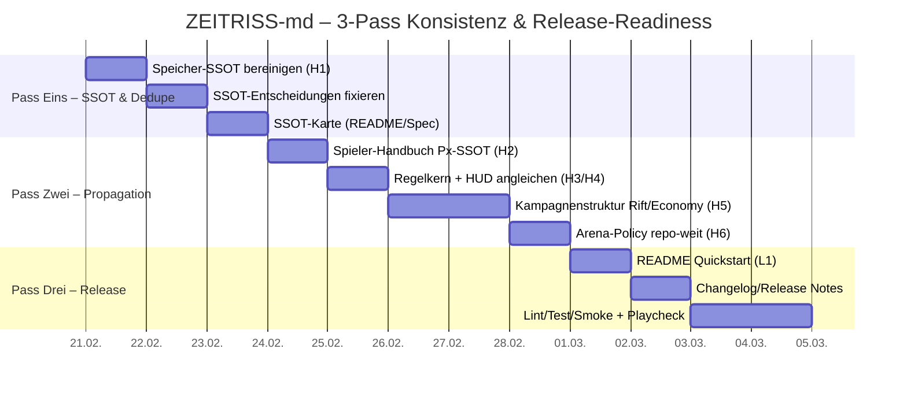

# ZEITRISS-md – Next-Pass Konsistenz-Audit & Release-Readiness Plan

## Executive Summary

Im Repo hast du im Vergleich zu dem „vorherigen Problemprofil“ spürbar nachgeschärft: **Mission/Episode** ist jetzt sauber definiert (Mission ≈ 12 Szenen, Episode ≈ 10 Missionen; Rift-Ops ≈ 14 Szenen) und das **HQ-only Save** ist stark gehärtet inklusive klarer „SSOT“-Ansprüche und dem neuen **Suspend/Resume** als *flüchtigem* Pausenmechanismus. Das wirkt in den Kern-Bausteinen wie eine echte Konsolidierung. Beispielhaft ist der Systems-Pass im Speichermodul: „**SaveGuard bleibt HQ-only**“ und „**Session-Suspend (Temporärer Snapshot)**“ sind klare Leitplanken. `systems/gameflow/speicher-fortsetzung.md`: „SaveGuard bleibt HQ-only“ / „`!suspend` schreibt einen flüchtigen Snapshot, `!resume` setzt ihn exakt einmal fort“.  

Release-ready ist der Stand dennoch **nicht** – hauptsächlich, weil mehrere Dokumente (und teils *ein und dasselbe Dokument*) weiterhin **zwei widersprüchliche Regelwelten parallel** ausformulieren. Der größte Drift betrifft den **Paradoxon-Index (Px)** (Progress-Logik, TEMP-Einfluss, Px Burn, Backlash/-1, „Kurzmissionen zählen erst nach zwei“, Jitter) sowie die **Rift-/Seed-Ökonomie** (NPC-Resolve mit CU×Level vs. Formelvorrang). Das führt dazu, dass ein Leser (oder dein Agent/Codex) je nach Datei zu anderen Ergebnissen kommt – besonders riskant, weil laut Beitragsleitfaden die Runtime-Quelle der Wahrheit eng gezogen ist und Widersprüche dann extrem schnell in Spielabläufe „leaken“. `CONTRIBUTING.md`: „Merksatz: Alles, was ingame sichtbar oder aktiv sein soll, MUSS im Spieler-Handbuch oder Toolkit stehen.“  

## Status seit dem letzten Konsistenz-Pass

**Was jetzt konsistenter wirkt (Fortschritt bestätigt):**

Die Begriffshierarchie wirkt in den Spieltexten deutlich klarer. Im Spieler-Handbuch steht explizit: „Eine **Mission** … umfasst meist zwölf Szenen. Eine **Episode** bündelt rund zehn Missionen … Rift-Ops … vierzehn Szenen.“ `core/spieler-handbuch.md`: „Eine Episode bündelt rund zehn Missionen… Rift-Ops … vierzehn Szenen.“ Auch das Kampagnenmodul beschreibt diese Hierarchie in derselben Form. `gameplay/kampagnenstruktur.md`: „Mission … rund zwölf Szenen“ / „Episode/Fall – fasst etwa zehn Missionen…“.  

Das Speichersystem ist im Vergleich zu „früheren Mischformen“ wesentlich härter formuliert und testbar: „**Einziger Save-Typ: Deepsave (HQ-only).**“ sowie ein referenziertes Fixture (`internal/qa/fixtures/savegame_v6_test.json`) macht das auditierbar. `systems/gameflow/speicher-fortsetzung.md`: „Einziger Save-Typ: Deepsave (HQ-only).“ / „Referenz-Fixture … `internal/qa/fixtures/savegame_v6_test.json`“. Zusätzlich ist das Suspend-Feature sauber als Nicht-Deepsave abgegrenzt: „Der Suspend-Snapshot … verfällt nach 24 Stunden.“ `systems/gameflow/speicher-fortsetzung.md`: „verfällt nach 24 Stunden“.  

**Was noch nicht „aus einem Guss“ ist (Hauptbefund):**

Du hast im Speichermodul oben eine „SSOT“-Logik etabliert („**Zwischen-Stufen (Px 1-4) liefern keine mechanischen Boni**“ + „Legacy-Varianten … gelten als verworfen“). `systems/gameflow/speicher-fortsetzung.md`: „Zwischen-Stufen … liefern keine mechanischen Boni“ / „Legacy-Varianten … gelten als verworfen“.  
Gleichzeitig steht im Spieler-Handbuch aber weiterhin ein explizites **Px Burn** und ein expliziter **TEMP-Progressions-Einfluss** („Px Burn: 1 Punkt → 1 Reroll“ / „TEMP beeinflusst Füllgeschwindigkeit“). `core/spieler-handbuch.md`: „Px Burn: 1 Punkt → 1 Reroll“ / „TEMP beeinflusst Füllgeschwindigkeit“. Das HUD-Modul verstärkt diese alternative Logik sogar mit UI-Beispielen wie „TEMP 11 · +1 nach 2 Missionen“ und „Paradoxon −1 · Backlash“. `characters/hud-system.md`: „TEMP 11 · +1 nach 2 Missionen“ / „Paradoxon −1 · Backlash“.  
Zusätzlich enthält das Speichermodul selbst nach der neuen SSOT-Sektion erneut **Legacy-Inhalte**, die wieder andere Felder („paradoxon_index“) und andere Gruppenformate („Charaktere“-Wrapper) einführen – und damit die eigene SSOT-Aussage unterlaufen. `systems/gameflow/speicher-fortsetzung.md`: Im „Kanonisches DeepSave-Schema (Kurzfassung)“ taucht neben `px` auch „`paradoxon_index`“ auf; später wird wieder ein „Charaktere“-Wrapper als bevorzugt dargestellt.  

**Web-Quellen-Status (unspezifiziert):**  
Der gewünschte Abgleich mit der Projektseite (pchospital.de) konnte in diesem Durchlauf nicht inhaltlich verifiziert werden, weil das Web-Tool die Seiten nicht laden konnte („UnexpectedStatusCode“). Damit sind Website-spezifische Aussagen hier **unspezifiziert**; ich stütze die Audit-Aussagen auf Repo-Quellen (README/Lizenz/Meta-Dokumente).  

## Höchstrisiko-Inkonsistenzen

| Pfad | Kurzbeschreibung der Inkonsistenz | Severity |
|---|---|---|
| `systems/gameflow/speicher-fortsetzung.md` | Datei enthält „SSOT“-Regeln (Px nur `campaign.px`, keine Zwischenboni) **und** später wieder Legacy-Abschnitte, die `paradoxon_index` + „Charaktere“-Wrapper + andere Logik einführen. | High |
| `core/spieler-handbuch.md` | Innerhalb derselben Datei: TL;DR sagt „Px 0–4 hat keine negativen Effekte“; später steht „Px Burn“ + „TEMP beeinflusst Füllgeschwindigkeit“ – kollidiert mit SSOT („keine Zwischenboni“). | High |
| `characters/hud-system.md` | HUD-Beispiele kodieren TEMP-basierte Px-Geschwindigkeit („+1 nach 2 Missionen“) und Backlash/-1, obwohl SSOT das explizit als verworfen/selten framet. | High |
| `core/zeitriss-core.md` | „Mehr TEMP bedeutet schnelleren Anstieg“ inkl. TEMP-Taktungstabelle; zusätzlich „modus paradoxon off/on“ ohne Einbindung in die SSOT-/Save-Policy. `core/zeitriss-core.md`: „Mehr TEMP bedeutet schnelleren Anstieg…“. | High |
| `gameplay/kampagnenstruktur.md` | `resolve_rifts(ids)`-Abschnitt: 50/50-Wurf + „Item im Wert von **CU × Spielerlevel**“; widerspricht dem eigenen „MUSS: CU-Formel bleibt identisch“ und dem Ökonomie-SSOT. `gameplay/kampagnenstruktur.md`: „50/50-Ergebnis“ / „Item im Wert von CU × Spielerlevel“. | High |
| `gameplay/kampagnenstruktur.md` | Seed-Status „locked_until_episode_end“ wird als Guard/Serializer-Regel beschrieben; Speichermodul beschreibt Status primär als open/closed und normalisiert unbekannt → open. `gameplay/kampagnenstruktur.md`: „status: \"locked_until_episode_end\"“. | High |
| `CONTRIBUTING.md` | Arena-Policy steht als „keine Seeds, kein Paradoxon … und keine CU-Belohnung“, während andere Stellen (z. B. Kampagnenstruktur/Speicher) Arena-Fee/Rewards/Mode-Reset detailreich modellieren. `CONTRIBUTING.md`: „keine CU-Belohnung“. | High |
| `core/zeitriss-core.md` | Save-Text kann als „Speicher am Ende jeder Mission (im Feld)“ missverstanden werden vs. SaveGuard HQ-only. `core/zeitriss-core.md`: „am Ende jeder Mission … Speicherstand“. | Medium |
| `gameplay/kampagnenstruktur.md` | „Kurzmissionen … zählen erst nach zwei Einsätzen als +1“ + „±1 Jitter“ werden genannt; diese Varianten sind in SSOT nicht konsistent als optional/legacy eingeordnet. | Medium |
| `characters/hud-system.md` | HUD-Policy (Banner „immer am Szenenende“) vs. Toast-Budget/80–20-HUD-Regel kann als widersprüchliche Output-Pflicht wirken. `characters/hud-system.md`: „Banner erscheint immer am Szenenende.“ | Medium |

## Priorisierte Fix-Checkliste

Die Liste ist bewusst als **Agenten-Übergabe** formuliert: klare Ziele, konkrete Pfade, und jeweils ein Akzeptanzkriterium. (Wenn ein Pfad in deinem Branch abweicht, ist das Detail „unspezifiziert“ – hier wurden die Pfade im `main`-Stand gelesen.)

### High

**Fix H1 – Speichermodul als echte SSOT-Datei bereinigen (Legacy-Block raus oder sauber auslagern)**  
**Pfad:** `systems/gameflow/speicher-fortsetzung.md`  
**Problem:** Oben wird SSOT formuliert, später wird wieder eine zweite, ältere Spezifikation eingebracht inkl. `paradoxon_index` und „Charaktere“-Wrapper. `systems/gameflow/speicher-fortsetzung.md`: „Zwischen-Stufen … keine mechanischen Boni“ vs. später „paradoxon_index“ / „Charaktere“.  
**Änderung:** Alles **ab der zweiten Inhaltsliste** („- Einführung und Zielsetzung …“) entweder (a) löschen oder (b) in eine klar markierte Legacy-Datei verschieben (z. B. `docs/dev/legacy/speicher-fortsetzung_legacy.md` mit `tags: [meta]`).  
**Akzeptanz:** In **dieser** Datei existiert danach genau **eine** Definition des v6-Schemas, und sie enthält **kein** `campaign.paradoxon_index` und **kein** zweites Gruppenformat.

**Fix H2 – Px-Mechanik: eine Entscheidung erzwingen (TEMP-Progress & Px Burn entfernen oder als optionale Variante *einheitlich* definieren)**  
**Pfad:** `core/spieler-handbuch.md`  
**Problem:** Es steht gleichzeitig „Px 0–4 hat keine negativen Effekte“ und zusätzlich „Px Burn …“ + „TEMP beeinflusst Füllgeschwindigkeit“. `core/spieler-handbuch.md`: TL;DR Punkt 4 vs. Cheatsheet: „Px Burn…“ / „TEMP beeinflusst…“.  
**Änderung (empfohlen für Konsistenz):**  
- Entferne im Cheatsheet die beiden Bulletpoints „Px Burn…“ und „TEMP beeinflusst…“.  
- Wenn du *unbedingt* Px Burn behalten willst, muss das Speichermodul ihn als **nicht-legacy** führen und exakt spezifizieren, wie Burn den `campaign.px` beeinflusst (inkl. Reset-Pending/Confirm).  
**Akzeptanz:** Spieler-Handbuch und Speichermodul widersprechen sich nicht mehr zur Px-Zwischenlogik.

**Fix H3 – HUD-Paradoxon-Beispiele an SSOT angleichen (kein TEMP-Takt, kein Backlash als Standard-Ausgabe)**  
**Pfad:** `characters/hud-system.md`  
**Problem:** HUD-Beispiele kodieren TEMP-basierte Füllrate und Backlash/-1. `characters/hud-system.md`: „TEMP 11 · +1 nach 2 Missionen“ / „Paradoxon −1 · Backlash“.  
**Änderung:** Paradoxon-Banner-Beispiele so umschreiben, dass sie **nur** den aktuellen Px-Stand und „ClusterCreate“ zeigen. Falls -1 existiert: als **seltenen Ausnahme-Toast** mit expliziter Begründung (Zivilopfer/Kernanker).  
**Akzeptanz:** HUD-Modul suggeriert keine zweite Px-Regelwelt.

**Fix H4 – Regelkern-Paradoxon: TEMP-Taktung entfernen oder als rein erzählerisches Flavor ohne Mechanik markieren**  
**Pfad:** `core/zeitriss-core.md`  
**Problem:** „Mehr TEMP bedeutet schnelleren Anstieg“ + TEMP-Tabelle implementiert eine andere Progression. `core/zeitriss-core.md`: „Mehr TEMP bedeutet schnelleren Anstieg… TEMP 11-13 alle zwei…“.  
**Änderung (empfohlen):** TEMP-Tabelle entfernen und stattdessen 2–4 Sätze: Px steigt über Missionsauswertung/„Hauptereignis stabilisiert“; TEMP ist thematisch, nicht Taktgeber.  
**Akzeptanz:** Regelkern widerspricht Speichermodul und Spieler-Handbuch nicht.

**Fix H5 – Rift-NPC-Resolve und CU×Level entfernen (Ökonomie-Formel durchziehen)**  
**Pfad:** `gameplay/kampagnenstruktur.md` (Abschnitt „Rifts sammeln“)  
**Problem:** 50/50 + CU×Spielerlevel ist ein massiver Balancing-Bruch. `gameplay/kampagnenstruktur.md`: „50/50-Ergebnis“ / „Item im Wert von CU × Spielerlevel“.  
**Änderung:** Entweder komplett streichen oder ersetzen durch: „NPC-Resolve ist reines Story-Tool ohne Beute“ **oder** „NPC-Resolve nutzt dieselbe CU-Formel (Basis×Ergebnis×Seed-Multi×Hazard-Pay) und erzeugt kein exponentielles Item-Scaling“.  
**Akzeptanz:** Es gibt repo-weit keine Stelle mehr, die CU×Level als Loot-Wert vorschreibt.

**Fix H6 – Arena-Policy repo-weit vereinheitlichen (Rewards ja/nein, abhängig von `match_policy`)**  
**Pfad:** `CONTRIBUTING.md` und `gameplay/kampagnenstruktur.md` (Arena-Abschnitt) sowie ggf. `systems/gameflow/speicher-fortsetzung.md` (Arena-Transfer/Rewards)  
**Problem:** CONTRIBUTING behauptet „keine CU-Belohnung“, während andere Module Arena-Flows inkl. Gebühr/Rewards modellieren. `CONTRIBUTING.md`: „keine CU-Belohnung“. `gameplay/kampagnenstruktur.md`: beschreibt CU/Px-Rewards (implizit).  
**Änderung (robuster Kompromiss):**  
- Definiere: `match_policy=sim` → **keine** CU/keine Px (Training), `match_policy=lore` → optional CU und **max. +1 Px pro Episode** (bereits als Stempel-Logik vorhanden).  
- Dokumentiere dieselbe Policy an allen drei Stellen.  
**Akzeptanz:** Ein Leser kann eindeutig beantworten: „Bekomme ich in der Arena CU/Px? Unter welchen Bedingungen?“

### Medium

**Fix M1 – Seed-Status-Tokens konsolidieren (open/closed *oder* locked/open/closed)**  
**Pfad:** `gameplay/kampagnenstruktur.md`, `systems/gameflow/speicher-fortsetzung.md`  
**Problem:** „locked_until_episode_end“ ist ein dritter Status, während SSOT-Teile primär open/closed formulieren. `gameplay/kampagnenstruktur.md`: „status: \"locked_until_episode_end\"“.  
**Änderung (empfohlen minimal):** Entferne locked-Status und enforce Episode-Ende nur über `launch_rift()` Guard (Episode completed / mission_in_episode ≥ 10), wie schon an mehreren Stellen beschrieben. `core/spieler-handbuch.md`: „Rift-Starts … verlangen … `mission_in_episode ≥ 10`“.  
**Akzeptanz:** Seeds haben repo-weit dieselben Statuswerte und dieselbe Guard-Logik.

**Fix M2 – Save-Formulierung im Regelkern präzisieren (damit HQ-only nicht missverstanden wird)**  
**Pfad:** `core/zeitriss-core.md`  
**Problem:** „am Ende jeder Mission erstellt … Speicherstand“ kann als In-Mission-Save gelesen werden. `core/zeitriss-core.md`: „am Ende jeder Mission … Speicherstand“.  
**Änderung:** 1–2 Sätze ändern zu „nach Debrief/HQ-Phase wird der Deepsave erzeugt; im Feld nicht“.  
**Akzeptanz:** Regelkern-Savebeschreibung ist kompatibel mit SaveGuard HQ-only.

**Fix M3 – SSOT-Karte sichtbar machen (damit Leser wissen, welche Datei gilt)**  
**Pfad:** `README.md` und/oder `docs/spec/ssot.md` (neu)  
**Problem:** Bei so vielen Modulen ist unklar, was *normativ* ist. CONTRIBUTING definiert Runtime-SSOT eng. `CONTRIBUTING.md`: „Runtime-fähig: core/spieler-handbuch.md … systems/toolkit…“.  
**Änderung:** Kleine Tabelle „Quellen der Wahrheit“ im README (Save/Px/Economy/Arena/Seeds) + Links.  
**Akzeptanz:** Neue Contributor/Leser wissen sofort, wo Regeln „final“ sind.

### Low

**Fix L1 – „Quickstart“ im README austauschen, juristische Blöcke weiter nach unten**  
**Pfad:** `README.md`  
**Problem:** Zu viel Maintainer-/Compliance-Ton bremst Neulinge (du hast das selbst beobachtet).  
**Änderung:** Substituiere den Quickstart-Block (siehe Vorschlag unten) und verschiebe lange Maintainer-/QA-/Trademark-Infos unter klare Überschriften („Für Maintainer“, „Recht & Marke“). `CHANGELOG.md` zeigt bereits, dass vieles in QA-Docs ausgelagert ist. `CHANGELOG.md`: „Laufende Änderungen … primär im QA-Fahrplan…“.  
**Akzeptanz:** README-Top macht spielbar in <5 Minuten verständlich.

## Agenten-Workflow in drei Durchläufen

Der Workflow ist so gebaut, dass dein Codex/Agent erst **Konflikte eliminiert**, dann **Regeln propagiert**, dann **Release-Checks** zuverlässig grün macht. Aufwand ist als Richtwert geschätzt; wenn ihr `make lint/test` nutzt, ist die Iteration meist schneller, aber nur wenn die SSOT-Entscheidungen in Pass 1 eindeutig getroffen wurden. `CONTRIBUTING.md`: „Verpflichtende Prüfungen: `make lint`, `make test`, `bash scripts/smoke.sh` …“.

### Pass Eins: SSOT-Entscheidungen & „Doppelte Spezifikationen“ entfernen

- **Task:** `systems/gameflow/speicher-fortsetzung.md` Legacy-Teil entfernen/auslagern (Fix H1).  
  **Effort:** 60–120 min  
- **Task:** Entscheidung dokumentieren: (A) Px Burn ja/nein, (B) TEMP beeinflusst Px ja/nein, (C) locked-status ja/nein, (D) Arena-Rewards Policy (`sim` vs `lore`) (Fix H2/H6/M1).  
  **Effort:** 45–90 min  
- **Task:** SSOT-Karte anlegen/aktualisieren (Fix M3).  
  **Effort:** 30–60 min  

### Pass Zwei: Propagation in die Hauptdokumente (Spieler-Handbuch, Regelkern, HUD, Kampagne)

- **Task:** Spieler-Handbuch auf Px-SSOT trimmen (Fix H2).  
  **Effort:** 45–90 min  
- **Task:** Regelkern-Paradoxon TEMP-Tabelle entfernen/neutralisieren + Save-Text schärfen (Fix H4 + M2).  
  **Effort:** 45–90 min  
- **Task:** HUD-Paradoxon-Beispiele und wording korrigieren (Fix H3).  
  **Effort:** 30–60 min  
- **Task:** Kampagnenstruktur: `resolve_rifts`-Abschnitt + Seed-Status + Kurzmissions/Jitter/2er-Zählung vereinheitlichen (Fix H5 + M1 + Risiko #9).  
  **Effort:** 90–180 min  
- **Task:** Arena-Policy in CONTRIBUTING und Kampagnenstruktur konsistent machen (Fix H6).  
  **Effort:** 30–60 min  

### Pass Drei: Release-Härtung (Dokumentation + Tests + Changelog)

- **Task:** README Quickstart austauschen (Fix L1).  
  **Effort:** 20–40 min  
- **Task:** Changelog/Release-Notiz minimal „public-friendly“ machen (siehe Versioning-Note unten).  
  **Effort:** 20–60 min  
- **Task:** Toolchain laufen lassen: `make lint`, `make test`, `bash scripts/smoke.sh` + Link-Linter (Pflicht) und ggf. Acceptance-Smoke (nach Briefing). `CONTRIBUTING.md`: „Verpflichtende Prüfungen …“.  
  **Effort:** 30–90 min (abhängig von Findings)  
- **Task:** Ein „goldener Beispiel-Flow“ als Playcheck (siehe Tests unten) einmal end-to-end durchspielen und Regressionen notieren.  
  **Effort:** 45–90 min  

## README Quickstart Replacement

Drop-in Ersatztext (ca. 12–20 Zeilen, bewusst „spielerisch“ statt maintainerig). Er ist so geschrieben, dass er oben im README direkt unter Titel/Badge stehen kann.

> **Quickstart (in 5 Minuten ins Spiel)**  
> 1) Öffne einen neuen Chat mit deiner KI-Spielleitung (Kodex/GM).  
> 2) Starte mit **einem** Befehl: `Spiel starten (solo schnell)` oder `Spiel starten (gruppe schnell)`.  
> 3) Folge dem Briefing (3 klare Ziele) und spielt die Mission in **12 Szenen** (Core) bzw. **14 Szenen** (Rift).  
> 4) Würfelregel: `1W6 + ⌊Attribut/2⌋ + Talent + Gear ≥ SG` (ab Attribut 11: W10; ab 14: Heldenwürfel).  
> 5) Nach der Mission kommt automatisch: Bewertung → Loot → CU → XP/Level → Ruf → HQ-Menü.  
> 6) **Speichern:** nur im HQ mit `!save` (JSON kopieren).  
> 7) Nächste Session: neuer Chat → `Spiel laden` → JSON einfügen → weiter im HQ/Briefing.  
> 8) **Paradoxon (Px)** ist ein Belohnungsbalken: Bei Px 5 erscheinen 1–2 Rift-Seeds; Rift-Ops spielt ihr nach Episodenende.  
> 9) Hilfe im Spiel: `!hilfe`, `!hud`, `kodex <thema>`.  
> 10) Nur testen? Spiel die Demo „Feuerkette 1410“ (12 Szenen) bis zum ersten Debrief.  

## Versionierung, Changelog und Validierung

**Versioning & Changelog (kurz):**  
Im Repo ist die Version 4.2.6 bereits breit gespiegelt und als QA-Fix-Release beschrieben. `CHANGELOG.md`: „4.2.6 – QA-Testprompt-Fixes“ / „Versionierung auf 4.2.6 vereinheitlicht…“. Gleichzeitig sagt das Changelog explizit, dass laufende Änderungen primär in QA-Dokumenten landen und der Changelog „nur noch als Archivanker“ dient. `CHANGELOG.md`: „Laufende Änderungen … primär im QA-Fahrplan… dieses Changelog dient nur noch als Archivanker.“  
Für eine „release-ready“ Public-Repo-Wahrnehmung funktioniert das, wenn du **pro Release** (Tag) mindestens **eine** knappe, lesbare Zusammenfassung im Changelog behältst, selbst wenn die Details in `internal/qa/**` liegen. Praktischer Minimal-Fix ohne Prozess-Overhead:  
- Halte `[Unveröffentlicht]` aktiv, aber schreibe dort nur 5–10 Bulletpoints „User-impacting“.  
- Tagge Releases konsistent (z. B. `v4.2.6`) und stelle sicher, dass `README.md` und `CHANGELOG.md` denselben Patchstand nennen.  
- Falls du „major.minor tolerant“ laden willst, muss in den Docs klar sein, dass Patch-Releases **keine** Save-Schema-Breaks enthalten. Das ist im Speichermodul als Semver-Toleranz erwähnt. `systems/gameflow/speicher-fortsetzung.md`: „Semver-Toleranz: Lädt, wenn major.minor … Patch-Level sind egal.“  

**Empfohlene Tests/Playchecks zur Validierung (3–6 Items):**

1) **SSOT-Regression Px:** Ein kompletter Core-Run bis Px 5 → ClusterCreate → Seeds erscheinen → Reset pending/confirm → anschließend Episode beenden → `launch_rift` erst danach. Prüfe, dass nirgendwo TEMP/Px-Burn als Mechanik „wieder reinrutscht“. `systems/gameflow/speicher-fortsetzung.md`: „Zwischen-Stufen … keine mechanischen Boni“ / „Rift-Seeds sind erst nach Episodenende spielbar.“  
2) **Ökonomie-Konsistenz:** Ein Debrief mit Auszahlung nach der Formel aus dem Spieler-Handbuch (Basis×Ergebnis×Seed-Multi×Hazard-Pay) und Gegenprobe, dass kein Dokument mehr CU×Level als Loot-Wert vorschreibt. `core/spieler-handbuch.md`: „Belohnung = Basiswert × Ergebnis × Seed-Multi × Hazard-Pay“.  
3) **Arena-Policy Check:** Ein Arena-Lauf in `match_policy=sim` vs `lore` (falls du den Split übernimmst) und Validierung, dass Rewards/Paradoxon/Logs/Mode-Reset in allen relevanten Dateien gleich beschrieben sind. `systems/gameflow/speicher-fortsetzung.md`: Arena-Mode-State-Machine / `campaign.mode` Reset.  
4) **SaveGuard & Suspend:** Verifiziere, dass `!save` außerhalb HQ blockiert, `!suspend` zwischen Szenen funktioniert und nach 24h verfällt (und dass kein Text mehr suggeriert, Suspend sei ein echter Save). `systems/gameflow/speicher-fortsetzung.md`: „Speichern nur im HQ“ / „Snapshot … verfällt nach 24 Stunden“.  
5) **Tooling-Gates:** Pflichtlauf `make lint`, `make test`, `bash scripts/smoke.sh` (und Link-Linter) nach allen Änderungen. `CONTRIBUTING.md`: „Verpflichtende Prüfungen … `make lint` … `make test` … `bash scripts/smoke.sh`“.  

**Wichtig für Release-Readiness:** Wenn du nur *eine* Sache „hart“ priorisieren willst, dann ist es H1 (Speichermodul-Dedupe) + H2/H3/H4 (Px-Konsolidierung). Solange mehrere Px-Regelwelten parallel existieren, bleibt das System für neue Spieler und für deinen Agenten nicht deterministisch – und genau das verhindert praktische Plays.