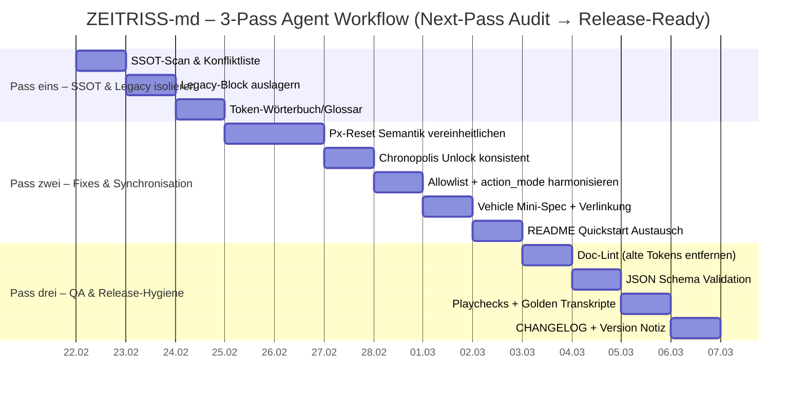

# ZEITRISS‑md Konsistenz‑ und Release‑Audit

Die jüngsten Änderungen rund um **Chronopolis** und das **Vehicle‑Logging** sind in der *Intention* klarer und in mehreren Kernstellen bereits konsistent angelegt: Chronopolis ist jetzt explizit bis **Level 10** gesperrt und als **CITY‑Knoten** vom HQ‑Save ausgeschlossen (Spieler‑Handbuch; Save‑System). Außerdem existiert mit `vehicle_clash` ein klar benannter HUD‑Event‑Typ, der in der Save‑Spezifikation und sogar im kanonischen v6‑Test‑Save vorkommt. Das ist ein gutes Fundament, weil es gerade die „LLM‑Spielbarkeit“ (deterministische, wiederholbare Zustände) stärkt.

Release‑Blocker bleiben aber deutlich: Das Save‑Modul enthält **noch eine zweite, alte Spezifikation** (inkl. Beispielen aus **v4.1.5**) *im selben Dokument* und reintroduziert dabei abweichende Feldnamen und Progressionslogiken. Zusätzlich ist das **kanonische** v6‑Fixture aktuell an mehreren Stellen nicht „kanonisch“ im Sinne der eigenen Regeln (u. a. Chronopolis‑Unlock bei Level 3, Px‑Reset/Absenkung auf 3, Merge‑Conflict‑Feldnamen außerhalb der Allowlist) – das ist hochriskant, weil es QA/Agenten‑Änderungen „falsch kalibriert“. Auf der Website pchospital.de ist die ZEITRISS‑Seite derzeit durch Cookie‑/Drittanbieter‑Einbettung inhaltlich praktisch nicht prüfbar, was Release‑Kommunikation zusätzlich erschwert. citeturn13view0

## Was die letzten Changes verbessert haben

Chronopolis ist jetzt in den Spieler‑Docs eindeutig als spätes Feature beschrieben: „Bis inklusive **Level 9** bleibt Chronopolis gesperrt. Bei **Level 10** schaltet Kodex den **digitalen Chronopolis‑Schlüssel** frei …“ (Datei `core/spieler-handbuch.md`). Außerdem wird Chronopolis dort erneut als „gesperrter CITY‑Knoten“ benannt, was gut zur SaveGuard‑Regel passt, die Chronopolis explizit *nicht* als HQ‑Kontext zulässt (Datei `systems/gameflow/speicher-fortsetzung.md`).  

Vehicle‑Events sind jetzt nicht mehr nur „Fluff“: In `systems/gameflow/speicher-fortsetzung.md` wird `hud_event(event, details)` explizit auf zwei Eventtypen begrenzt (u. a. `vehicle_clash` mit `tempo`, `stress`, `damage`), und im Fixture `internal/qa/fixtures/savegame_v6_test.json` taucht `vehicle_clash` mehrfach als strukturierter HUD‑Eintrag auf. Das ist wichtig, weil es ein stabiles Format für Agent/Loader‑Merges vorgibt (statt freier Texte).  

## Höchstrisiko‑Inkonsistenzen

Die folgende Tabelle listet die aus dem aktuellen Repo‑Stand ersichtlichen, **höchstriskanten** Inkonsistenzen, die entweder (a) durch die Chronopolis/Vehicle‑Änderungen sichtbarer wurden oder (b) durch letzte Umbauten *neu* in Konflikt geraten sind.

| Datei (Pfad) | Kurzbeschreibung (mit Evidenz‑Zitat) | Severity |
|---|---|---|
| `systems/gameflow/speicher-fortsetzung.md` | **Doppelte Spezifikation im selben Dokument**: Nach dem v6‑SSOT hängt ein **zweiter Inhaltsblock** („## Einführung und Zielsetzung“) an, der wieder ein anderes Design erklärt („Integration eines Zeitlinien‑Trackers…“, Beispiele mit `zr_version: "4.1.5"`). Zitat: „## Einführung und Zielsetzung … ZEITRISS 4.2.6 …“ gefolgt von v4.1.5‑Beispielen. | Hoch |
| `systems/gameflow/speicher-fortsetzung.md` | **Zwei Px‑Felder gleichzeitig** (Widerspruch zum SSOT „Px bleibt einheitlich (`campaign.px` als Quelle)“): Im „Kanonisches DeepSave‑Schema (Kurzfassung)“ steht `\"px\": 1` **und** `\"paradoxon_index\": 0`. | Hoch |
| `systems/gameflow/speicher-fortsetzung.md` | **SSOT sagt „HQ‑only, Chronopolis kein Save‑Kontext“**, aber im Legacy‑Teil wird wieder „Am Ende jeder Mission erzeugt das Spiel … Speicherblock“ betont (Solo‑Teil), was durch die *Nebeneinanderstellung* unklar wird (auch wenn später wieder HQ‑only steht). Zitat: „Am Ende jeder Mission erzeugt das Spiel einen maschinell lesbaren Speicherblock …“. | Hoch |
| `core/spieler-handbuch.md` | **Px‑Progression als TEMP‑abhängige Missionsfrequenz**: Zitat: „TEMP 1-3: +1 Paradoxonpunkt alle 5 Missionen … TEMP 11-13: alle 2 Missionen …“. Das kollidiert mit dem Save‑SSOT, der Px als missionsziel-/stabilisierungsgetrieben beschreibt („Px steigt, wenn … stabilisiert…“ ohne starre Frequenz). | Hoch |
| `characters/hud-system.md` | HUD‑Beispiel enthält **starre Px‑Tick‑Rate**: Zitat: `` `Paradoxon: ▓▓▓░░ · TEMP 11 · +1 nach 2 Missionen` ``. Gleichzeitig wird an anderer Stelle Px als kontextsensitives Icon beschrieben; das ist als Beispiel okay, aber als „Regelgefühl“ im Modul widersprüchlich zu Save‑SSOT. | Hoch |
| `internal/qa/fixtures/savegame_v6_test.json` | **Chronopolis‑Unlock widerspricht Level‑Gating**: Fixture‑Charakter ist `\"level\": 3`, aber Trace enthält Event `\"chronopolis_unlock\"` („Unlock nach Level 10“) und Flags setzen `\"chronopolis_unlocked\": true`, `\"chronopolis_unlock_level\": 10`. | Hoch |
| `internal/qa/fixtures/savegame_v6_test.json` | **ClusterCreate / Px‑Reset unlogisch**: Trace: `px_before: 5`, aber `px_after: 3` („Px sinkt auf 3“). Das passt weder zu „Px → 0“ (Handbuch‑Tabelle) noch zu „Reset via HQ‑Bestätigung“ (Save‑Modul). | Hoch |
| `internal/qa/fixtures/savegame_v6_test.json` | **Merge‑Conflict‑Allowlist gebrochen**: `logs.flags.merge_conflicts[]` enthält `"field": "arena.state"`, obwohl das Save‑Modul die Allowlist nennt (`wallet`, `rift_merge`, `arena_resume`, `campaign_mode`, `phase_bridge`, `location_bridge`). | Hoch |
| `systems/gameflow/saveGame.v6.schema.json` vs. Docs/Beispiele | **Action‑Mode‑Inkonsistenz**: Schema erlaubt `ui.action_mode` nur `frei|konform`, während Beispiele im Save‑Modul auch `action_mode=\"uncut\"` verwenden (z. B. in JSON‑Beispielen im oberen Teil von `speicher-fortsetzung.md`). | Mittel‑Hoch |
| `characters/hud-system.md` | HUD wird gleichzeitig als „lokal, nicht gestört“ behauptet und doch sollen „Paradoxon‑Effekte oder Störsignale“ die Verbindung brechen; die technische Trennung HUD vs. Comlink ist zwar angelegt, aber die Formulierung „Das HUD ist lokal. Es kann nicht gehackt oder gestört werden“ ist zu absolut. | Mittel |

## Priorisierte Fix‑Checkliste

Die folgenden Fixes sind so formuliert, dass du sie **direkt an deinen Codex/Agenten** geben kannst. Jeder Punkt nennt **konkrete Pfade** und das Zielbild (SSOT‑konform). Priorität: **High / Medium / Low**.

1. **High — `systems/gameflow/speicher-fortsetzung.md`: Legacy‑Block entfernen oder auslagern**  
   **Aktion:** Alles ab der zweiten Inhaltsliste („- Einführung und Zielsetzung …“) und dem folgenden Abschnitt „## Einführung und Zielsetzung …“ in **separate Datei** verschieben, z. B. `systems/gameflow/speicher-fortsetzung.legacy.md`, oder löschen.  
   **Begründung/Zitat:** Das Dokument enthält aktuell nach dem v6‑SSOT erneut „## Einführung und Zielsetzung“ plus v4.1.5‑Beispiele („zr_version: \"4.1.5\"“).

2. **High — `systems/gameflow/speicher-fortsetzung.md`: Px‑Feld und Reset‑Semantik vereinheitlichen**  
   **Aktion:** Im gesamten Dokument alle Neben‑Felder wie `campaign.paradoxon_index` entfernen. Canonical: **nur** `campaign.px`.  
   **Evidenz:** SSOT‑Anker: „Px bleibt einheitlich (`campaign.px` als Quelle)“. Gleichzeitig steht im Kurzschema: `\"px\": 1, \"paradoxon_index\": 0`.

3. **High — `internal/qa/fixtures/savegame_v6_test.json`: Chronopolis‑Unlock konsistent machen**  
   **Aktion (Option A, empfehlenswert):** Setze `character.level` auf **10** (oder höher), *wenn* das Fixture Chronopolis‑Unlock demonstrieren soll.  
   **Aktion (Option B):** Wenn das Fixture *nicht* Chronopolis testen soll: setze `logs.flags.chronopolis_unlocked=false`, entferne `chronopolis_unlock`‑Trace, belasse `chronopolis_unlock_level=10`.  
   **Evidenz:** `\"level\": 3` steht im Fixture, aber `chronopolis_unlock` ist geloggt („Unlock nach Level 10“).

4. **High — `internal/qa/fixtures/savegame_v6_test.json` + `core/spieler-handbuch.md` + `systems/gameflow/speicher-fortsetzung.md`: ClusterCreate/Px‑Reset definieren und Fixture anpassen**  
   **Aktion:** Entscheide SSOT‑konform eine von zwei Varianten (und dokumentiere sie überall gleich):  
   - **Variante 1:** Bei Px=5 → Seeds erzeugen → **Px bleibt 5**, `px_reset_pending=true`; Reset auf 0 erst nach Debrief/HQ‑Bestätigung.  
   - **Variante 2:** Bei Px=5 → Seeds erzeugen → **Px sofort 0**, keine Pending‑Flags (weniger State‑Komplexität).  
   **Aktion danach:** Passe das Fixture an (kein `px_after: 3`).  
   **Evidenz:** Fixture: `px_before 5`, `px_after 3` („Px sinkt auf 3“). Handbuch‑Tabelle sagt „Px 5 … Px → 0“. Save‑Modul beschreibt Pending‑Reset („Reset erfolgt via HQ‑Bestätigung“).

5. **High — `internal/qa/fixtures/savegame_v6_test.json` + `systems/gameflow/speicher-fortsetzung.md`: Merge‑Conflict‑Allowlist fixen**  
   **Aktion:** Im Fixture `field: "arena.state"` auf einen Allowlist‑Wert mappen (z. B. `arena_resume` oder `phase_bridge`, je nach Bedeutung).  
   **Aktion zusätzlich:** Im Save‑Modul die Allowlist entweder (a) als harte Norm lassen und im Fixture strikt verwenden oder (b) explizit erweitern (aber dann überall).  
   **Evidenz:** Save‑Modul nennt explizit, `field` dürfe „nur … `wallet`, `rift_merge`, `arena_resume`, `campaign_mode`, `phase_bridge`, `location_bridge`“ sein – Fixture bricht das.

6. **High — `systems/gameflow/saveGame.v6.schema.json` + `systems/gameflow/speicher-fortsetzung.md`: `ui.action_mode`‑Tokens harmonisieren**  
   **Aktion:** Alle Beispiele in `speicher-fortsetzung.md`, die `action_mode: "uncut"` nutzen, auf `action_mode: "frei"` umstellen (oder Schema erweitern + dokumentierte Migrationsmap).  
   **Evidenz:** Schema erlaubt nur `frei|konform`, Beispiele nutzen „uncut“.

7. **Medium — `core/spieler-handbuch.md` + `characters/hud-system.md` + `systems/gameflow/speicher-fortsetzung.md`: TEMP→Px‑„Füllgeschwindigkeit“ als *Guideline* statt harter Regel formulieren**  
   **Aktion:** Entweder (a) strikte TEMP‑Frequenztabelle entfernen oder (b) klar als „Richtwert/Tempo‑Heuristik für SL“ markieren, damit sie nicht mit dem „mission outcome“‑Modell kollidiert.  
   **Evidenz:** Handbuch: „+1 … alle X Missionen“; HUD‑Beispiel: „+1 nach 2 Missionen“; Save‑Modul: Px als belohnungs-/stabilisierungsgetrieben ohne starres Intervall.

8. **Medium — `systems/gameflow/speicher-fortsetzung.md` (ggf. zusätzlich neue Datei): Vehicle‑Subsystem minimal spezifizieren**  
   **Aktion:** Erstelle z. B. `systems/fahrzeuge.md` (oder Abschnitt in `core/sl-referenz.md`, falls das der SSOT‑Ort ist) mit:  
   - wann `vehicle_clash` geloggt wird  
   - Felder (`tempo`, `stress`, `damage`) und Wertetypen  
   - wie es in Debriefs/Save roundtrips erscheint  
   **Evidenz:** Save‑Modul: `hud_event` akzeptiert `vehicle_clash`; Fixture enthält mehrere `vehicle_clash`‑Events.

9. **Medium — `systems/gameflow/speicher-fortsetzung.md`: Location‑Feld als SSOT festnageln**  
   **Aktion:** Überall klar sagen: Root‑`location` ist SSOT (`HQ|MISSION|ARENA|CITY`), Pseudocode nicht mehr gemischt als `state.location` vs. `campaign.loc`. Falls `state.location` intern genutzt wird, als „Runtime‑Mirror“ deklarieren.  
   **Evidenz:** SaveGuard‑Pseudocode nutzt `state.location`, Schema fordert root‑`location`, im Text wird außerdem „CITY‑Status“ erwähnt.

10. **Low — `characters/hud-system.md`: „HUD ist lokal“ präziser formulieren**  
   **Aktion:** Formulierung auf „nicht remote hackbar“/„Comlink kann ausfallen“ ändern; lokal kann durch *physische* Linseffekte beeinträchtigt sein.  
   **Evidenz:** Modul enthält sowohl „HUD lokal“ als auch Szenarien von Ausfall („Bricht die Verbindung ab … reduziert sich die Anzeige“).

11. **Low — `README.md`: Quickstart und „Maintainer‑Ton“ entkoppeln**  
   **Aktion:** Oben ein kurzes, einladendes Quickstart‑Snippet (siehe Drop‑in unten). Rechtliches/Infra‑Details deutlich tiefer; README soll laut entity["organization","GitHub","code hosting platform"]‑Doku als „Einstieg & Erwartungen“ dienen. citeturn14view0turn14view1

12. **Medium (Website) — pchospital.de/zeitriss: statische Release‑Infos ohne Drittanbieter‑Embed** *(außerhalb Repo)*  
   **Aktion:** Ergänze auf der ZEITRISS‑Webseite einen statischen Textblock + Download‑Link, der ohne Cookie‑Umstellung sichtbar ist. Aktuell blockiert die Seite „Drittanbieter‑Inhalte“. citeturn13view0

## Agent‑Workflow in drei Pässen

Der Agent sollte **nicht** „querbeet“ editieren, sondern erst SSOT stabilisieren, dann Refactor, dann QA. Aufwand ist als *aktive Arbeitszeit* geschätzt (LLM‑Agent + Review).

### Pass eins

Ziel: **Widersprüche inventarisieren, SSOT festsetzen, Legacy isolieren.**

| Task | Ergebnis | Aufwand |
|---|---|---:|
| Scan „SSOT‑Knoten“: `speicher-fortsetzung.md`, `saveGame.v6.schema.json`, `savegame_v6_test.json`, `spieler-handbuch.md`, `hud-system.md` | Konfliktliste + Entscheidungspunkte (Px‑Reset, TEMP‑Rolle, Allowlists) | 45–75 min |
| Legacy‑Block in `speicher-fortsetzung.md` isolieren (Move/Delete) | Nur noch *ein* Save‑System im Dokument | 30–45 min |
| „Token‑Wörterbuch“ anlegen (Px, TEMP, location, Chronopolis, vehicle_clash) | 1 SSOT‑Glossar (kurz) für spätere automatische Ersetzungen | 30–45 min |

### Pass zwei

Ziel: **Konkrete Änderungen durchführen, Beispiele/Fixtures synchronisieren, Docs wieder „aus einem Guss“.**

| Task | Ergebnis | Aufwand |
|---|---|---:|
| Px‑Reset‑Semantik implementieren (Docs + Fixture + ggf. Schema‑Notes) | Kein `px_after: 3`, keine widersprüchliche „Px→0 vs pending“ Story | 60–120 min |
| Chronopolis‑Unlock konsistent machen (Fixture + ggf. Handbuch‑Text) | Kein Unlock bei Level 3, klare Level‑10‑Story überall | 30–60 min |
| Merge‑Conflict‑Allowlist und Beispiele fixen | Fixture entspricht Allowlist, Save‑Doc widerspruchsfrei | 30–60 min |
| `ui.action_mode`‑Token konsolidieren | Schema/Beispiele/Fixture kompatibel | 30–45 min |
| Vehicle‑Mini‑Spec erstellen + Links setzen | 1 zentrale Stelle, die Vehicle‑Events erklärt | 45–75 min |
| README Quickstart austauschen | Neulings‑Einstieg in < 2 Minuten verständlich | 30–60 min |

### Pass drei

Ziel: **Release‑Ready Checks: Konsistenz, Link‑Integrität, Playchecks, minimale Release‑Hygiene.**

| Task | Ergebnis | Aufwand |
|---|---|---:|
| „Doc‑Lint“: Grep für alte Tokens (`paradoxon_index`, `uncut`, v4.1.5) | Keine verwaisten Alt‑Regeln mehr | 30–60 min |
| JSON‑Validation (Fixture gegen Schema) | `savegame_v6_test.json` validiert | 30–45 min |
| Mini‑Playcheck‑Skripte/Transkripte aktualisieren | 1–2 „Happy Path“ Läufe konsistent | 45–90 min |
| Changelog/Version Notiz ergänzen | Release‑Notizen nachvollziehbar | 30–45 min |

## README Quickstart Ersatztext

Drop‑in‑Text (ca. 12–20 Zeilen), gedacht als **oberster** Abschnitt in `README.md` direkt unter Titel/Badge:

> **Quickstart (5–10 Minuten)**  
> 1) Lies zuerst: `core/spieler-handbuch.md` (TL;DR + Cheatsheet).  
> 2) Starte eine Session im Chat mit deinem bevorzugten KI‑Spielleiter‑Setup (oder lies nur die Regeln, ohne zu spielen).  
> 3) Gib ein: `Spiel starten (solo schnell)` – Rolle + Kurzprofil reichen.  
> 4) Nach dem Briefing bekommst du **3 nummerierte Ziele** und startest in Szene 1/12.  
> 5) Proben: `1W6 + ⌊Attribut/2⌋ + Talent + Gear ≥ SG` (ab Attribut 11 W10).  
> 6) Nach Mission: Debrief → HQ‑Optionen → **nur im HQ speichern** mit `!save`.  
> 7) Neue Mission: neuen Chat öffnen → `Spiel laden` → JSON einfügen.  
> 8) Chronopolis: erst ab **Level 10** (CITY‑Knoten; kein Save‑Kontext).  
> 9) Bei Fragen: `kodex [thema]`, z. B. `kodex psi` oder `kodex HQ`.  
> 10) Für Regel‑Details: `characters/hud-system.md` (HUD/Comms) und `systems/gameflow/speicher-fortsetzung.md` (Save v6).  
> **Tipp:** Wenn du nur lesen willst: starte mit den Überschriften im Handbuch und ignorier alle Tooling‑/Setup‑Sektionen.

## Versionierung, Changelog und Validierung

### Versioning & Changelog Fixes

Für Release‑Readiness lohnt sich ein **sauberer CHANGELOG** nach dem „Keep a Changelog“‑Format: „All notable changes …“ plus `Unreleased` und klaren Kategorien (`Added/Changed/Fixed/Removed`). Das Ziel ist, dass Leser ohne Git‑Diff verstehen, **was** sich geändert hat und **warum**. citeturn15view0  
Parallel sollte die Versionierung SemVer‑artig interpretiert werden (auch wenn es ein Regelwerk ist):  
- **MAJOR** wenn Save‑Schema/Token‑Semantik *breaking* ist (z. B. Save v7, andere Pflichtpfade)  
- **MINOR** wenn neue Systeme/Module hinzukommen (Vehicle‑Subsystem formalisiert)  
- **PATCH** für Klarstellungen, Textkorrekturen, Konsistenzfixes ohne Mechanikänderung citeturn15view1  

**Unspecified:** Ob du Releases als GitHub „Release“ + PDF‑Export, als Tags‑only oder zusätzlich als Website‑Download ausspielen willst, ist in den vorliegenden Quellen nicht eindeutig angegeben.

### Empfohlene Tests und Playchecks

1. **Schema‑Test:** Validiere `internal/qa/fixtures/savegame_v6_test.json` gegen `systems/gameflow/saveGame.v6.schema.json`. Erwartung: **grün** nach den Fixes (insb. `ui.action_mode`, Pflichtcontainer).  
2. **Chronopolis‑Gating‑Playcheck:** Simuliere Level 9 → Eintritt blockiert (kein Unlock, kein CITY‑Enter), Level 10 → Unlock‑Toast/Flag, aber weiterhin „kein Save in CITY“. Erwartung: Handbuch‑Text („bis inkl. Level 9 gesperrt“) passt zu SaveGuard‑Text („Chronopolis … kein HQ‑Savepunkt“).  
3. **Px‑Konsistenz‑Playcheck:** Spiele/Simuliere bis Px=5, löse `ClusterCreate()` aus und prüfe anschließend: (a) Seeds erscheinen, (b) Px verhält sich exakt wie definiert (0 oder pending‑Reset), (c) HUD/Debrief‑Texte entsprechen derselben Story.  
4. **Merge‑Conflict‑Playcheck (Gruppenschnellstart):** 2 Saves + 1 Rolle (`Spiel starten (gruppe schnell)`) laden → Host‑Regel gilt, Konflikte landen mit Allowlist‑Keys, keine „arena.state“.  
5. **Vehicle‑Event‑Roundtrip:** Erzeuge mindestens einen `vehicle_clash`‑Event im HUD‑Log (Format wie im Fixture) → Save → Load → Sicherstellen, dass Struktur erhalten bleibt und nicht zu Freitext kollabiert.

### Website‑Status für Release‑Kommunikation

Die ZEITRISS‑Seite auf pchospital.de zeigt in der aktuellen Darstellung primär den generischen IT‑Content; der eigentliche ZEITRISS‑Bereich ist als „Externe Inhalte“ hinter Cookie‑Einstellungen verborgen („… können aufgrund Ihrer aktuellen Cookie‑Einstellungen nicht angezeigt werden.“). Das erschwert öffentliche Release‑Readiness, weil ein „Download/Spielstart“ nicht ohne Interaktion sichtbar ist. citeturn13view0  
(Unternehmen: entity["company","pchospital","it services munich, de"]; Ort: entity["city","München","bavaria, de"].)